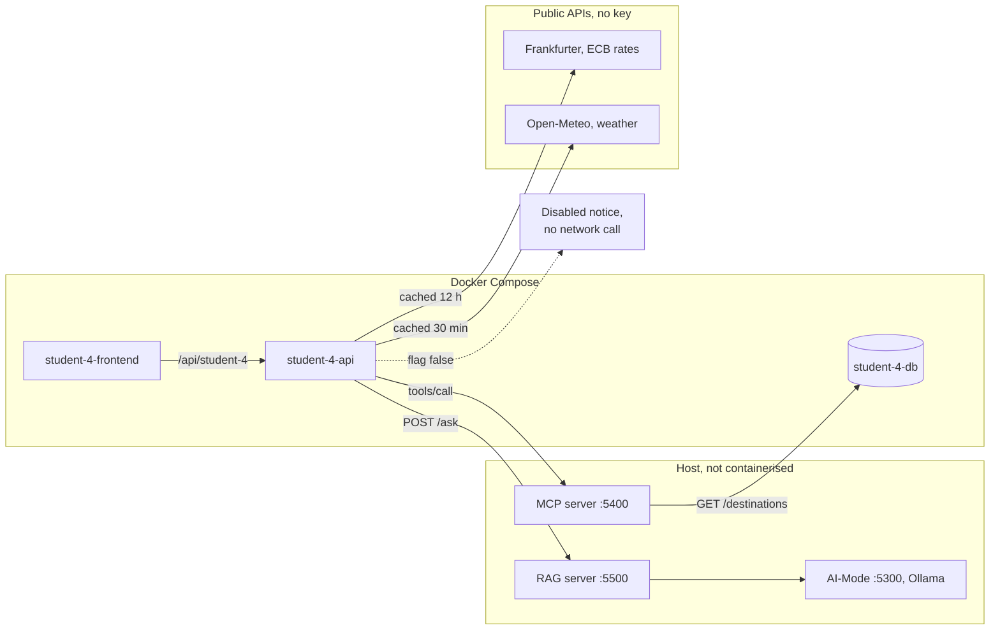

# Release 1 Technical Report - Group 25

**41026 Advanced Software Development, Spring 2026**
**Project: NextStop - Agentic AI travel planning application**

> Working draft. Export to PDF for submission as `group-25.pdf`.
> **Canvas accepts ONE group PDF, submitted by one person.** A duplicate group
> submission will not be marked.
>
> **Due: 4 October 2026, 11:59 PM AEST.**
>
> Section numbers below map 1:1 to the eight report sections in the Release 1
> brief, section 4. Sections marked **(Individual)** need one subsection per
> student; a missing individual subsection costs that student marks, not the
> group.
>
> **All five students must attend the Week 9 showcase. Non-attendance is 0.**

**GitHub Repository:** https://github.com/aurelia-sari/ads-assignment.git
**Showcase video:** _TODO - max 10 minutes_

---

## 1. Project overview and Release 1 scope

_Concise overview of the Release 0 application, then what Release 1 adds.
Must clearly separate each student's responsibilities from shared group ones._

### 1.1 Release 0 in brief

_2-3 paragraphs. Five features, each three containerised microservices; shared
AI-Mode; the two standing rules (each DB owns its schema; only AI-Mode talks to
Ollama)._

### 1.2 What Release 1 adds

| Addition | Kind | Owner |
|----------|------|-------|
| Shared local MCP server (:5400) | Group | Caroline |
| Shared local RAG server (:5500) | Group | Caroline |
| Agentic loop MCP + RAG validation modes | Group | Caroline |
| De-containerising AI-Mode, MCP, RAG, loop | Group | Caroline |
| MCP + RAG access from each feature's frontend via its backend/API | Individual | All five |
| `student-x.yml` updated, MCP/RAG disabled in CI | Individual | All five |

### 1.3 The containerisation boundary

_The key structural change. Release 1 requires AI-Mode, MCP, RAG and the agentic
loop to run on the host and NOT appear as docker-compose services. Explain
host.docker.internal in one direction, localhost in the other._

### 1.4 Per-student Release 1 scope **(Individual)**

_One short subsection per student: what their feature gained._

- **student-1 - Caroline Zhou (Trips & Itinerary)** - Trips & Itinerary reaches the shared MCP and RAG servers only through student-1-api. The MCP tools tab runs `list_trips` and `get_trip_itinerary` against student-1-db and shows boundary refusals by name. The Ask (grounded) tab answers trip-planning questions with citations and a confidence category, or an insufficient-context response. AI-Mode can now be switched off with `AI_MODE_ENABLED`, like MCP and RAG, so CI runs with all three disabled. Trip and itinerary CRUD and the Release 0 AI assistant are unchanged.
- **student-2 - Kevin Kim (Attractions & Dining)** - _TODO_
- **student-3 - Tanishpreet Kour (Travel Mate)** - _TODO_
- **student-4 - Aurelia Sari (Accounts & Guides)** - Travel Guides reaches the shared MCP and RAG servers only through student-4-api. MCP searches destinations with `lookup_destination_guide`, and RAG answers guide questions with citations and a confidence badge. Guides also load live exchange rates and weather after the page renders, falling back to seeded data.
- **student-5 - Aung Ko Khaing (Bookings & Budget)** - _TODO_

#### student-4 requirements

| ID | Requirement |
|----|-------------|
| R4-1 | `POST /mcp/destination-guide` proxies `lookup_destination_guide`, including boundary refusals |
| R4-2 | `POST /rag/ask` returns the answer, citations and confidence, or the insufficient-context reply |
| R4-3 | A disabled flag returns a clear notice without any network call. An unreachable service gives an unavailable notice, never a crash |
| R4-4 | Live rates (Frankfurter) with a converter, and live weather (Open-Meteo), load after the page renders, are cached and fall back to seeded data |
| R4-5 | The AI Assistant quotes the same live figures as the page and converts currency in code |
| R4-6 | Release 0 guides, accounts and AI Assistant keep working, and CI runs with MCP, RAG and live data disabled |

---

## 2. Release 1 requirements

_Functional requirements. Number them R1-n so validation in section 6 can cite
them._

### 2.1 Shared MCP server

| ID | Requirement |
|----|-------------|
| R1-1 | Runs locally, non-containerised, not a compose service |
| R1-2 | Exposes a registry of tools over JSON-RPC (`tools/list`, `tools/call`) |
| R1-3 | Accepts valid requests and returns structured results |
| R1-4 | Enforces declared tool boundaries and refuses calls that cross them |
| R1-5 | Every feature can invoke tools via its frontend UI through its backend/API |

### 2.2 Shared RAG server

| ID | Requirement |
|----|-------------|
| R1-6 | Runs locally, non-containerised, not a compose service |
| R1-7 | Retrieves relevant project context for a question |
| R1-8 | Generates answers grounded in retrieved context only |
| R1-9 | Every answer carries source citations |
| R1-10 | Every answer carries a confidence category |
| R1-11 | Returns an insufficient-context response when nothing relevant is retrieved |

### 2.3 Per-feature integration and the agentic loop

| ID | Requirement |
|----|-------------|
| R1-12 | Each feature's frontend reaches MCP and RAG only through its own backend/API |
| R1-13 | Release 0 functionality and AI-Mode keep working after the extension |
| R1-14 | Agentic loop gains separate MCP and RAG validation modes |
| R1-15 | Loop runs locally, non-containerised, and produces output for both modes |
| R1-16 | MCP and RAG integration retained but disabled during CI/CD |

---

## 3. Non-functional requirements

_The brief names nine areas and asks for measurable requirements where
practical. One row each; add the measure, not just the aspiration._

| # | Area | Requirement | How it is measured |
|---|------|-------------|--------------------|
| N1 | Security | _TODO_ | |
| N2 | MCP tool boundaries | Every tool call is read-only, allowlisted, schema-checked and row-capped | 6 boundary probes in the loop's MCP mode, each must be refused at the expected boundary |
| N3 | RAG grounding and traceability | Every grounded answer cites the passages it used | Citations non-empty whenever `grounded=true`; retrieval checks assert the top source |
| N4 | Reliability | _TODO_ | |
| N5 | Performance | _TODO - measure a /ask round trip locally_ | |
| N6 | Usability | _TODO_ | |
| N7 | Maintainability | _TODO_ | |
| N8 | Interoperability | _TODO_ | |
| N9 | Availability | _TODO - behaviour when a local AI service is down_ | |

---

## 4. Release 1 architecture

_Required: overall architecture diagram showing components, connections and the
containerisation boundary._

- [x] `docs/diagrams/release-1-architecture.mmd` (rendered: `docs/evidence/release-1-architecture.png`)
- [ ] Updated repository structure (mirror the README tree)

_Prose: what is containerised, what is not, and how the two halves connect._

---

## 5. MCP and RAG design

_Required: a flow diagram covering frontend/backend interactions, the RAG
retrieval and grounded-response process, and the MCP tool layer._

- [x] `docs/diagrams/mcp-rag-flow.mmd` (rendered: `docs/evidence/mcp-rag-flow.png`)

### 5.1 Registered MCP tools

| Tool | Owner | Reads from | Required args | Row limit |
|------|-------|-----------|---------------|-----------|
| `list_trips` | student-1 | student-1-db | none | 20 |
| `get_trip_itinerary` | student-1 | student-1-db | `trip_id` | 30 |
| `search_places` | student-2 | student-2-db | none | 20 |
| `find_travel_mates` | student-3 | student-3-db | none | 20 |
| `lookup_destination_guide` | student-4 | student-4-db | `query` | 20 |
| `search_flights` | student-5 | student-5-db | none | 20 |

### 5.2 Tool boundaries

| Boundary | Rule |
|----------|------|
| `registered` | The tool must exist in the registry |
| `read-only` | Only GET is issued upstream; `boundaries.py` offers no write path |
| `allowlisted` | The target must be the service the tool declared |
| `schema-checked` | Arguments must match the declared input schema |
| `capped` | Results truncated to the tool's row limit |

### 5.3 RAG retrieval and grounding

_Knowledge sources: 7 curated markdown files, 45 chunks. BM25, no embedding
model - justify: explainable citations, instant start on 8 GB, no extra model
dependency._

**Confidence categories** - computed from retrieval scores, not asked of the
model, because a small local model answers "high" almost unconditionally.

| Category | Rule |
|----------|------|
| `high` | top score >= 7.0, coverage >= 50%, >= 2 corroborating passages |
| `medium` | top score >= 4.0 **and** coverage >= 40% |
| `low` | above the 2.5 relevance floor but below medium |
| `insufficient` | nothing clears the relevance floor - no model call is made |

### 5.4 student-4 integration

The browser only ever calls student-4-api. `MCP_ENABLED`, `RAG_ENABLED` and `GUIDES_LIVE_DATA` each switch one path off. The seeded guide renders first and never waits for a live call.

---

## 6. Validation and results

_Required evidence, all three bullets:_

### 6.1 MCP and RAG through every feature's frontend UI and backend/API **(Individual)**

_One screenshot pair per student: an MCP tool result, and a grounded RAG answer
showing citations + confidence._

| Student | MCP interaction | RAG interaction |
|---------|-----------------|-----------------|
| student-1 | ✅ captured | ✅ captured |
| student-2 | ⬜ TODO | ⬜ TODO |
| student-3 | ⬜ TODO | ⬜ TODO |
| student-4 | ⬜ MCP Tools tab built, screenshot pending | ⬜ Ask (grounded) tab built, screenshot pending |
| student-5 | ⬜ TODO | ⬜ TODO |

### 6.2 Local terminal validation

_`curl` transcripts against :5400 and :5500 - health, tools/list, a tool call, a
boundary refusal, a grounded answer, an insufficient-context answer._

### 6.3 Agentic loop, both validation modes

- `docs/evidence/agentic-loop-release1-mcp-mode.md` - all 6 tools returned rows;
  all 6 boundary probes refused at the expected boundary
- `docs/evidence/agentic-loop-release1-rag-mode.md` - 5/5 retrieval checks hit
  the expected source; both insufficient-context checks correctly refused

### 6.4 Successful `student-x.yml` runs with MCP/RAG disabled **(Individual)**

| Workflow | Run link |
|----------|----------|
| student-1.yml | ✅ [run 36380145872](https://github.com/aurelia-sari/ads-assignment/actions/runs/36380145872) - AI-Mode, MCP and RAG disabled |
| student-2.yml | ⬜ TODO |
| student-3.yml | ⬜ TODO |
| student-4.yml | ⬜ Run link pending. Runs 97 unit tests, then the smoke test asserts disabled MCP, RAG and live data |
| student-5.yml | ⬜ TODO |

### 6.5 Deployment via the Release 0 docker-compose.yml

`docker compose up` deploys 19 containers: the 18 application containers
(shared frontend, API and database, plus each feature's frontend, backend/API
and database) and `mailpit`, student-4's local email service. AI-Mode, the MCP
server, the RAG server and the agentic loop do not appear in
`docker compose config --services`. Every backend/API gets `AI_MODE_URL`,
`MCP_SERVER_URL` and `RAG_SERVER_URL`, all pointing at `host.docker.internal`,
from the shared `x-api-env` block, extending the connection approach Release 0
used for AI-Mode. Evidence: `docs/evidence/release1-terminal-validation.md`
section 5.

---

## 7. Individual contributions **(Individual)**

_One log per student: feature updates, Release 1 work, integration and
validation activity, and identifiable commits._

| Student | Contribution | Commits |
|---------|-------------|---------|
| student-1 Caroline Zhou | Shared MCP + RAG servers, loop validation modes, de-containerisation, student-1 MCP/RAG integration, CI disable switches, architecture diagrams | See 7.1 |
| student-2 Kevin Kim | _TODO_ | |
| student-3 Tanishpreet Kour | _TODO_ | |
| student-4 Aurelia Sari | MCP and RAG proxy endpoints, MCP Tools and Ask (grounded) tabs and a CI pytest step (PR #31). Guide seeding with fixed ids and Australian and Japanese cities (PRs #34, #35). Live exchange rates, converter and AI conversions (PR #40). Live weather and city-timezone months (PR #41). RAG knowledge kept accurate (PR #32 and `chore/student-4-live-guides-docs`), with all loop probes still passing | PRs #31, #32, #34, #35, #40, #41 |
| student-5 Aung Ko Khaing | _TODO_ | |

### 7.1 student-1 - Caroline Zhou (Trips & Itinerary)

Merged to `main` through four pull requests. PR #26 was squash-merged; its
individual commits remain on the `release-1/shared-mcp-rag` branch.

| Date | Area | Work | Commit |
|------|------|------|--------|
| 11 Sep | Group | Shared MCP server (:5400): six read-only tools over JSON-RPC, boundary enforcement. Shared RAG server (:5500): BM25 retrieval, citations, score-derived confidence, insufficient-context response | [`a486755`](https://github.com/aurelia-sari/ads-assignment/commit/a486755) |
| 11 Sep | Group | Agentic loop MCP and RAG validation modes; AI-Mode, MCP, RAG and loop moved out of compose onto the host | [`ba7adbf`](https://github.com/aurelia-sari/ads-assignment/commit/ba7adbf) |
| 11 Sep | Group + feature | MCP and RAG disabled in CI via `MCP_ENABLED`/`RAG_ENABLED`; removed ai-mode service dropped from all five workflows | [`ead51a8`](https://github.com/aurelia-sari/ads-assignment/commit/ead51a8) |
| 11 Sep | Feature | student-1 frontend reaches MCP and RAG only through student-1-api: MCP tools and Ask (grounded) tabs | [`8e17d3a`](https://github.com/aurelia-sari/ads-assignment/commit/8e17d3a) |
| 11 Sep | Group | Release 1 topology in the README; loop runs in both modes captured as evidence; this report's scaffold | [`e819bda`](https://github.com/aurelia-sari/ads-assignment/commit/e819bda), [`6d348d5`](https://github.com/aurelia-sari/ads-assignment/commit/6d348d5), [`a9c15d2`](https://github.com/aurelia-sari/ads-assignment/commit/a9c15d2) |
| 11 Sep | Merge | PR #26 - all of the above | [`0bc3317`](https://github.com/aurelia-sari/ads-assignment/commit/0bc3317) |
| 28 Sep | Feature | `AI_MODE_ENABLED` switch so AI-Mode is also disabled in CI, as the brief requires (PR #27) | [`45b6510`](https://github.com/aurelia-sari/ads-assignment/commit/45b6510) |
| 28 Sep | Feature + validation | MCP and RAG tabs redesigned; panels moved inside the page shell; `get_trip_itinerary` result fixed; terminal validation of MCP and RAG, backend responses, CRUD smoke test and frontend screenshots captured (PR #28) | [`a925637`](https://github.com/aurelia-sari/ads-assignment/commit/a925637) |
| 28 Sep | Group | Release 1 architecture and MCP/RAG flow diagrams (PR #29) | [`5534cde`](https://github.com/aurelia-sari/ads-assignment/commit/5534cde) |

**Validation evidence:** `docs/evidence/release1-terminal-validation.md`,
`docs/evidence/student-1-*.png`, `docs/evidence/agentic-loop-release1-mcp-mode.md`,
`docs/evidence/agentic-loop-release1-rag-mode.md`. Passing `student-1.yml` run
with AI-Mode, MCP and RAG disabled: [run 36380145872](https://github.com/aurelia-sari/ads-assignment/actions/runs/36380145872).

---

## 8. Repository and showcase links

- **Repository:** https://github.com/aurelia-sari/ads-assignment.git
- **Showcase video:** _TODO_ (max 10 min; must show MCP + RAG through every
  feature's UI, terminal validation of both servers, and the loop in both modes)

---

## 9. Known issues and limitations

_Carry the Release 0 table format. Seeded from what Release 1 has already
surfaced:_

| ID | Issue | Likelihood | Impact | Mitigation | Owner |
|----|-------|-----------|--------|------------|-------|
| R1-A | The loop's OBSERVE step sometimes asserts facts not present in the collected evidence - one MCP run claimed `allow: get` appears in `nginx.conf`, which it never saw. The ACT evidence is collected by code and is accurate; the model's commentary drifts | Occasional | Low | Read ACT evidence as authoritative; OBSERVE is commentary. A larger review model reduces it | Caroline |
| R1-B | BM25 retrieval matches terms, not meaning - a question phrased entirely in synonyms of the corpus wording can fall below the relevance floor and be refused despite being covered | Occasional | Medium | Confidence and the refusal are honest about it; an embedding retriever is the fix if it proves to matter | Caroline |
| R1-C | The local AI services must be started separately from `docker compose up`. `dev.sh up` does it, but starting compose by hand leaves every AI path failing | Certain, by design | Low | Required by the brief - they cannot be compose services. Frontends show a clear unreachable notice naming the fix | Group |
| R4-A | `lookup_destination_guide` matches city and country only, so "Queensland" returns no rows | Occasional | Low | The input hint suggests a city or country | Aurelia |
| R4-B | The hand-written RAG knowledge can drift from the code, as it did twice | Occasional | Medium | Update it with every feature change and recheck the probes | Aurelia |
| R4-C | Release 0 guide endpoints return 503 fragments, which HTMX does not swap | Rare | Low | Return 200 notices, as the Release 1 and live endpoints do | Aurelia |
| R4-D | Live data depends on free external APIs, and Frankfurter can take 5 to 7 seconds | Occasional | Low | Caching, the last good data and a seeded fallback | Aurelia |
| R4-E | Book flights is hidden for Japan, since student-5 has no Japanese flights | Certain | Medium | Needs Japanese inventory in student-5 | Aurelia |
| R4-F | Model currency answers are validated loosely. One wrongly said cards work almost everywhere in Kyoto | Rare | Medium | Conversions are computed in code. A stricter validator is planned | Aurelia |
| R4-G | Monthly weather is seeded. Osaka, Kyoto and Nara share one set, and the Australian source is unnamed | Certain | Low | Labelled as long-term averages. Per-city JMA normals planned | Aurelia |
| R1-D | When a trip id is passed as live context, the small local model (llama3.2) sometimes cites an unrelated retrieved passage and leaves a stray citation marker, though the same question without a trip answers correctly | Occasional | Low | Live context is labelled separately from the cited passages. Ask without a trip for general questions; a larger model reduces it | Caroline |
| R1-E | The local model occasionally replies that it cannot answer even though relevant passages were retrieved and cited (1 in 7 runs of the same question in testing). Retrieval and confidence are computed by code and stay correct; only the generated text varies | Occasional | Low | Asking again normally succeeds. A lower temperature or a larger model would reduce it | Caroline |

---

## Appendix A: local execution constraints

_Required by the brief: "local execution constraints for MCP, RAG, and the
agentic loop". Ports 5300/5400/5500, the host venv, the one-`.env`-two-
perspectives rule, Ollama on 8 GB._
