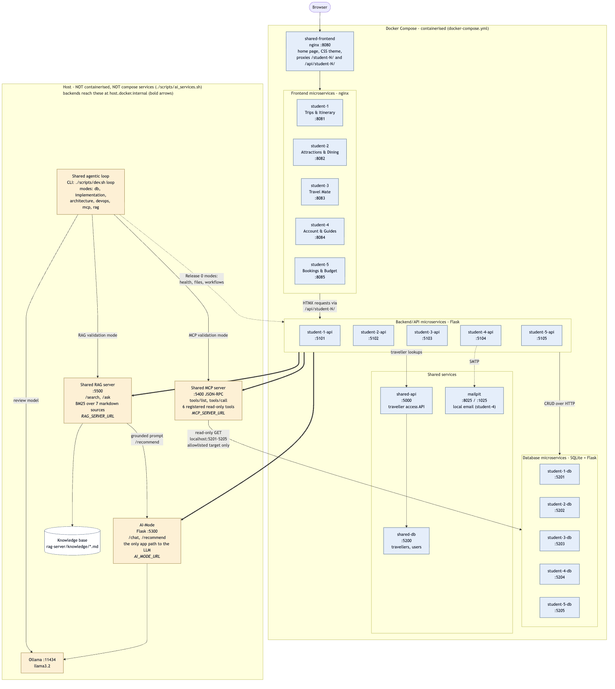
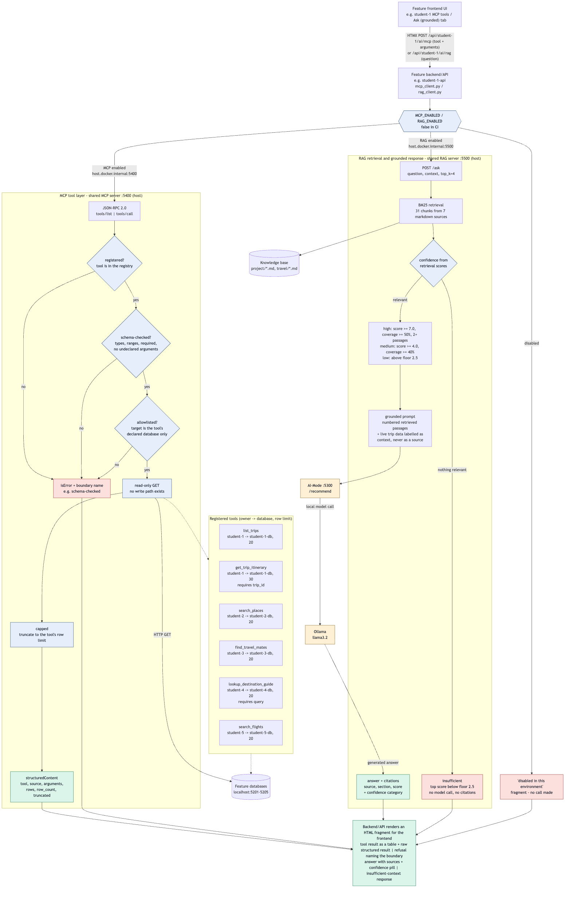
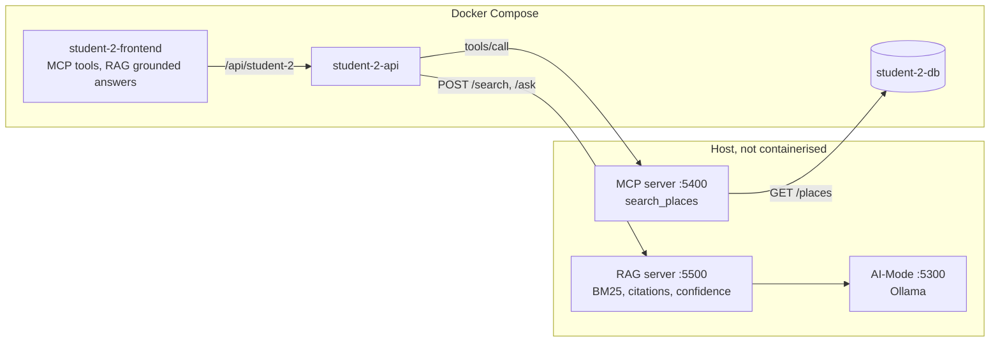
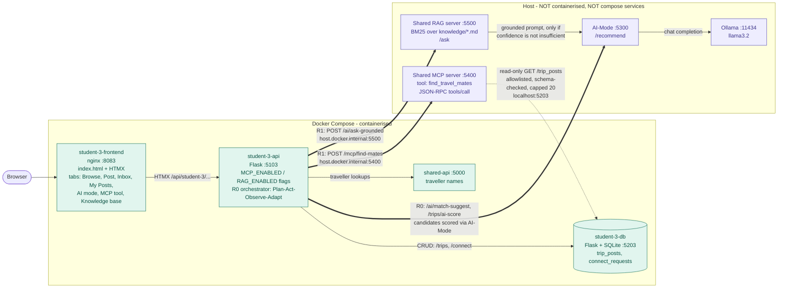
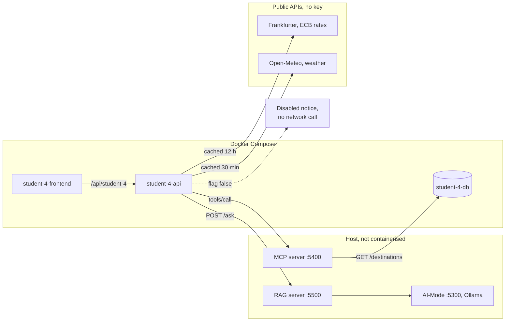

# Release 1 Technical Report - Group 25

**41026 Advanced Software Development, Spring 2026**
**Project: NextStop - Agentic AI travel planning application**

---

## 1. Project overview and Release 1 scope

### 1.1 Release 0 in brief

NextStop is a travel-planning application made of five student features: Trips
& Itinerary, Attractions & Dining, Travel Mate, Accounts & Guides, and Bookings
& Budget. Each is three containerised microservices (nginx + HTMX frontend,
Flask backend/API, Flask + SQLite database), joined by a shared frontend, API
and database and deployed by one `docker-compose.yml`. Each database owns its
schema, and only the shared AI-Mode service talks to the local LLM.

### 1.2 What Release 1 adds

| Addition | Kind | Owner |
|----------|------|-------|
| Shared local MCP server (:5400) | Group | Caroline |
| Shared local RAG server (:5500) | Group | Caroline |
| Agentic loop MCP + RAG validation modes | Group | Caroline |
| De-containerising AI-Mode, MCP, RAG, loop | Group | Caroline |
| MCP + RAG access from each feature's frontend via its backend/API | Individual | All five |
| `student-x.yml` updated, AI services disabled in CI | Individual | All five |

### 1.3 Per-student Release 1 scope **(Individual)**

- **student-1 - Caroline Zhou (Trips & Itinerary):** an MCP tools tab
  (`list_trips`, `get_trip_itinerary`, refusals shown by boundary) and an Ask
  (grounded) tab with citations, confidence and insufficient-context replies,
  both through student-1-api. `AI_MODE_ENABLED` added so CI disables all three
  AI services. Release 0 CRUD and AI assistant unchanged.
- **student-2 - Kevin Kim (Attractions & Dining):** MCP `search_places` and
  grounded RAG answers through student-2-api. Places, Favourites and AI Mode
  unchanged.

- **student-3 - Tanishpreet Kour (Travel Mate):** An MCP tool tab calling `find_travel_mates` and a grounded RAG Knowledge base tab (with citations, confidence, insufficient-context reply), both via `student-3-api` and disabled with a 503 notice when `MCP_ENABLED` / `RAG_ENABLED` are false, as in CI. The connect flow now has an in-card message thread (send, reply, delete sender's own) showing sender names from shared-api. Browse, Post, My Posts and the Release 0 AI match flow are unchanged.

- **student-4 - Aurelia Sari (Accounts & Guides):** MCP
  `lookup_destination_guide` and grounded RAG guide answers through
  student-4-api. Guides also load live exchange rates and weather, falling back
  to seeded data.
- **student-5 - Aung Ko Khaing (Bookings & Budget):** _TODO_

---

## 2. Release 1 requirements

### 2.1 Shared MCP server

| ID | Requirement |
|----|-------------|
| R1-1 | Runs locally, non-containerised, not a compose service |
| R1-2 | Exposes a tool registry over JSON-RPC (`tools/list`, `tools/call`) |
| R1-3 | Accepts valid requests and returns structured results |
| R1-4 | Enforces declared tool boundaries and refuses calls that cross them |
| R1-5 | Every feature invokes tools from its frontend through its backend/API |

### 2.2 Shared RAG server

| ID | Requirement |
|----|-------------|
| R1-6 | Runs locally, non-containerised, not a compose service |
| R1-7 | Retrieves relevant project context for a question |
| R1-8 | Generates answers grounded only in retrieved context |
| R1-9 | Every answer carries source citations |
| R1-10 | Every answer carries a confidence category |
| R1-11 | Returns an insufficient-context response when nothing relevant is retrieved |

### 2.3 Integration and the agentic loop

| ID | Requirement |
|----|-------------|
| R1-12 | Each frontend reaches MCP and RAG only through its own backend/API |
| R1-13 | Release 0 functionality and AI-Mode keep working |
| R1-14 | The agentic loop gains separate MCP and RAG validation modes |
| R1-15 | The loop runs locally, non-containerised, with output for both modes |
| R1-16 | MCP and RAG integration retained but disabled in CI/CD |

### 2.4 Per-feature requirements

| ID | Requirement |
|----|-------------|
| R2-1 | `POST /mcp/search-places` calls `search_places` (category, optional name) and returns the structured result |
| R2-2 | `POST /rag/search` and `POST /rag/ask` return context and a grounded answer with citations and confidence, or the insufficient-context reply |
| R2-3 | Unavailable services, timeouts and invalid requests return controlled errors |
| R4-1 | `POST /mcp/destination-guide` proxies `lookup_destination_guide`, including refusals |
| R4-2 | `POST /rag/ask` returns answer, citations and confidence, or the insufficient-context reply |
| R4-3 | A disabled flag returns a notice with no network call; an unreachable service returns a notice, never a crash |
| R4-4 | Live rates (Frankfurter, with converter) and weather (Open-Meteo) load after render, are cached, and fall back to seeded data |
| R4-5 | The AI Assistant quotes the page's live figures and converts currency in code |

---

## 3. Non-functional requirements

Measured on the reference machine (Apple M1, 8 GB, llama3.2).

| # | Area | Requirement | Measured |
|---|------|-------------|----------|
| N1 | Security | Browsers never reach AI services directly; tool arguments schema-checked before any read; output HTML-escaped; no secrets in git | Frontends call only `/api/student-N/`. `trip_id="1; DROP TABLE trips"` refused at `schema-checked`. `.env` gitignored. Gap: R1-F |
| N2 | MCP tool boundaries | Every call read-only, allowlisted, schema-checked, row-capped | All 6 loop boundary probes refused at the expected boundary |
| N3 | RAG grounding | Every grounded answer cites its passages | Citations present whenever `grounded=true`; 5/5 retrieval checks hit the expected source |
| N4 | Reliability | Every AI call has a timeout; failures return a notice, never a crash | Timeouts: MCP upstream 8 s, backend MCP 30 s, RAG generation 180 s |
| N5 | Performance | MCP call p95 < 500 ms; refusal < 100 ms; grounded answer < 10 s | MCP median 8 ms (13 ms via backend, n=20). Refusal 1-11 ms. Grounded median 3.7 s, max 6.8 s (n=8) |
| N6 | Usability | Answers show sources and confidence; refusals look different; outages name the fix | Screenshots (6.1). Outage notice: `start it with ./scripts/ai_services.sh up` |
| N7 | Maintainability | New tools and knowledge need no boundary or retrieval changes | A tool is one `@register` entry; a source is one markdown file |
| N8 | Interoperability | One protocol per service: MCP JSON-RPC 2.0 (protocol `2024-11-05`); RAG JSON over HTTP | The loop calls all 6 tools with no per-tool code |
| N9 | Availability | With an AI service down, Release 0 keeps working and the tab says what is down within 1 s | MCP, RAG, AI-Mode stopped in turn: notice in < 0.12 s, trip CRUD unaffected |

---

## 4. Release 1 architecture



Compose runs the containerised application: the shared frontend, API and
database, each feature's three microservices, and student-4's `mailpit`.
AI-Mode, MCP, RAG and the loop run on the host and are not compose services.
Backends reach them at `host.docker.internal`; the MCP server reads feature
databases back through their published `localhost` ports.

```text
ads-assignment/
├── .github/workflows/       student-1.yml .. student-5.yml
├── ai-services/             NOT containerised, run on the host
│   ├── ai-mode/             AI-Mode (:5300)
│   ├── mcp-server/          MCP server (:5400)
│   ├── rag-server/          RAG server (:5500), knowledge/ corpus
│   └── agentic-loop/        Plan -> Act -> Observe -> Adapt, MCP + RAG modes
├── docs/                    diagrams/, evidence/, this report
├── scripts/                 dev.sh, ai_services.sh, smoke_test.py
├── shared/                  home page, CSS theme, access API and DB
├── student-1/ .. student-5/ frontend/, api/, db/, tests/
└── docker-compose.yml       containerised services only
```

---

## 5. MCP and RAG design



### 5.1 Registered MCP tools

| Tool | Owner | Reads from | Required args | Row limit |
|------|-------|-----------|---------------|-----------|
| `list_trips` | student-1 | student-1-db | none | 20 |
| `get_trip_itinerary` | student-1 | student-1-db | `trip_id` | 30 |
| `search_places` | student-2 | student-2-db | `category`, `name` | 20 |
| `find_travel_mates` | student-3 | student-3-db | none | 20 |
| `lookup_destination_guide` | student-4 | student-4-db | `query` | 20 |
| `search_flights` | student-5 | student-5-db | none | 20 |

### 5.2 Tool boundaries

| Boundary | Rule |
|----------|------|
| `registered` | The tool must exist in the registry |
| `read-only` | Only GET is issued upstream; there is no write path |
| `allowlisted` | The target must be the tool's declared service |
| `schema-checked` | Arguments must match the declared schema |
| `capped` | Results truncated to the row limit |

### 5.3 RAG retrieval and grounding

Seven curated markdown files (45 chunks) are retrieved with BM25: citations stay
explainable, start-up is instant on 8 GB, and no embedding model is needed.
Confidence is computed from retrieval scores, because a small model rates
itself "high" almost unconditionally.

| Category | Rule |
|----------|------|
| `high` | top score >= 7.0, coverage >= 50%, >= 2 corroborating passages |
| `medium` | top score >= 4.0 **and** coverage >= 40% |
| `low` | above the 2.5 relevance floor but below medium |
| `insufficient` | below the floor, or one shared term covering under half the question - no model call |

### 5.4 student-2 integration


### 5.5 student-3 integration

**Travel Mate request flow and containerisation boundary.**
The frontend posts to `/api/student-3/...`, proxied by nginx to `student-3-api`. For MCP, the API sends a JSON-RPC `tools/call` to the shared server, which validates arguments against the tool schema (destination up to 60 characters, status enum), reads `student-3-db` over HTTP, caps results at 20 rows and returns `structuredContent` or an `isError` result naming the refusing boundary. For RAG, the API calls `/ask`: BM25 retrieval, a confidence category computed from scores, and generation through AI-Mode only when confidence is not insufficient. Only `student-3-db` opens `student3.db`.


### 5.6 student-4 integration



Each of `AI_MODE_ENABLED`, `MCP_ENABLED`, `RAG_ENABLED` and `GUIDES_LIVE_DATA`
switches one path off; the seeded guide never waits for a live call.

---

## 6. Validation and results

### 6.1 MCP and RAG through each feature's frontend and backend/API **(Individual)**

| Student | MCP interaction | RAG interaction |
|---------|-----------------|-----------------|
| student-1 | ✅ `student-1-mcp-list-trips.png` | ✅ `student-1-rag-grounded-answer.png`, `student-1-rag-insufficient-context.png` |
| student-2 | ✅ `student-2-release1-mcp.png` - `search_places` result via student-2-api | ✅ `student-2-release1-rag.png` - grounded answer with citations and confidence |
| student-3 | ✅ `student-3-release1-mcp.png` - `find_travel_mates` result via student-3-api; `student-3-release1-mcp-refused.png` - refusal for a destination over 60 characters | ✅ `student-3-release1-rag.png` - grounded answer with citations and confidence; `student-3-release1-rag-insufficient.png` - insufficient-context reply |
 |
| student-4 | ⬜ screenshot pending | ⬜ screenshot pending |
| student-5 | ⬜ TODO | ⬜ TODO |

`student-1-release0-trips.png` shows Release 0 trips still working.

`student-3-release0-browse.png` and `student-3-release1-thread.png` show Release 0 Browse and the new message thread working.

### 6.2 Local terminal validation

Transcripts: `docs/evidence/release1-terminal-validation.md`.

| Check | Result |
|-------|--------|
| MCP `/health`, `tools/list` | running, not containerised, 6 tools |
| MCP `tools/call` | `structuredContent` rows from student-1-db |
| MCP refusals | unregistered tool -> `registered`; bad and undeclared arguments -> `schema-checked` |
| RAG `/search` | BM25 scores and coverage per passage |
| RAG grounded `/ask` | 4 citations, confidence `high` |
| RAG insufficient `/ask` | `grounded=false`, no citations, `model=null` |
| Via student-1-api | same results as HTML fragments; Release 0 chatbot answering |

### 6.3 Agentic loop, both modes

- MCP mode (`agentic-loop-release1-mcp-mode.md`): all 6 tools returned rows; all
  6 boundary probes refused at the expected boundary.
- RAG mode (`agentic-loop-release1-rag-mode.md`): 5/5 retrieval checks hit the
  expected source; both insufficient-context checks refused.

### 6.4 `student-x.yml` runs with AI services disabled **(Individual)**

| Workflow | Run |
|----------|-----|
| student-1.yml | ✅ [36380145872](https://github.com/aurelia-sari/ads-assignment/actions/runs/36380145872) - AI-Mode, MCP, RAG disabled |
| student-2.yml | ✅ [36556065572](https://github.com/aurelia-sari/ads-assignment/actions/runs/36556065572) - MCP, RAG disabled; build, health, smoke tests passed |
| student-3.yml | ✅ [<run id>](https://github.com/aurelia-sari/ads-assignment/actions/runs/<run id>) - MCP, RAG disabled; build, health, smoke tests passed |
| student-4.yml | ⬜ link pending - 147 unit tests, smoke test asserts AI-Mode, MCP, RAG and live data disabled |
| student-5.yml | ⬜ TODO |

### 6.5 Deployment via the Release 0 docker-compose.yml

`docker compose up` deploys 19 containers: 18 application containers plus
`mailpit`. None of AI-Mode, MCP, RAG or the loop is a compose service. Every
backend gets `AI_MODE_URL`, `MCP_SERVER_URL` and `RAG_SERVER_URL` at
`host.docker.internal` from the shared `x-api-env` block, extending Release 0's
AI-Mode connection approach (transcripts, section 5).

### 6.6 student-3 feature validation **(Individual)**

After Release 1 the Travel Mate frontend, API and database containers still serve every Release 0 function. A trip posted in the UI appears in `student-3-db` and is gone after deletion in My Posts, and a message sent in the connect thread is stored in `connect_requests` and shown with the sender's name. `smoke_test.py` passes (CRUD, 10+ seeded records per table, wiring, 503 from MCP and RAG when `CI=true`), as do the unit tests with the shared servers stubbed.

| Layer | Evidence |
|-------|----------|
| Frontend | `student-3-release0-browse.png`, `-post.png`, `-inbox.png`, `-mine.png`, `-ai-mode.png`, `student-3-release1-thread.png` |
| Backend/API | `curl` of `:5103/health`, `/trips`, `/ai/status` |
| Through nginx | `curl localhost:<port>/api/student-3/trips` |
| Database | `curl :5203/health` (row counts) plus the UI-to-DB round trip screenshots |
| Automated | `smoke_test.py` output and the green `pytest` run |

---

## 7. Individual contributions **(Individual)**

| Student | Contribution | Commits |
|---------|-------------|---------|
| student-1 Caroline Zhou | Shared MCP + RAG servers, loop modes, de-containerisation, student-1 integration, CI switches, diagrams | 7.1 |
| student-2 Kevin Kim | MCP and RAG through student-2-api, frontend workflows, multi-city seeding, report | 7.2 |
| student-3 Tanishpreet Kour | MCP and RAG tabs and endpoints, RAG knowledge document (`travel-mate-matching.md`), connect message thread with sender names, MCP/RAG clients, CI switches, tests, student-3 evidence | 7.3 |
| student-4 Aurelia Sari | MCP/RAG endpoints, tabs and CI pytest step (#31); guide seeding with Australian and Japanese cities (#34, #35); live rates, converter and AI conversions (#40); live weather (#41); RAG knowledge kept accurate (#32) | PRs #31, #32, #34, #35, #40, #41 |
| student-5 Aung Ko Khaing | _TODO_ | |

### 7.1 student-1 - Caroline Zhou

PR #26 was squash-merged; its commits remain on `release-1/shared-mcp-rag`.

| Date | Work | Commit |
|------|------|--------|
| 11 Sep | MCP server: six read-only tools, boundary enforcement. RAG server: BM25, citations, confidence, insufficient-context | [`a486755`](https://github.com/aurelia-sari/ads-assignment/commit/a486755) |
| 11 Sep | Loop MCP and RAG modes; AI services moved out of compose | [`ba7adbf`](https://github.com/aurelia-sari/ads-assignment/commit/ba7adbf) |
| 11 Sep | MCP and RAG disabled in CI in all five workflows | [`ead51a8`](https://github.com/aurelia-sari/ads-assignment/commit/ead51a8) |
| 11 Sep | student-1 MCP tools and Ask (grounded) tabs via student-1-api | [`8e17d3a`](https://github.com/aurelia-sari/ads-assignment/commit/8e17d3a) |
| 11 Sep | README topology, loop evidence, report scaffold | [`e819bda`](https://github.com/aurelia-sari/ads-assignment/commit/e819bda), [`6d348d5`](https://github.com/aurelia-sari/ads-assignment/commit/6d348d5), [`a9c15d2`](https://github.com/aurelia-sari/ads-assignment/commit/a9c15d2) |
| 11 Sep | PR #26 merge | [`0bc3317`](https://github.com/aurelia-sari/ads-assignment/commit/0bc3317) |
| 28 Sep | `AI_MODE_ENABLED` CI switch (#27) | [`45b6510`](https://github.com/aurelia-sari/ads-assignment/commit/45b6510) |
| 28 Sep | Tab redesign, itinerary result fix, validation evidence (#28) | [`a925637`](https://github.com/aurelia-sari/ads-assignment/commit/a925637) |
| 28 Sep | Architecture and MCP/RAG flow diagrams (#29) | [`5534cde`](https://github.com/aurelia-sari/ads-assignment/commit/5534cde) |
| 4 Oct | Measured NFRs, terminal summary, Appendix A (#52) | [`501d3ae`](https://github.com/aurelia-sari/ads-assignment/commit/501d3ae) |
| 4 Oct | RAG single-term refusal fix (#50); outage notices shown in page (#51) | [`05f1084`](https://github.com/aurelia-sari/ads-assignment/commit/05f1084), [`1ac520e`](https://github.com/aurelia-sari/ads-assignment/commit/1ac520e) |

### 7.2 student-2 - Kevin Kim

| Date | Work | Commit |
|------|------|--------|
| 29 Sep | MCP `search_places` and RAG grounded answers through student-2-api; frontend workflows; places seeded across six cities (#30) | [`d0a0497`](https://github.com/aurelia-sari/ads-assignment/commit/d0a0497) |
| 1 Oct | Seeded place data and image URLs corrected (#36) | `Fixed init_db` |
| 2 Oct | Student-2 report sections and evidence (#48) | `docs(student-2): update Release 1 technical report` |

### 7.3 student-3 - Tanishpreet Kour

| Date | Work | Commit |
|------|------|--------|
| <date> | MCP route `/mcp/find-mates`, MCP tab, `mcp_client` | [`<hash>`](https://github.com/aurelia-sari/ads-assignment/commit/<hash>) |
| <date> | RAG route `/ai/ask-grounded`, Knowledge base tab, `rag_client` | [`<hash>`](https://github.com/aurelia-sari/ads-assignment/commit/<hash>) |
| <date> | Connect message thread and sender names via shared-api | [`<hash>`](https://github.com/aurelia-sari/ads-assignment/commit/<hash>) |
| <date> | `MCP_ENABLED` / `RAG_ENABLED` flags, `/ai/status`, 503 handling | [`<hash>`](https://github.com/aurelia-sari/ads-assignment/commit/<hash>) |
| <date> | `test_ai_tools.py`, `test_clients.py`, CI-aware smoke test | [`<hash>`](https://github.com/aurelia-sari/ads-assignment/commit/<hash>) |
| <date> | `student-3.yml` with MCP and RAG disabled | [`<hash>`](https://github.com/aurelia-sari/ads-assignment/commit/<hash>) |

---

## 8. Repository and showcase links

- **Repository:** https://github.com/aurelia-sari/ads-assignment.git
- **Showcase video (max 10 min):** https://drive.google.com/file/d/1x60FKDhiU1gznKfoVHy1eLSlX-3sdv6N/view?usp=sharing

---

## 9. Known issues and limitations

| ID | Issue | Likelihood | Impact | Mitigation | Owner |
|----|-------|-----------|--------|------------|-------|
| R1-A | Loop OBSERVE commentary can assert facts absent from the evidence | Occasional | Low | ACT evidence, collected by code, is authoritative | Caroline |
| R1-B | BM25 matches terms, not meaning; synonym-only questions can be refused | Occasional | Medium | Refusal is honest; an embedding retriever would fix it | Caroline |
| R1-C | AI services start separately from `docker compose up` | Certain | Low | Required by the brief; `dev.sh up` starts both; outage notice names the fix | Group |
| R1-D | With a trip as live context, llama3.2 sometimes cites an unrelated passage | Occasional | Low | Context is labelled non-citable; a larger model helps | Caroline |
| R1-E | The model occasionally declines despite relevant passages (1 in 7 test runs) | Occasional | Low | Retrying succeeds; retrieval and confidence stay correct | Caroline |
| R1-F | Host AI services listen on all interfaces without authentication | Possible | Medium | Local demo only; bind to `127.0.0.1` or add a token | Caroline |
| R2-A | Place data and RAG knowledge are maintained separately and can drift | Occasional | Medium | Update knowledge and reindex with data changes | Kevin |
| R2-B | `search_places` filters after reading the whole collection | Rare | Low | Row-capped, small data; move filtering into student-2-db if it grows | Kevin |
| R3-A | The API takes the traveller from a fixed `CURRENT_TRAVELLER_ID` setting, not the logged-in session, so every browser acts as the same user | Certain | Low | Set per environment in compose; read the student-4 session in the API once it is exposed | Tanishpreet |
| R3-B | The MCP tab only sends a destination; `status` is fixed to `open`, so the status check (open, matched, closed) is not reachable from the UI | Certain | Low | Shown through `curl` and the agentic loop's boundary probes instead | Tanishpreet |
| R3-C | Chat messages are stored as `connect_requests` rows and the thread is rebuilt in the API on every send, reply or delete | Certain | Low | Keeps the Release 0 schema untouched; a dedicated messages table would be the next step | Tanishpreet |
| R3-D | Sender names need one `shared-api` call per message, and fall back to "Unknown traveller" if it is down | Occasional | Low | 3 s timeout so the thread never hangs; names return once shared-api is back | Tanishpreet |
| R3-E | The Travel Mate knowledge document is written by hand, so answers can drift from how the feature really behaves | Occasional | Medium | Update it with each change to the connect flow and run `/reindex`; re-ask the sample questions | Tanishpreet |
| R3-F | Seeded trip posts stay `open` after their dates pass, so Browse and the AI scoring can include past trips | Certain | Low | Affects seed data only; filtering on end date is a small follow-up | Tanishpreet |
| R4-A | `lookup_destination_guide` matches city and country only, not regions | Occasional | Low | Input hint suggests a city or country | Aurelia |
| R4-B | Hand-written RAG knowledge can drift from the code (it did twice) | Occasional | Medium | Update with each change; recheck the probes | Aurelia |
| R4-C | Release 0 guide endpoints return 503 fragments HTMX does not swap | Rare | Low | Return 200 notices, as Release 1 endpoints do | Aurelia |
| R4-D | Live data relies on free APIs; Frankfurter can take 5-7 s | Occasional | Low | Caching, last good data, seeded fallback | Aurelia |
| R4-E | Resolved: Book flights cities, AI answers contradicting the guide, unsourced weather figures | - | Low | Fixed; checks are pattern-based | Aurelia |

---

## Appendix A: local execution constraints

- **Not containerised.** AI-Mode (:5300), MCP (:5400), RAG (:5500) and the loop
  run from `ai-services/.venv` (Python 3.9) via `./scripts/ai_services.sh`;
  `./scripts/dev.sh up` starts both halves.
- **One `.env`, two perspectives.** Host services use `localhost`; containers
  use `host.docker.internal`, which only resolves inside a container.
- **Ports.** 5300, 5400, 5500 and 11434 on the host; 8080-8085, 5000-5205 and
  8025/1025 for compose.
- **Model size.** On 8 GB, `llama3.2` (2 GB) is the largest workable model;
  `llama3.1:8b` swaps. The first answer is slow while the model loads.
- **Loop.** `./scripts/dev.sh loop mcp|rag|all` needs every service up and calls
  Ollama directly for its review model.
- **CI.** Each `student-x.yml` sets `AI_MODE_ENABLED`, `MCP_ENABLED` and
  `RAG_ENABLED` to `false`.

## Appendix B: student-3 repository structure

```text
student-3/
├── api/
│   ├── app.py
│   ├── Dockerfile
│   ├── requirements.txt
│   ├── agentic_loop/
│   │   ├── collectors/trip_collector.py
│   │   └── core/{classifier.py, orchestrator.py}
│   ├── services/
│   │   ├── ai_client.py  database_api.py  mcp_client.py
│   │   └── prompt_loader.py  rag_client.py
│   ├── views/ai_formatter.py
│   └── prompts/implementation/match_system.txt
├── db/
│   ├── app.py  init_db.py  requirements.txt  Dockerfile
├── frontend/
│   ├── Dockerfile  nginx.conf
│   └── templates/index.html
└── tests/
    ├── smoke_test.py
    ├── test_ai_tools.py  test_clients.py  test_agentic_loop.py
    └── README.md
```

The shared MCP server, RAG server, AI-Mode and agentic loop are under `ai-services/` (section 4). The Travel Mate RAG knowledge document is `ai-services/rag-server/knowledge/travel/travel-mate-matching.md`.