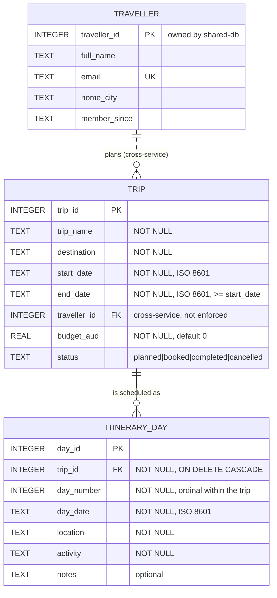

# Release 0 Technical Report - Group 25

**41026 Advanced Software Development, Spring 2026**
**Project: NextStop - Agentic AI travel planning application**

> Working draft. Export to PDF for submission - Canvas accepts one group PDF.
>
> **Due: 6 September 2026, 11:59 PM.** The specification PDF and the assignment
> description both say 30 August; the Canvas due-date field says 6 September,
> and that is the date that applies.
>
> Every section below is required by section 10.3 of the project
> specification. Sections marked **(Individual)** need one subsection per
> student; a missing individual subsection costs that student marks, not the
> group.

---

## 1. Project overview

**The problem.** Planning a multi-day trip means holding several disconnected
things in your head at once: where you are going and when, what you will do each
day, what it costs, and who is coming. Most people do this across a spreadsheet,
a notes app and a dozen browser tabs, and nothing reconciles. The failure is not
a missing tool - it is that the tools do not share data, so changing the dates
does not reach the itinerary or the budget.

**The application.** NextStop is a travel planning platform where those concerns
are separate services that do share data. A traveller plans a trip, builds a
day-by-day itinerary against it, discovers attractions and dining, tracks
bookings and budget, and finds a travel companion. An AI assistant runs locally
and answers questions grounded in the traveller's actual data rather than
offering general travel advice.

**Target user.** An independent traveller planning a trip of several days or
more, who wants the parts of the plan to stay consistent with each other.

**Scope of Release 0.** The foundation, not the finished product:

| In scope | Out of scope, and where it lands |
|----------|----------------------------------|
| Five features, each with frontend, backend/API and database microservices | Multi-Agent System - Release 2 |
| One integrated application from a single Docker Compose configuration | Cloud deployment - Release 2 |
| AI-Mode: a local LLM through Ollama, callable from the frontend | MCP and RAG servers - Release 1 |
| The shared Plan - Act - Observe - Adapt agentic workflow | Automated unit testing - Release 2 |
| Per-student CI that builds and validates each set of microservices | Real authentication - the account feature is scaffolded, not secured |

NextStop is a **multi-traveller platform**: a trip belongs to the traveller who
planned it. Release 0 has no authentication, so all trips are visible and
filterable by traveller. Once the account feature is complete, "my trips" becomes
a filter over the same data rather than a change to the model.

### 1.1 Team members and individual feature allocation

| Slot | Student | Feature | Frontend | Backend/API | Database |
|------|---------|---------|----------|-------------|----------|
| student-1 | Caroline Zhou | Trips & Itinerary (day-by-day) + AI chatbot | :8081 | :5101 | :5201 `trips`, `itinerary_days` |
| student-2 | Kevin Kim | Sightseeing, attractions, restaurants, recommendations | :8082 | :5102 | :5202 |
| student-3 | Tanishpreet Kour | Travel mate matching | :8083 | :5103 | :5203 |
| student-4 | Aurelia Sari | Auth, profile, onboarding, dashboard, travel guides | :8084 | :5104 | :5204 |
| student-5 | Aung Ko Khaing | Flights, hotels, car rentals, budget | :8085 | :5105 | :5205 |

For each feature the specification (section 2.4) requires a feature name, a
brief description, and a description of the frontend, backend/API, and database
microservices. *Each student writes their own row's detail.*

---

## 2. Project analysis and planning

### 2.1 Agile team project plan (Group)

**Team.** Five students, Canvas Group 25, working in one shared GitHub
repository.

**Allocation.** One feature per student, each owning three microservices, agreed
in the Project Group Registration Form. Ownership is recorded in `README.md`, in
a header comment in every generated source file, and on each feature page, so no
one has to remember it.

| Slot | Owner | Feature |
|------|-------|---------|
| student-1 | Caroline Zhou | Trips & Itinerary + AI assistant |
| student-2 | Kevin Kim | Attractions & Dining |
| student-3 | Tanishpreet Kour | Travel Mate |
| student-4 | Aurelia Sari | Account & Dashboard |
| student-5 | Aung Ko Khaing | Bookings & Budget |

**How work flows.** Trunk-based development against `main`, with every change
arriving through a pull request:

1. Branch from `main` as `student-N/<feature>`
2. Push and open a pull request
3. That student's GitHub Actions workflow builds their three microservices,
   starts them with the **shared** compose file, waits for health, and runs a
   full CRUD smoke test
4. Merge when green

Because CI runs against the shared compose file rather than a local copy, `main`
is always a working integrated application. That is what the specification means
by integrating incrementally, and it is what makes the rule that non-integrated
features score zero a non-issue rather than a risk.

**Boundaries that let five people work in parallel.** Each student edits only
their own `student-N/` directory and their own workflow file. `docker-compose.yml`,
`shared/` and `ai-services/` are shared, and changes there are announced first.
This is not theoretical: a change to the shared theme and to another student's
feature page broke four pages and one feature while CI stayed green. That
incident is recorded in 2.6 and is why the convention is now written down in
`docs/CONTRIBUTING.md`.

**Iterations.** Work is organised around the three release deadlines rather than
fixed-length sprints. The Release 0 iteration ran from Week 4 group registration
to the 6 September submission.

> **Team to confirm before submitting:** meeting cadence and days, where
> stand-ups happen (lab session or group chat), and how the backlog is tracked
> (GitHub Issues, a board, or the table in 2.2). Describe what actually
> happened - do not list ceremonies the team did not hold.

### 2.2 Sprint backlog (Group)

Release 0 backlog. Status reflects the repository as at 29 August 2026 and is
verifiable from the commit history and CI runs.

| ID | Item | Owner | Type | Status |
|----|------|-------|------|--------|
| G-01 | Shared repository with the structure required by specification 7.1 | Caroline | Group | Done |
| G-02 | One shared `docker-compose.yml` running the integrated application | Caroline | Group | Done |
| G-03 | Unified `index.html` routing to all five frontends | Caroline / Aung | Group | Done |
| G-04 | Shared CSS theme across all five features | Aung / Caroline | Group | Done |
| G-05 | Shared AI-Mode service using Ollama and an approved LLM | Caroline | Group | Done |
| G-06 | Plan - Act - Observe - Adapt agentic workflow | Caroline | Group | Done |
| G-07 | `student-1.yml` to `student-5.yml` CI workflows | Caroline | Group | Done |
| G-08 | Shared access API and database for traveller identity | Caroline | Group | Done |
| G-09 | Technical report | All | Group | In progress |
| G-10 | Showcase video, 10 minutes, all five students | All | Group | **Not started** |
| S1-1 | Trips CRUD: frontend, API, database | Caroline | Individual | Done |
| S1-2 | Itinerary days CRUD | Caroline | Individual | Done |
| S1-3 | AI assistant grounded in live trip data | Caroline | Individual | Done |
| S1-4 | Cross-feature traveller resolution via the shared API | Caroline | Individual | Done |
| S2-1 | Places, favourites and recommendations CRUD | Kevin | Individual | Done |
| S2-2 | AI integration for recommendations | Kevin | Individual | Done |
| S3-1 | Travel Mate schema and CRUD | TJ | Individual | **Scaffold only** |
| S4-1 | Account, profile and dashboard schema and CRUD | Aurelia | Individual | **Scaffold only** |
| S5-1 | Bookings and budget schema and CRUD | Aung | Individual | **Scaffold only** |
| S5-2 | Landing page design and shared theme | Aung | Individual | Done |

**Seeded record counts**, against the ten-per-table minimum in specification 2.4:

| Service | Tables | Rows |
|---------|--------|------|
| student-1 | `trips`, `itinerary_days` | 12, 15 |
| student-2 | `places`, `favourites`, `recommendations` | 15, 10, 10 |
| student-3 | `records` (placeholder) | 12 |
| student-4 | `records` (placeholder) | 12 |
| student-5 | `records` (placeholder) | 12 |
| shared | `travellers` | 12 |

Students 3, 4 and 5 currently hold the generated scaffold rather than their real
schema. The record counts satisfy the minimum, but the tables are placeholders,
which is recorded as known issue 1.

### 2.3 Overall project plan (Group)

| Release | Focus | Weight | Due | Showcase |
|---------|-------|--------|-----|----------|
| Release 0 | Microservices, AI-Mode, agentic loop, DevOps | 20% | 6 September 2026 | Week 6 |
| Release 1 | MCP, RAG, grounded AI responses | 30% | 27 September 2026 | Week 9 |
| Release 2 | Multi-Agent System, testing, cloud deployment | 30% | 18 October 2026 | Week 12 |

Each release extends the previous one; nothing is rebuilt.

**Release 1 - what Release 0 leaves for it**

| Item | Why it lands here |
|------|-------------------|
| MCP server | Required by specification 4.2 |
| RAG server and grounded responses | Required by specification 4.2 |
| Real schemas for students 3, 4 and 5 | Placeholders in Release 0 - known issue 1 |
| `trip_travellers` join table | Travel Mate matches companions to a trip, which a 1:many model cannot express - see 2.7 |
| Aggregates computed in the backend | Local models answer direct lookups correctly but miscompare across rows - known issue 3 |
| `budget_aud` as integer cents | Floating point is wrong for money before any arithmetic is added - see 2.7 |
| Authentication, so "my trips" is a real filter | Account feature is scaffolded, not secured |

**Release 2 - what it adds**

Multi-Agent System with Planner, Worker and Reviewer agents; pre-commit `pytest`
and post-commit AI-assisted unit testing in every workflow; `cloud-deployment.yml`;
and deployment to Azure or AWS with AI-Mode enabled and MCP, RAG and Multi-Agent
disabled.

**Critical path.** The team's own dependency, not the specification's: Release 1
cannot start cleanly until students 3, 4 and 5 replace their scaffolds, because
MCP and RAG have to expose real schemas. That work is the first thing on the
Release 1 board.

> **Team to confirm:** who owns MCP, who owns RAG, and the cloud platform choice
> for Release 2. Deciding the platform early matters - accounts and credentials
> take time to arrange.

### 2.4 Functional and non-functional requirements **(Individual)**

Each student adds their own requirements to the sprint backlog and lists them
here.

#### student-1 - Caroline Zhou

Functional:

| ID | Requirement | Acceptance criteria |
|----|-------------|---------------------|
| F1.1 | Create a trip with name, destination, dates, traveller, budget and status | Trip appears in the trip table with a generated ID |
| F1.2 | Read trips, filtered by destination, traveller or status | Filtered table returns only matching trips |
| F1.3 | Update any field of an existing trip | Changed values persist and redisplay |
| F1.4 | Delete a trip and its itinerary days | Trip and its days are both removed |
| F1.5 | Add, view, update and delete day-by-day itinerary entries for a trip | Days display in day-number order; edits persist and redisplay |
| F1.6 | Ask the AI chatbot a question grounded in real trip data | Answer references the traveller's actual trips |

Non-functional:

| ID | Requirement | How it is met |
|----|-------------|---------------|
| N1.1 | The backend never opens the SQLite file directly | All database access goes through `services/database_api.py` |
| N1.2 | A database or AI outage does not show a stack trace to the user | Routes catch `RequestException` and return a notice fragment |
| N1.3 | User-supplied text cannot inject HTML | All values pass through `html.escape` in `views/formatters.py` |
| N1.4 | The page matches the team UI | The page links `/shared/css/theme.css` only |

*students 2-5: add your subsections here.*

### 2.5 Feature plan **(Individual)**

#### student-1 - Caroline Zhou - Trips & Itinerary

**Scope.** A traveller creates a trip, builds a day-by-day itinerary against it,
and asks an AI chatbot questions grounded in that data. Two tables, both with
full CRUD, plus one AI surface.

**Why this order.** The work was sequenced bottom-up, so that every layer was
verifiable before anything depended on it. A frontend built against an unproven
API produces two suspects when something breaks.

| # | Task | Deliverable | Done |
|---|------|-------------|------|
| 1 | Database schema and seed | `trips` (12 rows), `itinerary_days` (15 rows) | 24 Aug |
| 2 | Database API | CRUD over HTTP on both tables, port 5201 | 24 Aug |
| 3 | Backend/API | HTMX fragments, `routes/` `services/` `views/` split | 24 Aug |
| 4 | Frontend | Three tabs, shared CSS theme | 24 Aug |
| 5 | AI-Mode integration | Chatbot grounded in live trip data | 24 Aug |
| 6 | CI workflow | `student-1.yml`, build + health + CRUD validation | 24 Aug |
| 7 | Cross-feature read | Resolve `traveller_id` via the shared access API | 24 Aug |
| 8 | Complete itinerary CRUD | Update on days, closing a gap found in review | 28 Aug |

**Design decisions worth defending.**

1. *One module owns database access.* Every call to `student-1-db` goes through
   `services/database_api.py`. The data-ownership rule is then checkable by
   reading one file rather than auditing every route.
2. *The backend returns HTML, not JSON.* HTMX swaps fragments directly, so
   there is no client-side rendering layer to keep in sync with the API.
3. *Cross-feature data is fetched, never copied.* A trip stores `traveller_id`
   and nothing else about the traveller. The name is resolved at render time
   from the shared access API, so there is one source of truth.
4. *Every external call degrades.* If the shared API is down the table shows
   `#7` instead of a name; if AI-Mode is down the chatbot returns a notice, not
   a stack trace. One service failing must not take the feature down.

**Deferred to Release 1.**

- Ground the chatbot in retrieved context via the RAG server, rather than the
  hand-built summary in `routes/ai_chat.py`
- Expose trips through the MCP server so other features can query them
- Reconcile itinerary days against Kevin's attractions, so a day can reference a
  real place rather than free text
- Server-side pagination once the trip count outgrows a single table

### 2.6 Risk management plan **(Individual)**

#### student-1 - Caroline Zhou

Risks are rated for their effect on **my** deliverable. Several already
occurred during Release 0, so this register records what actually happened and
what was put in place afterwards, rather than only what might.

**Risks that materialised**

| # | Risk | Impact | What happened | Response |
|---|------|--------|---------------|----------|
| R1 | A teammate's change breaks my feature | **High** | A design commit replaced my page with static markup. Every `hx-*` attribute and API call was removed. The feature looked fine and did nothing. | `smoke_test.py` now asserts each page carries HTMX attributes and calls its own API. Team convention agreed: a design change must preserve `hx-*` wiring. |
| R2 | Green CI while the feature is broken | **High** | The tests validated the API and database, never that the page called them. R1 passed CI. | Frontend wiring assertions added. Verified against the broken revision - it now fails. |
| R3 | A race-dependent bug survives testing | **High** | nginx resolved upstreams at startup, so the hub required all five frontends to exist. It passed repeatedly, then deadlocked when start order shifted. | All `proxy_pass` targets are variables, resolved per request. A missing service now 502s on its own route only. |
| R4 | Shared files edited in parallel | Medium | `theme.css` was replaced rather than extended, dropping 24 classes four other pages relied on. | Component layer restored on top of the new design. Convention agreed: extend the theme, never replace it. |
| R5 | Dependency version drift | Medium | `openai==1.51` passed `proxies=` to `httpx`, which 0.28 removed. AI-Mode crash-looped. | `httpx` pinned to 0.27.2. |
| R6 | Work built on a wrong assumption | Medium | The student-to-slot mapping was assumed rather than confirmed, and was wrong for four of five. | Corrected before anyone built on it. Ownership is now in the README, in file headers, and on each page. |

**Open risks**

| # | Risk | Likelihood | Impact | Mitigation | Owner |
|---|------|-----------|--------|------------|-------|
| R7 | Ollama not running at showcase, so every AI feature fails live | Medium | **High** | `dev.sh up` warns when port 11434 is unreachable. Starting Ollama is an explicit step in the demo script and is shown in the video. | Me |
| R8 | The demo machine cannot serve the model | Medium | **High** | Default is `qwen2.5:0.5b`, which runs on the 8 GB machine. `OLLAMA_MODEL` is per-machine, so no one is forced onto a model their laptop cannot run. | Me |
| R9 | The home page loads 8 images from `picsum.photos`; venue wifi fails | Medium | Medium | Copy the images into `shared/assets/` and serve them locally before the showcase. **Not yet done.** | Team |
| R10 | Cross-feature reference integrity | Low | Low | SQLite cannot enforce a reference across a service boundary, so a trip can point at a deleted traveller. Display degrades to `#<id>`. Accepted for Release 0; see ADR-001. | Me |
| R11 | Report evidence cannot be reconstructed after the fact | Medium | **High** | Screenshots, CI logs and loop run records are collected into `docs/evidence/` as work happens, not at the end. | Team |
| R12 | Integration slips because features are built in isolation | Low | **High** | The scaffold integrated all five slots from day one, and CI runs against the shared compose file rather than a local copy. | Team |

**What I would carry into Release 1.** R1, R2 and R3 share a shape: something
passed every check and was still broken, because the check tested a layer below
the one that mattered. The response in each case was to move the assertion up to
the layer a marker or user actually touches. Release 1 adds MCP and RAG, where
the same trap exists - a retrieval call can succeed and still return nothing
useful - so the tests need to assert on grounded output, not just on a 200.

### 2.7 Data design

The specification requires conceptual, ERD, logical and physical models. They
are given below as four distinct levels rather than four drawings of the same
thing: each adds a decision the previous level deliberately left open.

*Each student covers their own tables. student-1's models follow.*

#### 2.7.1 Conceptual model

Entities and relationships only - no attributes, no keys, no types.

Source: `docs/diagrams/student-1-conceptual.mmd`


Three entities. NextStop is a **multi-traveller platform**: a traveller plans
many trips, and each trip belongs to exactly one traveller, who is its planner.
A trip is scheduled as many itinerary days. **Only TRIP and ITINERARY_DAY are owned by student-1.**
TRAVELLER belongs to the shared access service, and that boundary is the single
most consequential fact in this model - it is why the traveller relationship
cannot be a foreign key.

#### 2.7.2 Entity-relationship diagram

Attributes, keys and cardinality.

Source: `docs/diagrams/student-1-erd.mmd`



The two relationship notations differ deliberately:

| Notation | Relationship | Meaning |
|----------|--------------|---------|
| `\|\|--o{` (solid) | TRIP to ITINERARY_DAY | Identifying, enforced in SQLite by a foreign key with `ON DELETE CASCADE` |
| `\|\|..o{` (dashed) | TRAVELLER to TRIP | Non-identifying and **not enforceable** - the entities live in different services and different SQLite files |

#### 2.7.3 Logical model

Relations, keys, domains and constraints, independent of any particular DBMS.

**TRIP**

| Attribute | Domain | Key | Constraint |
|-----------|--------|-----|------------|
| trip_id | integer | PK | surrogate, auto-assigned |
| trip_name | string(120) | | NOT NULL |
| destination | string(120) | | NOT NULL |
| start_date | date | | NOT NULL |
| end_date | date | | NOT NULL, `end_date >= start_date` |
| traveller_id | integer | FK → TRAVELLER | NOT NULL, **cross-service** |
| budget_aud | decimal(10,2) | | NOT NULL, default 0 |
| status | enum | | one of planned, booked, completed, cancelled |

**ITINERARY_DAY**

| Attribute | Domain | Key | Constraint |
|-----------|--------|-----|------------|
| day_id | integer | PK | surrogate, auto-assigned |
| trip_id | integer | FK → TRIP | NOT NULL, cascade on delete |
| day_number | integer | | NOT NULL, >= 1 |
| day_date | date | | NOT NULL |
| location | string(120) | | NOT NULL |
| activity | string(255) | | NOT NULL |
| notes | string(255) | | optional |

**Normalisation.** Both relations are in third normal form.

- *1NF* - every attribute is atomic. Itinerary days are rows, not a repeating
  group or a delimited list inside TRIP.
- *2NF* - both relations use a single-attribute surrogate primary key, so no
  partial dependency on part of a composite key is possible.
- *3NF* - no non-key attribute determines another. `destination` does not
  derive `budget_aud`; `day_number` does not derive `location`.

`traveller_id` is deliberately the *only* traveller attribute stored here.
Copying `full_name` into TRIP would denormalise across a service boundary and
create a second source of truth that could silently diverge from the shared
access database. The name is resolved at render time instead - see ADR-001.

#### 2.7.4 Physical model

The logical model realised in SQLite, which is what the specification mandates
for Release 0.

```sql
CREATE TABLE trips (
    trip_id      INTEGER PRIMARY KEY,
    trip_name    TEXT NOT NULL,
    destination  TEXT NOT NULL,
    start_date   TEXT NOT NULL,
    end_date     TEXT NOT NULL,
    traveller_id INTEGER NOT NULL,
    budget_aud   REAL NOT NULL DEFAULT 0,
    status       TEXT NOT NULL DEFAULT 'planned'
);

CREATE TABLE itinerary_days (
    day_id     INTEGER PRIMARY KEY,
    trip_id    INTEGER NOT NULL,
    day_number INTEGER NOT NULL,
    day_date   TEXT NOT NULL,
    location   TEXT NOT NULL,
    activity   TEXT NOT NULL,
    notes      TEXT DEFAULT '',
    FOREIGN KEY (trip_id) REFERENCES trips (trip_id) ON DELETE CASCADE
);
```

Seeded with **12 trips and 15 itinerary days**, above the ten-record minimum
required by specification section 2.4.

**Where the physical model departs from the logical model, and why**

| Logical | Physical | Reason |
|---------|----------|--------|
| `date` | `TEXT` | SQLite has no date type. ISO 8601 strings sort and compare correctly as text. |
| `enum` for status | `TEXT` + application check | SQLite has no enum. Validated in `db/app.py` against `VALID_STATUSES`. |
| `end_date >= start_date` | application check | Enforced in `validate_trip()` rather than as a table constraint. |
| `decimal(10,2)` | `REAL` | See the limitation below. |
| FK to TRAVELLER | none | The referenced table is in another service's database file. |

`PRAGMA foreign_keys = ON` is set on every connection, because SQLite does not
enforce foreign keys by default - without it the cascade would silently not
happen.

**Known limitations of the physical model**

1. **`budget_aud` is `REAL`.** Binary floating point is the wrong
   representation for money and can accumulate rounding error. Integer cents
   would be correct. Not changed for Release 0 because the field is only
   displayed and summed for presentation, never used in a financial
   calculation, but it should be fixed before any budgeting arithmetic is
   added in Release 1.
2. **No unique constraint on `(trip_id, day_number)`.** Confirmed by
   experiment: posting a second day numbered 1 to trip 1 returns `201`, leaving
   day numbers `[1, 1, 2, 3, 4]`. The UI sorts by `day_number`, so duplicates
   display in arbitrary order rather than failing loudly. A
   `UNIQUE (trip_id, day_number)` constraint is the fix, deferred to Release 1
   because it needs a migration of seeded data.
3. **No indexes beyond the primary keys.** At 12 and 15 rows this is
   irrelevant; `itinerary_days(trip_id)` would be the first index to add, since
   every itinerary view filters on it.

## 3. Repository structure

The repository follows the structure required by specification 7.1.

```
.
├── .github/workflows/       student-1.yml .. student-5.yml
├── ai-services/
│   ├── ai-mode/             shared AI-Mode service (Flask, :5300)
│   ├── agentic-loop/        Plan -> Act -> Observe -> Adapt loop
│   └── prompts/             prompt engineering artefacts
│       ├── implementation/  prompts the running application uses
│       └── review/          prompts the agentic loop uses
├── docs/
│   ├── diagrams/            architecture and data diagrams (Mermaid)
│   ├── evidence/            CI logs, agentic loop runs, screenshots
│   ├── ADR-001-service-boundaries.md
│   ├── CONTRIBUTING.md
│   └── technical-report.md
├── scripts/                 dev.sh, smoke_test.py, wait_for_health.py, scaffold_student.py
├── shared/                  unified index.html, CSS theme, access API, access DB
├── student-1/ .. student-5/ frontend/, api/, db/, tests/ per student
├── docker-compose.yml       one configuration for the whole application
├── .env.example
└── README.md
```

Each `student-N/` directory holds that student's three microservices:

```
student-N/
├── frontend/   nginx + HTMX page, links the shared CSS theme
├── api/        Flask backend/API returning HTMX fragments
├── db/         Flask + SQLite database API that owns its schema
└── tests/
```

**Separation of shared and individual components.** The specification requires a
clear boundary, and it is drawn so that it can be checked rather than trusted:

| Scope | Directories | Who edits |
|-------|-------------|-----------|
| Individual | `student-N/`, `.github/workflows/student-N.yml` | That student only |
| Shared | `shared/`, `ai-services/`, `scripts/`, `docker-compose.yml` | Anyone, announced first |

Two properties make the boundary hold. Each database service opens only its own
SQLite file, so cross-feature data must travel over HTTP. And in
`docker-compose.yml` each student's three services form one contiguous block, so
two people editing different features do not touch the same lines.

Directory names are fixed at `student-N/`. They were briefly renamed to include
owner names, which broke every build context and workflow path filter at once;
ownership is recorded in the README and in file headers instead.

---

## 4. Software architecture

### 4.1 Individual software architecture **(Individual)**

One diagram per student. student-1: `docs/diagrams/student-1-architecture.mmd`.

### 4.2 Integrated Release 0 software architecture

`docs/diagrams/integrated-architecture.mmd`.

Key decisions are recorded in `docs/ADR-001-service-boundaries.md`:

1. Each database service exclusively owns its schema; cross-feature data moves
   over HTTP only.
2. One shared AI-Mode service instead of five Ollama clients.
3. Ollama runs on the host by default, for RAM reasons.
4. One origin: `shared-frontend` reverse-proxies every student frontend and API.

### 4.3 Docker Compose architecture

`docs/diagrams/docker-compose-architecture.mmd`. Nineteen containers: three
shared, fifteen student, one shared AI service, plus the terminal-only
`agentic-loop` under the `tools` profile.

### 4.4 DevOps pipeline architecture

`docs/diagrams/devops-pipeline.mmd`.

---

## 5. Agentic AI

### 5.1 Plan -> Act -> Observe -> Adapt workflow

`docs/diagrams/agentic-loop.mmd`. The ACT step collects real evidence - live
HTTP calls and reads of the compose and workflow files - so OBSERVE reviews
facts rather than assumptions, and ADAPT's "next check" seeds the following
iteration.

### 5.2 AI-Mode implementation

| Item | Implementation |
|------|----------------|
| AI-Mode | `ai-services/ai-mode`, Flask on :5300 |
| Ollama runtime | Host, `host.docker.internal:11434/v1` |
| Approved LLM | `qwen2.5:0.5b` serving, `llama3.2:latest` for review |
| Request flow | Frontend -> Backend/API -> AI-Mode -> Ollama -> LLM |

### 5.3 Prompt engineering and context management

> **Marking criterion 5.** This criterion covers prompt engineering and context
> management *used during software development*, which is a different thing from
> the prompts the running application uses. Both are documented:
>
> | | Where |
> |---|-------|
> | AI **in** the product - AI-Mode, chatbot, agentic loop | this section and appendix A |
> | AI **for** development - Claude, used to build the microservices | **`docs/evidence/ai-assisted-development.md`** |
>
> The development-time document records the context sources used, how AI
> assistance mapped to each activity in specification section 4.4, the eight
> defects in AI-generated work that validation caught, and the prompting
> patterns that worked. Specification section 4.6 requires AI-generated work to
> be validated before submission; that document is the evidence it was.

#### 5.3.1 Prompts the running application uses

Prompt artefacts live in `ai-services/prompts/`, split into `implementation/`
(prompts the running application uses) and `review/` (prompts the agentic loop
uses).

| Prompt | Role |
|--------|------|
| `implementation/system_prompt.txt` | Chatbot persona and grounding rules |
| `implementation/chatbot_task_prompt.txt` | What the chatbot should do with a question |
| `implementation/chatbot_context_prompt.txt` | Schema and units the model can rely on |
| `review/planner_system_prompt.txt` | Reviewer persona for the agentic loop |
| `review/plan_prompt.txt` | PLAN step |
| `review/observe_prompt.txt` | OBSERVE step |
| `review/adapt_prompt.txt` | ADAPT step |
| `review/*_review_prompt.txt` | One per review target |

Context management: `routes/ai_chat.py` builds a plain-text summary of the
traveller's live trips and itinerary days and passes it as context, so the model
answers about trips that exist. When the database is unreachable the chatbot
answers without grounding rather than failing outright.

Three prompt iterations are documented in full in **appendix A**, each with the
observed failure, the change made and the measured result:

| | What went wrong | Fix |
|---|-----------------|-----|
| A.1 | The agentic loop's reviewer invented `schemaRepository.js`, `config.json` and Java files that do not exist | Grounding rules restricting it to files named verbatim in the evidence |
| A.2 | The assistant invented distances and per-day costs, and returned the wrong day | Grounding rules, a missing field added to the context, and a model change |
| A.4 | Model selection | `llama3.2` over `qwen2.5:0.5b` for accuracy, not speed |

A.2 is the useful one to read: three different causes produced the same symptom -
a confident wrong number - and only one of them was fixable by changing the
prompt.

### 5.4 Agentic loop workflow record

*Paste a run from `ai-services/agentic-loop/runs/` here, or reference the copy
in `docs/evidence/`. Each student identifies the prompts they contributed.*

---

## 6. DevOps and CI/CD

### 6.1 GitHub Actions workflow files

`student-1.yml` to `student-5.yml`. Each one:

1. checks out the shared repository
2. byte-compiles that student's source
3. validates the shared compose configuration
4. builds the student's three microservices
5. starts them with the shared compose file
6. waits for `/health` on the database, API, and AI-Mode
7. runs `scripts/smoke_test.py N` - full CRUD plus a fragment check
8. curls the frontend
9. dumps container logs on failure and always tears down

Triggers: pushes to `main` and pull requests touching that student's directory,
the shared directories, or `docker-compose.yml`.

### 6.2 GitHub Actions execution evidence

All five workflows passed on pull request #1 and again on `main` after the
merge - ten green runs, 57s to 1m8s each, on clean GitHub-hosted runners.

Full logs: **`docs/evidence/github-actions-execution.md`**, which for each
workflow records the run URL, trigger, commit, the three images built, the
compose start-up, the health wait, and the complete CRUD validation output.

| Workflow | Feature | Owner | Result |
|----------|---------|-------|--------|
| `student-1.yml` | Trips & Itinerary | Caroline Zhou | success |
| `student-2.yml` | Attractions & Dining | Kevin Kim | success |
| `student-3.yml` | Travel Mate | Tanishpreet Kour | success |
| `student-4.yml` | Account & Dashboard | Aurelia Sari | success |
| `student-5.yml` | Bookings & Budget | Aung Ko Khaing | success |

One detail worth drawing out for the architecture section: each workflow starts
only `shared-frontend` and that student's three services, yet the compose
start-up log shows `shared-db` and `shared-api` coming up as well. Docker
Compose resolved the `depends_on` chain, which is what allows the cross-feature
traveller lookup to be exercised in CI rather than only on a developer machine.

*Still to add: screenshots of the Actions tab and the PR checks view.*

### 6.3 Docker Compose execution evidence

*`docker compose up --build` output and `docker compose ps` showing all
containers up, into `docs/evidence/`.*

---

## 7. Implementation summary

**Group foundation.** One shared repository with the structure in section 3. An
integrated application of 18 containers from a single `docker-compose.yml`: five
sets of frontend, backend/API and database microservices, plus a shared frontend,
access API and access database, plus the AI-Mode service. A unified home page
routes to all five features on one origin. A shared CSS theme covers the landing
page and the feature pages. Five GitHub Actions workflows build and validate each
student's services against the shared compose file.

**AI.** `ai-services/ai-mode` is the only service that talks to Ollama; backends
call it over HTTP, giving one place for model selection, prompt loading and
failure handling. `ai-services/agentic-loop` implements Plan - Act - Observe -
Adapt over four review targets, collecting real evidence in the ACT step - live
HTTP calls and reads of the compose and workflow files - and writing a markdown
record per run.

**Per student**

| Student | Feature | Built |
|---------|---------|-------|
| student-1 Caroline | Trips & Itinerary | Two tables (12 trips, 15 itinerary days), full CRUD on both through frontend, API and database. AI assistant grounded in live trip data. Cross-feature traveller resolution from the shared access API, with a 30s cache and graceful degradation. |
| student-2 Kevin | Attractions & Dining | Three tables (`places` 15, `favourites` 10, `recommendations` 10), CRUD, AI integration through AI-Mode. |
| student-3 TJ | Travel Mate | Generated scaffold: working `records` CRUD trio, real schema outstanding. |
| student-4 Aurelia | Account & Dashboard | Generated scaffold: working `records` CRUD trio, real schema outstanding. |
| student-5 Aung | Bookings & Budget | Generated scaffold. Also designed the landing page and the shared CSS theme used across the application. |

**Integration properties worth stating.** Each database container owns its schema
and is the only process that opens its SQLite file; cross-feature data moves over
HTTP only. No service calls Ollama directly. A service that is down degrades its
own route rather than the application: the hub returns 502 for a missing feature
and stays up, and student-1's trip table renders with `#7` in place of a
traveller name when the shared access API is unreachable.

---

## 8. Testing evidence

### 8.1 Local testing evidence

```
$ python3 scripts/smoke_test.py 1
Smoke test: student-1
  ok  database service is healthy
  ok  backend/API service is healthy
  ok  GET /trips returns 200
  ok  /trips is seeded with at least 10 records (found 12)
  ok  POST /trips creates a record (201)
  ok  PUT /trips/13 updates it
  ok  DELETE /trips/13 removes it
  ok  GET /trips/13 is 404 after delete
  ok  backend/API returns an HTML fragment, not JSON

student-1 passed all checks.
```

*Add the runs for students 2-5.*

### 8.2 Screenshots of the integrated application

*To capture into `docs/evidence/` before submission:*

| # | Screenshot | Shows |
|---|------------|-------|
| 1 | Home page, full | Unified index routing to all five features |
| 2 | Home page integration status panel | 18 of 18 services up |
| 3 | student-1 trips table | CRUD, and traveller names resolved cross-service |
| 4 | student-1 itinerary for a trip | Second table, day-by-day |
| 5 | student-1 AI assistant answering | AI-Mode through Ollama, grounded |
| 6-9 | Each remaining student's feature | Every feature works in the integrated app |
| 10 | `docker compose ps` | All containers up |
| 11 | Agentic loop running in the terminal | Plan - Act - Observe - Adapt |
| 12 | GitHub Actions, five green workflows | CI evidence, alongside the logs already in `docs/evidence/` |

Take these from the integrated application at `http://localhost:8080`, not from
a feature's own port - the specification assesses features as part of the
integrated application.

---

## 9. Known issues and limitations

| # | Issue | Impact | Plan |
|---|-------|--------|------|
| 1 | Students 2-5 still hold the generated `records` scaffold rather than real feature schemas | Those features are not yet real | Each owner replaces their schema, routes and page |
| 2 | Ollama runs on the host, not in a container | Deployment has a manual prerequisite | Document in the video; containerise if RAM allows |
| 3 | Local models answer direct lookups correctly but fail aggregation across the full context - asked which of 12 trips has the smallest budget, `llama3.2` named a trip costing AUD 3,300 when the smallest is AUD 2,900 | An aggregate question gives a confidently wrong answer | Demonstrate direct lookups, which are reliable. A real fix computes aggregates in the backend and passes the answer as context, rather than asking the model to scan and compare. Release 1. |
| 4 | AI-Mode adds one hop over the specification's direct Backend -> Ollama flow | Deviation from the spec diagram | Justified in ADR-001 |
| 5 | Cross-feature referential integrity is advisory - SQLite cannot enforce a reference across service boundaries | A trip can point at a deleted traveller | Display degrades to `#<id>`; a reconciliation check is a Release 1 candidate |
| 6 | No automated tests beyond the smoke test | Limited regression cover | pytest is a Release 2 requirement |
| 7 | The agentic loop's ACT evidence is accurate, but `llama3.2:latest` (3B) still miscounts it and occasionally names files that do not exist | Review findings need a human check before being acted on | Tightened grounding prompts (Appendix A.1) removed the worst of it; a larger review model on a 16 GB machine is the real fix |

---

## 10. Project evidence

### 10.1 GitHub commit logs

```bash
git log --pretty=format:'%h %an %ad %s' --date=short
git shortlog -sn --all          # commits per author
```

Commits per author as at 29 August 2026:

| Author | Commits |
|--------|---------|
| caramelchew (Caroline Zhou) | 22 |
| Kevin-111-kim (Kevin Kim) | 7 |
| caro (Caroline Zhou, web edits) | 5 |
| AlvinKhaing (Aung Ko Khaing) | 1 |
| Aurelia Sari | 1 |

*Caroline appears under two identities because commits made through the GitHub
web editor use a different author name. Both are the same person.*

Full history, most recent first:

```
b099e38 caro 2026-08-29 Restore feature-page function, keep the new design, complete itinerary CRUD (#7)
b2678a0 AlvinKhaing 2026-08-28 Page Design and layout
33df5fb Kevin-111-kim 2026-08-25 Merge pull request #6 from aurelia-sari/student-2/attractions-dining-v1
db20b89 Kevin-111-kim 2026-08-25 Resolve main merge conflicts for student-2
a24a4dd Kevin-111-kim 2026-08-25 Fix student-2 feature and pass CI tests
546ebdd Kevin-111-kim 2026-08-25 Revert "Student 2 v0"
3d43d8c Kevin-111-kim 2026-08-25 Add Student 2 prompt directories
ab2d229 Kevin-111-kim 2026-08-25 Student 2 v0
f987f62 caro 2026-08-24 Merge pull request #3 from aurelia-sari/rename/nextstop
2ce6349 caramelchew 2026-08-24 Give the frontends a readiness probe, fixing a CI race
ed85ae4 caramelchew 2026-08-24 Rename the app to NextStop, and fix an nginx startup deadlock
f055a0f caro 2026-08-24 Update README.md
e64ef28 caro 2026-08-24 Merge pull request #2 from aurelia-sari/evidence/release-0-ci
3d0e451 caramelchew 2026-08-24 Add GitHub Actions execution evidence for Release 0
1860745 caro 2026-08-24 Merge pull request #1 from aurelia-sari/scaffold/release-0
0429a6c caramelchew 2026-08-24 Add cross-feature reads, and correct the student slot mapping
ce5cb28 caramelchew 2026-08-24 Ground the review prompts, fix false-negative health probes
863b714 caramelchew 2026-08-24 Scaffold Release 0: integrated microservices, AI-Mode, agentic loop, CI
2a8bae5 Aurelia Sari 2026-08-21 Initial commit
```

**Pull requests**

| # | Title | Author | Merged |
|---|-------|--------|--------|
| 7 | Restore feature-page function, keep the new design, complete itinerary CRUD | Caroline | 29 Aug |
| 6 | Student 2: attractions and dining | Kevin | 25 Aug |
| 3 | Rename to NextStop, fix an nginx startup deadlock | Caroline | 24 Aug |
| 2 | GitHub Actions execution evidence | Caroline | 24 Aug |
| 1 | Release 0 scaffold | Caroline | 24 Aug |

### 10.2 Contribution logs **(Individual)**

| Student | Contribution | Commits | Evidence |
|---------|--------------|---------|----------|
| Caroline Zhou | Repository scaffold and shared architecture; Trips & Itinerary feature (2 tables, full CRUD, AI chatbot); shared AI-Mode service; agentic loop; all five CI workflows; cross-feature read; ADR-001 | 8 | `git log --author=caramelchew` |
| Kevin Kim | Attractions & Dining feature: 3 tables (`places` 15, `favourites` 10, `recommendations` 10), CRUD, AI integration | 6 | PR #6 |
| Aung Ko Khaing | Landing page design and shared CSS theme (navy/cream palette, Poppins + Inter) | 1 | commit `b2678a0` |
| Tanishpreet Kour | *(to complete)* | | |
| Aurelia Sari | *(to complete)* | | |

Per-student commit counts:

```bash
git shortlog -sn --all
```

#### Caroline Zhou - detail

| Date | Contribution |
|------|--------------|
| 24 Aug | Repository scaffold: 18-container Compose stack, shared frontend/API/DB, AI-Mode service, agentic loop, 5 CI workflows, docs |
| 24 Aug | Trips & Itinerary: schema + seed, database API, backend/API, HTMX frontend, AI chatbot |
| 24 Aug | Cross-feature traveller resolution with caching and graceful degradation; corrected the student slot mapping |
| 24 Aug | Fixed an nginx startup deadlock and a CI readiness race |
| 28 Aug | Restored feature-page function after a design regression; added frontend wiring assertions to CI |
| 28 Aug | Completed CRUD on itinerary days |

### 10.3 Attendance checkpoints

> **Each student completes their own row set. This cannot be reconstructed from
> the repository - fill it in from what actually happened.** Week 6 showcase
> attendance is mandatory; the specification is explicit that non-attendance
> scores 0 for that student.

| Week | Date | Session | Caroline | Kevin | TJ | Aurelia | Aung |
|------|------|---------|----------|-------|----|---------|------|
| 1 | | Lab | | | | | |
| 2 | | Lab | | | | | |
| 3 | | Lab | | | | | |
| 4 | | Lab - group registration | | | | | |
| 5 | | Lab | | | | | |
| 6 | | **Showcase (mandatory)** | | | | | |

---

## 11. Showcase video

**Video URL:** *(paste the published URL here - required, 10 minutes max)*

The video must show:

- the integrated application running
- every student demonstrating their own feature
- deployment steps, including starting Ollama
- the agentic loop executing in the terminal
- the CI/CD pipeline

All five students must appear. All five must attend the Week 6 showcase -
non-attendance scores 0.

---

## Appendix A: prompt engineering iterations

These are iterations on the prompts the *product* uses. For prompt engineering
and context management during *development*, see
`docs/evidence/ai-assisted-development.md`.

Evidence for marking criterion 5 (prompt engineering and context management).

### A.1 Grounding the agentic loop's reviewer

**Problem observed.** The first version of `review/planner_system_prompt.txt`
described the reviewer's role but said nothing about what the project is made
of. Running the loop against the DevOps target with `llama3.2:latest`, the
model's ADAPT step proposed creating `schemaRepository.js`, adding settings to
`config.json`, and checking
`src/main/java/com/example/student/frontend/StudentFrontend.java` - none of
which exist. The ACT step's evidence was correct; the model invented a
JavaScript and Java codebase around it.

**Change.** Three additions to the prompts:

1. The system prompt now states the actual stack (Flask, nginx, HTMX, SQLite,
   GitHub Actions, Docker Compose) and adds explicit grounding rules, including
   "there are no .js, .json, or .java files in this project".
2. The OBSERVE prompt now forces a planned check that the evidence is silent
   about into ISSUE as "not shown by the evidence", rather than letting the
   model credit it as a PASS.
3. The ADAPT prompt now requires the proposed change to address something the
   observations actually flagged, and to say so when every check passed instead
   of inventing a defect.

**Why it matters.** The value of this loop is that ACT collects real evidence.
A model that invents filenames discards that advantage. Constraining the output
vocabulary to what appears in the evidence is what makes the review usable.

**Result.** The invented JavaScript and Java vocabulary disappeared, and the
model stayed within the project's real file names. It still miscounted the
services in `docker-compose.yml` and referred once to a `main.yml`. Prompt
grounding fixed the vocabulary problem but not the counting problem, which is
a capability limit of a 3B model rather than a prompt defect.

A sample run is committed at `docs/evidence/agentic-loop-sample-run.md`.

*To do: attach the before/after ADAPT output side by side for the report.*

### A.2 Stopping the chatbot inventing figures

**Problem observed.** With the first system prompt, the chatbot answered
questions about data it had not been given. Asked *"which of my trips has the
tightest budget for its length?"*, `qwen2.5:0.5b` replied that a trip "covers a
distance of 2026 kilometres and costs AUD 1,795 per day" - both invented, with
2026 taken from the year in a date. Asked what was planned on day 2, it returned
day 1's activity.

**Change 1 - the prompt.** The system prompt now leads with grounding rules that
override everything else: answer only from the supplied data, never state a
number that is not written verbatim in it, and say the information is not
recorded when it is absent. The task prompt tells the model to identify which
trip or day the question is about *before* answering.

*Result:* the day-2 question became correct on both models.

**Change 2 - the context had a hole.** Asked about budgets, the model had
nothing to work from: `build_context` listed every trip's name, destination,
dates and status but omitted `budget_aud`. The model filled the gap by
inventing. Prompt rules cannot fix missing data, only make the model admit it.
Budget is now included.

**Change 3 - the model.** Even with the tightened prompt, `qwen2.5:0.5b` still
invented kilometre figures for a question the data could not answer. `llama3.2`
answered *"This information is not recorded."* to the identical question, and
still responds in 2-8 seconds on the 8 GB machine, so it became the serving
model.

| Question | qwen2.5:0.5b | llama3.2 |
|----------|--------------|----------|
| What is planned on day 2? | correct after prompt fix | correct |
| How many kilometres will I travel? | invented per-day distances | **"This information is not recorded."** |
| Which trip has the smallest budget? | wrong | wrong |

**What is still not solved.** Both models fail the aggregation question. The
smallest budget is AUD 2,900; `llama3.2` names a trip at AUD 3,300. Scanning
twelve rows and comparing is not something a 3B model does reliably, and no
prompt fixed it. Recorded as known issue 3. The right fix is to compute the
aggregate in the backend and pass the answer as context, rather than asking the
model to do arithmetic - deferred to Release 1.

**The generalisable lesson.** Three different causes produced the same symptom:
a confident wrong number. One was a prompt that permitted invention, one was
missing context, one was model capability. Diagnosing which of the three you
have is the actual skill; changing the prompt only helps for the first.

### A.3 Grounding the traveller chatbot

`routes/ai_chat.py` builds a plain-text summary of the traveller's real trips
and itinerary days and passes it as context, so answers reference trips that
exist. `implementation/system_prompt.txt` adds two rules that matter for a
travel assistant: say so plainly when the data does not contain the answer, and
never claim to have made or changed a booking.

*To do: record an example answer with and without the grounding context.*

### A.4 Model selection

`llama3.2:latest` serves the application and also runs the review loop. It was
chosen over `qwen2.5:0.5b` for accuracy, not speed - see A.2. `llama3.1:8b`
remains unusable on the 8 GB machine, needing a 6.2 GB working set. The model is
configurable per machine through `.env`, because team hardware differs - see
ADR-001, decision 3.

*To do: note any further model changes and the reason for each.*
