# Release 0 Technical Report - Group 25

**41026 Advanced Software Development, Spring 2026**
**Project: NextStop - Agentic AI travel planning application**

> Working draft. Export to PDF for submission - Canvas accepts one group PDF.
>
> **Due: 6 September 2026, 11:59 PM.** The specification PDF and the assignment
> description both say 30 August; the Canvas due-date field says 6 September,
> and that is the date that applies.
>
> Every section below is required by section 10.3 of the project
> specification. Sections marked **(Individual)** need one subsection per
> student; a missing individual subsection costs that student marks, not the
> group.

**GitHub Repository:** https://github.com/aurelia-sari/ads-assignment.git

---

## 1. Project overview

**The problem.** Planning a multi-day trip means holding several disconnected
things in your head at once: where you are going and when, what you will do each
day, what it costs, and who is coming. Most people do this across a spreadsheet,
a notes app and a dozen browser tabs, and nothing reconciles. The failure is not
a missing tool - it is that the tools do not share data, so changing the dates
does not reach the itinerary or the budget.

**The application.** NextStop is a travel planning platform where those concerns
are separate services that do share data. A traveller plans a trip, builds a
day-by-day itinerary against it, discovers attractions and dining, tracks
bookings and budget, and finds a travel companion. An AI assistant runs locally
and answers questions grounded in the traveller's actual data rather than
offering general travel advice.

**Target user.** An independent traveller planning a trip of several days or
more, who wants the parts of the plan to stay consistent with each other.

**Scope of Release 0.** The foundation, not the finished product:

| In scope | Out of scope, and where it lands |
|----------|----------------------------------|
| Five features, each with frontend, backend/API and database microservices | Multi-Agent System - Release 2 |
| One integrated application from a single Docker Compose configuration | Cloud deployment - Release 2 |
| AI-Mode: a local LLM through Ollama, callable from the frontend | MCP and RAG servers - Release 1 |
| The shared Plan - Act - Observe - Adapt agentic workflow | Automated unit testing - Release 2 |
| Per-student CI that builds and validates each set of microservices | Real authentication - the account feature is scaffolded, not secured |

NextStop is a **multi-traveller platform**: a trip belongs to the traveller who
planned it. Release 0 has no authentication, so all trips are visible and
filterable by traveller. Once the account feature is complete, "my trips" becomes
a filter over the same data rather than a change to the model.

### 1.1 Team members and individual feature allocation

| Slot | Student | Feature | Frontend | Backend/API | Database |
|------|---------|---------|----------|-------------|----------|
| student-1 | Caroline Zhou | Trips & Itinerary (day-by-day) + AI chatbot | :8081 | :5101 | :5201 `trips`, `itinerary_days` |
| student-2 | Kevin Kim | Sightseeing, attractions, restaurants, recommendations | :8082 | :5102 | :5202 `places`, `favourites`, `recommendations` |
| student-3 | Tanishpreet Kour | Travel mate matching | :8083 | :5103 | :5203 `trip_posts`, `connect_requests` |
| student-4 | Aurelia Sari | Auth, profile, onboarding, travel guides | :8084 | :5104 | :5204 `destinations`, `currency_infos`, `transportation_infos`, `visa_requirements`, `weather_infos`, `safety_infos` |
| student-5 | Aung Ko Khaing | Flights, hotels, car rentals, budget | :8085 | :5105 | :5205 `flights`, `hotels`, `budgets`, `trip_selections`, `search_history` |

For each feature the specification (section 2.4) requires a feature name, a
brief description, and a description of the frontend, backend/API, and database
microservices. *Each student writes their own row's detail.*

---

## 2. Project analysis and planning

### 2.1 Agile team project plan (Group)

**Team.** Five students, Canvas Group 25, working in one shared GitHub
repository.

**Allocation.** One feature per student, each owning three microservices, agreed
in the Project Group Registration Form. Ownership is recorded in `README.md`, in
a header comment in every generated source file, and on each feature page, so no
one has to remember it.

| Slot | Owner | Feature |
|------|-------|---------|
| student-1 | Caroline Zhou | Trips & Itinerary + AI assistant |
| student-2 | Kevin Kim | Attractions & Dining |
| student-3 | Tanishpreet Kour | Travel Mate |
| student-4 | Aurelia Sari | Account & Dashboard |
| student-5 | Aung Ko Khaing | Bookings & Budget |

**How work flows.** Trunk-based development against `main`, with every change
arriving through a pull request:

1. Branch from `main` as `student-N/<feature>`
2. Push and open a pull request
3. That student's GitHub Actions workflow builds their three microservices,
   starts them with the **shared** compose file, waits for health, and runs a
   full CRUD smoke test
4. Merge when green

Because CI runs against the shared compose file rather than a local copy, `main`
is always a working integrated application. That is what the specification means
by integrating incrementally, and it is what makes the rule that non-integrated
features score zero a non-issue rather than a risk.

**Boundaries that let five people work in parallel.** Each student edits only
their own `student-N/` directory and their own workflow file. `docker-compose.yml`,
`shared/` and `ai-services/` are shared, and changes there are announced first.
This is not theoretical: a change to the shared theme and to another student's
feature page broke four pages and one feature while CI stayed green. That
incident is recorded in 2.6 and is why the convention is now written down in
`docs/CONTRIBUTING.md`.

**Iterations.** Work is organised around the three release deadlines rather than
fixed-length sprints. The Release 0 iteration ran from Week 4 group registration
to the 6 September submission.

> **Team to confirm before submitting:** meeting cadence and days, where
> stand-ups happen (lab session or group chat), and how the backlog is tracked
> (GitHub Issues, a board, or the table in 2.2). Describe what actually
> happened - do not list ceremonies the team did not hold.

### 2.2 Sprint backlog (Group)

Release 0 backlog. Status reflects the repository as at 29 August 2026 and is
verifiable from the commit history and CI runs.

| ID | Item | Owner | Type | Status |
|----|------|-------|------|--------|
| G-01 | Shared repository with the structure required by specification 7.1 | Caroline | Group | Done |
| G-02 | One shared `docker-compose.yml` running the integrated application | Caroline | Group | Done |
| G-03 | Unified `index.html` routing to all five frontends | Caroline / Aung | Group | Done |
| G-04 | Shared CSS theme across all five features | Aung / Caroline | Group | Done |
| G-05 | Shared AI-Mode service using Ollama and an approved LLM | Caroline | Group | Done |
| G-06 | Plan - Act - Observe - Adapt agentic workflow | Caroline | Group | Done |
| G-07 | `student-1.yml` to `student-5.yml` CI workflows | Caroline | Group | Done |
| G-08 | Shared access API and database for traveller identity | Caroline | Group | Done |
| G-09 | Technical report | All | Group | In progress |
| G-10 | Showcase video, 10 minutes, all five students | All | Group | **Not started** |
| S1-1 | Trips CRUD: frontend, API, database | Caroline | Individual | Done |
| S1-2 | Itinerary days CRUD | Caroline | Individual | Done |
| S1-3 | AI assistant grounded in live trip data | Caroline | Individual | Done |
| S1-4 | Cross-feature traveller resolution via the shared API | Caroline | Individual | Done |
| S2-1 | Places, favourites and recommendations CRUD | Kevin | Individual | Done |
| S2-2 | AI integration for recommendations | Kevin | Individual | Done |
| S2-3 | Shared user-ID alignment and final place-image integration | Kevin | Individual | Done |
| S3-1 | Travel Mate schema and CRUD | TJ | Individual | Done |
| S4-1 | Account schema (`users`, `access_logs`, both in shared-db) and sign-up flow | Aurelia | Individual | Done |
| S4-2 | Email verification: Mailpit delivery, single-use 5 min token, rate-limited resend | Aurelia | Individual | Done |
| S4-3 | Profile and dashboard CRUD | Aurelia | Individual | **Not started** |
| S5-1 | Bookings and budget schema and CRUD | Aung | Individual | Done |
| S5-2 | Landing page design and shared theme | Aung | Individual | Done |

**Seeded record counts**, against the ten-per-table minimum in specification 2.4:

| Service | Tables | Rows |
|---------|--------|------|
| student-1 | `trips`, `itinerary_days` | 12, 15 |
| student-2 | `places`, `favourites`, `recommendations` | 15, 10, 10 |
| student-3 | `trip_posts`, `connect_requests` | 12, 12 |
| student-4 | `destinations`, `currency_infos`, `transportation_infos`, `visa_requirements`, `weather_infos`, `safety_infos` | 13, 13, 51, 104, 156, 13 |
| student-5 | `flights`, `hotels`, `budgets`, `trip_selections`, `search_history` | 12 each |
| shared | `travellers`, `users`, `access_logs` | 12, 10, 10 |

Every table meets the ten-record minimum in specification 2.4, and every
student's database microservice owns a schema.

Identity is the one deliberate exception to feature ownership: `users` and
`access_logs` sit in `shared-db` rather than in `student-4-db`, because a user's
identity and session state are data every feature needs. Student-4's own
feature data - the Travel Guides schema - lives in `student-4-db`. The
reasoning is in 2.7 and ADR-001. student-4 replaced its scaffold with a real
sign-up/verification flow, but `users` and `access_logs` were deliberately moved
into shared-db rather than kept in student-4-db. student-4-db owns the Travel Guides
schema (destinations, currency, transportation, visa, weather and safety), all
seeded from the Australian cities used as flight and hotel destinations in student-5.

### 2.3 Overall project plan (Group)

| Release | Focus | Weight | Due | Showcase |
|---------|-------|--------|-----|----------|
| Release 0 | Microservices, AI-Mode, agentic loop, DevOps | 20% | 6 September 2026 | Week 6 |
| Release 1 | MCP, RAG, grounded AI responses | 30% | 27 September 2026 | Week 9 |
| Release 2 | Multi-Agent System, testing, cloud deployment | 30% | 18 October 2026 | Week 12 |

Each release extends the previous one; nothing is rebuilt.

**Release 1 - what Release 0 leaves for it**

| Item | Why it lands here |
|------|-------------------|
| MCP server | Required by specification 4.2 |
| RAG server and grounded responses | Required by specification 4.2 |
| Real schemas for students 3, 4 and 5 | Placeholders in Release 0 - known issue 1 |
| `trip_travellers` join table | Travel Mate matches companions to a trip, which a 1:many model cannot express - see 2.7 |
| Aggregates computed in the backend | Local models answer direct lookups correctly but miscompare across rows - known issue 3 |
| `budget_aud` as integer cents | Floating point is wrong for money before any arithmetic is added - see 2.7 |
| Authentication, so "my trips" is a real filter | Account feature is scaffolded, not secured |

**Release 2 - what it adds**

Multi-Agent System with Planner, Worker and Reviewer agents; pre-commit `pytest`
and post-commit AI-assisted unit testing in every workflow; `cloud-deployment.yml`;
and deployment to Azure or AWS with AI-Mode enabled and MCP, RAG and Multi-Agent
disabled.

**Critical path.** The team's own dependency, not the specification's: Release 1
cannot start cleanly until students 3, 4 and 5 replace their scaffolds, because
MCP and RAG have to expose real schemas. That work is the first thing on the
Release 1 board.

Task ownership for Releases 1 and 2 is not allocated here. The Release 0
requirements ask for an overall project plan, not a work breakdown of later
releases, and allocating work this far ahead of the features it depends on would
be guesswork rather than planning.

### 2.4 Functional and non-functional requirements **(Individual)**

Each student adds their own requirements to the sprint backlog and lists them
here.

#### student-1 - Caroline Zhou

Functional:

| ID | Requirement | Acceptance criteria |
|----|-------------|---------------------|
| F1.1 | Create a trip with name, destination, dates, traveller, budget and status | Trip appears in the trip table with a generated ID |
| F1.2 | Read trips, filtered by destination, traveller or status | Filtered table returns only matching trips |
| F1.3 | Update any field of an existing trip | Changed values persist and redisplay |
| F1.4 | Delete a trip and its itinerary days | Trip and its days are both removed |
| F1.5 | Add, view, update and delete day-by-day itinerary entries for a trip | Days display in day-number order; edits persist and redisplay |
| F1.6 | Ask the AI chatbot a question grounded in real trip data | Answer references the traveller's actual trips |

Non-functional:

| ID | Requirement | How it is met |
|----|-------------|---------------|
| N1.1 | The backend never opens the SQLite file directly | All database access goes through `services/database_api.py` |
| N1.2 | A database or AI outage does not show a stack trace to the user | Routes catch `RequestException` and return a notice fragment |
| N1.3 | User-supplied text cannot inject HTML | All values pass through `html.escape` in `views/formatters.py` |
| N1.4 | The page matches the team UI | The page links `/shared/css/theme.css` only |

#### student-2 - Kevin Kim

Functional:

| ID | Requirement | Acceptance criteria |
|----|-------------|---------------------|
| F2.1 | View the available attractions and restaurants | `GET /places` returns the seeded place records and the frontend displays them as place cards |
| F2.2 | Create a new place | A valid place submitted through the frontend/API is stored by student-2-db and appears in the places view with a generated ID |
| F2.3 | Update an existing place | Changes to an existing place persist in student-2-db and are shown when the places view is refreshed |
| F2.4 | Delete an existing place | The selected place is removed and any favourites referencing it are removed by the database `ON DELETE CASCADE` relationship |
| F2.5 | Add a place to a traveller's favourites | The selected place is stored in `favourites` with the current shared user ID and appears in the favourites view |
| F2.6 | View and remove favourites | Favourites for the current user can be displayed and individually removed |
| F2.7 | Ask for an AI-based attraction or dining recommendation | A natural-language question is sent from the frontend through student-2-api to the shared AI-Mode service and a recommendation is returned |
| F2.8 | Ground AI recommendations in real place data | The recommendation pipeline selects candidate records from the live `places` data before invoking the LLM, and the response is validated against those candidates |
| F2.9 | Store AI recommendation history | Each completed recommendation request is persisted in `recommendations` with the user ID, question, location and recommendation result |
| F2.10 | Associate favourites and recommendations with the shared user identity | `favourites.user_id` and `recommendations.user_id` use the integer identifier owned by shared-db rather than feature-specific string identities |

Non-functional:

| ID | Requirement | How it is met |
|----|-------------|---------------|
| N2.1 | The backend must not access the SQLite file directly | All student-2-api database operations go through `services/database_api.py` and the student-2 database API over HTTP |
| N2.2 | Student 2 must not call Ollama directly | AI requests are sent to the shared AI-Mode service, which is the single application-level gateway to Ollama |
| N2.3 | AI recommendations must be grounded and constrained | Deterministic filtering selects relevant candidate places before the LLM call, and the validator checks returned place names against the canonical candidate records |
| N2.4 | A dependency failure must not expose an application stack trace to the traveller | API/database/AI failures are converted into controlled error responses or frontend fragments rather than raw exceptions |
| N2.5 | Cross-feature identity data must not be duplicated | Student 2 stores only the shared integer `user_id`; the USER record itself remains owned by shared-db and no cross-database SQLite foreign key is created |
| N2.6 | The feature must use the integrated team interface | The Student 2 frontend uses the shared NextStop theme and is accessible through the shared frontend reverse proxy |
| N2.7 | External image availability must not determine whether the feature can be demonstrated | Final place imagery uses stable matching assets rather than random `picsum.photos` placeholders |

#### student-3 - Tanishpreet kour
Functional:
 
| ID | Requirement | Acceptance criteria |
|----|-------------|---------------------|
| F3.1 | Post a trip looking for a travel companion, with destination, dates, travel style and an optional note | A valid submission creates a row in `trip_posts` with a generated `post_id` and `status = "open"`, and appears in Browse |
| F3.2 | Browse open trip posts, filtered by destination | `GET /trip_posts?destination=` returns only posts whose destination contains the given text, case-insensitive |
| F3.3 | View a single trip post | `GET /trip_posts/<id>` returns that post's full detail, or 'trip not found' if it doesn't exist |
| F3.4 | Update any field of an existing trip post | Changed values persist and redisplay in Browse and My Posts |
| F3.5 | Delete a trip post | The post and any connect requests referencing it (`ON DELETE CASCADE`) are both removed |
| F3.6 | Send a "Say Hi" connect request to another traveller's open post | A row is created in `connect_requests` with `status = "pending"`, and the button shows "Requested" |
| F3.7 | View incoming and outgoing connect requests separately | Incoming shows requests against the current traveller's own posts; outgoing shows requests the current traveller has sent |
| F3.8 | Accept or decline an incoming request | `PUT /connect_requests/<id>` updates `status` to `accepted` or `declined` and the row re-renders with the new status pill |
| F3.9 | Withdraw a pending outgoing request | `DELETE /connect_requests/<id>` removes the row entirely |
| F3.10 | Ask the AI to score compatibility against the traveller's own open post | A free-text question sent to `/ai/match-suggest` returns a scored, reasoned match for each relevant candidate post |
| F3.11 | See AI compatibility scores directly on Browse cards, on demand | The "Get AI Matches" button scores every currently visible card without requiring the separate AI mode tab |
 
Non-functional:
 
| ID | Requirement | How it is met |
|----|-------------|---------------|
| N3.1 | The backend never opens the SQLite file directly | All access to `trip_posts`/`connect_requests` goes through `student-3-db`'s REST API, called only from `DB_SERVICE_URL` |
| N3.2 | No direct call to Ollama | `call_ollama_match()` calls the shared AI-Mode service's `/recommend` endpoint, the same boundary every other feature describes |
| N3.3 | A database or AI outage does not show a stack trace to the user | Routes catch `requests.RequestException`/`ValueError`/`json.JSONDecodeError` and return a plain-language notice fragment instead |
| N3.4 | The page matches the team UI | The page links `/shared/css/theme.css` only |
| N3.5 | LLM output is treated as untrusted output, not trusted structure | `call_ollama_match()` normalises a wrapped object, a single object instead of a list, and rejects an empty result rather than assuming the model returned a bare JSON array |
| N3.6 | Destination matching tolerates how a place name is actually typed | Matching is substring-based against every comma-separated part of a destination, so a question naming either a city or a country still matches a post stored as `"City, Country"` |

#### student-4 - Aurelia Sari

Functional:

| ID | Requirement | Acceptance criteria |
|----|-------------|---------------------|
| F4.1 | Create an account with name, email and password | Account appears in `users` (shared-db) with a generated ID, `is_validated = 0` |
| F4.2 | Reject a sign-up whose email is already registered | `POST /auth/register` returns 409 with "This email is already associated with an account." |
| F4.3 | Reject a password that fails the strength rules | 400 response naming the 8-64 char / upper / lower / number / special rule, both client- and server-side |
| F4.4 | Require agreement to Terms and Conditions before an account can be created | Checkbox required client-side; `POST /auth/register` returns 400 if `terms_accepted` is missing or false |
| F4.5 | Send a one-time verification email and let the user confirm it | Email arrives in Mailpit, visiting the link marks `is_validated = 1` |
| F4.6 | Expire a verification link after 5 minutes and allow only one use | Expired token returns 410; a reused token returns 404 |
| F4.7 | Let the user request another verification email if they didn't get one | "Resend" on the pending page issues a fresh token and email |
| F4.8 | Rate-limit resend requests | At most 5 resends per window, 60s apart, then a 10 minute block before the window resets |
| F4.9 | Sign in with email and password | `POST /auth/login` returns 200 with the user record on a correct password against a verified account |
| F4.10 | Refuse an unverified account at sign-in, and send a fresh verification email rather than leaving the user stuck | 403 with `error_code: "email_not_verified"`; a fresh email sends unless the 60s resend cooldown from 4.8 is still active |
| F4.11 | Record every successful sign-in | A `POST /access-logs` row is written (`user_id`, `sign_in_at`, `in_session = 1`) before `/auth/login` responds |
| F4.12 | Sign out, closing the session other features can see | `POST /auth/logout` and `GET /auth/status/<id>` in student-4-api close and expose the session (see ADR-001 Decision 6) |
| F4.13 | Require a valid session before the dashboard or any other feature page renders | Visiting the landing page or a feature page without a session redirects to the sign in page instead of showing content. A valid session shows the page normally |
| F4.14 | Answer a Travel Guides question about currency, transportation, visa, weather or safety, naming the city inside the question itself | `POST /ai/guide-chat` resolves the destination from the question text, grounds its answer only in that destination's real data, and never calls the model at all when the data is missing |
| F4.15 | Redirect a question that belongs to another feature, instead of guessing at an answer this feature does not own | A question matching a `feature_redirect_map` keyword (book a flight, food, travel mate and so on) returns a clickable link to that feature instead of a guide answer |
| F4.16 | Keep a chat history per user, resumable and deletable | `GET /users/<id>/guide-chat-sessions` lists past chats, `GET /ai/guide-chat/session/<id>` returns one in full, `DELETE` on the same path removes it |
| F4.17 | Let a user request a password reset link by email | `POST /auth/forgot-password` returns 200 with a generic message whether or not the email is registered, and Mailpit receives a reset email only when it is |
| F4.18 | Expire a reset link after 5 minutes and allow only one use | Expired token returns 410, a reused token returns 404, matching F4.6 for verification |
| F4.19 | Let the user set a new password from the reset link, server-validated | `POST /auth/reset-password` checks the password against the same strength rule as F4.3, checks the confirmation matches, then updates `password_hash` and clears the token |

Non-functional:

| ID | Requirement | How it is met |
|----|-------------|---------------|
| N4.1 | The database never stores a plaintext password | `generate_password_hash` (Werkzeug, pbkdf2) runs before the value leaves `student-4-api` |
| N4.2 | A resend cannot be replayed to brute-force verification | The token is single-use (cleared on verify) and time-limited (5 min); shared-db enforces the rate limit atomically per request |
| N4.3 | An outage in a dependency does not show a stack trace to the user | `register`/`resend`/`verify`/`login` catch `RequestException` and return a JSON or rendered error page instead |
| N4.4 | The sign-up and sign-in forms match the team UI and work down to mobile width | Both pages link `/shared/css/theme.css` only and share the same card layout; verified at 375px (phone) and 700px (tablet) |
| N4.5 | Cross-cutting identity data is not duplicated per feature | `users`/`access_logs` live once in shared-db, resolved by every feature over HTTP (see 2.7) |
| N4.6 | A failed sign-in never reveals whether an email is registered | `/users/authenticate` returns the identical 401 body for "no such user" and "wrong password", and hashes a dummy value on the former so response timing does not leak it either; the `email_not_verified` code is only ever returned once the password has already been confirmed correct |
| N4.7 | The session gate applies to the whole integrated application, not only this feature's own pages | `shared/js/auth-guard.js` is loaded by the shared home page and by all five feature pages. Each one hides its content until `NextStopSession.verifySession()` confirms a session |
| N4.8 | The assistant never answers with an invented fact | The Observe step (`agentic_loop/core/validator.py`) checks the model's answer restates a fact that was actually retrieved, retrying once with a stricter prompt, then falling back to a disclaimer or a clarifying question instead of a guess |
| N4.9 | A password reset request never reveals whether an email is registered | `POST /auth/forgot-password` returns the identical body for a registered and an unregistered email, folding a 404 from shared-api into the same generic response as a real send |

#### student-5 - Aung Ko Khaing

Functional:

| ID | Requirement | Acceptance criteria |
|----|-------------|---------------------|
| F5.1 | Search flights by origin, destination, dates, travellers and maximum budget | Results ranked by a weighted score (50% price, 30% rating, 20% popularity) and displayed in a table |
| F5.2 | Search hotels by destination, check-in/check-out dates and maximum budget | Results ranked the same way, using total stay price rather than per-night price |
| F5.3 | Set or update a trip's total, flight and hotel budget allocation | Saving upserts — creates the budget row if none exists for that trip, updates it otherwise |
| F5.4 | Add a searched flight or hotel to a trip's selections | Selection appears in the trip's selection list with a generated ID and recorded price |
| F5.5 | View and remove a trip's selections, with a running total | Selections list shows every item and the summed price; removing one drops it from both the list and the total |
| F5.6 | View a trip's past flight/hotel searches | Every search run through F5.1/F5.2 is logged automatically and retrievable per trip |
| F5.7 | Ask an AI chatbot a question grounded in the trip's real budget, selections and live search results | Answer references actual numbers from the trip, not invented ones |
| F5.8 | Ask an AI budget advisor to review a trip's budget against actual spend | Response is grounded in the trip's real budget and selection totals and gives one practical recommendation |

Non-functional:

| ID | Requirement | How it is met |
|----|-------------|---------------|
| N5.1 | The backend never opens the SQLite file directly | All access to `student-5-db` goes through `services/database_api.py` |
| N5.2 | never calls Ollama directly | AI requests go through `services/ai_mode.py` to the shared AI-Mode service only |
| N5.3 | A database or AI outage does not show a stack trace to the user | Routes catch `requests.RequestException`/`requests.HTTPError` separately and return a controlled error (an HTML notice fragment for chat, a JSON error for budget-advisor and every CRUD route) |
| N5.4 | User input cannot perform SQL injection | Every query in `db/app.py` uses parameterized `?` placeholders; even dynamic `WHERE` clause construction for flight/hotel search only interpolates column names the code controls, never values |


### 2.5 Feature plan **(Individual)**

#### student-1 - Caroline Zhou - Trips & Itinerary

**Scope.** A traveller creates a trip, builds a day-by-day itinerary against it,
and asks an AI chatbot questions grounded in that data. Two tables, both with
full CRUD, plus one AI surface.

**Why this order.** The work was sequenced bottom-up, so that every layer was
verifiable before anything depended on it. A frontend built against an unproven
API produces two suspects when something breaks.

| # | Task | Deliverable | Done |
|---|------|-------------|------|
| 1 | Database schema and seed | `trips` (12 rows), `itinerary_days` (15 rows) | 24 Aug |
| 2 | Database API | CRUD over HTTP on both tables, port 5201 | 24 Aug |
| 3 | Backend/API | HTMX fragments, `routes/` `services/` `views/` split | 24 Aug |
| 4 | Frontend | Three tabs, shared CSS theme | 24 Aug |
| 5 | AI-Mode integration | Chatbot grounded in live trip data | 24 Aug |
| 6 | CI workflow | `student-1.yml`, build + health + CRUD validation | 24 Aug |
| 7 | Cross-feature read | Resolve `traveller_id` via the shared access API | 24 Aug |
| 8 | Complete itinerary CRUD | Update on days, closing a gap found in review | 28 Aug |

**Design decisions worth defending.**

1. *One module owns database access.* Every call to `student-1-db` goes through
   `services/database_api.py`. The data-ownership rule is then checkable by
   reading one file rather than auditing every route.
2. *The backend returns HTML, not JSON.* HTMX swaps fragments directly, so
   there is no client-side rendering layer to keep in sync with the API.
3. *Cross-feature data is fetched, never copied.* A trip stores `traveller_id`
   and nothing else about the traveller. The name is resolved at render time
   from the shared access API, so there is one source of truth.
4. *Every external call degrades.* If the shared API is down the table shows
   `#7` instead of a name; if AI-Mode is down the chatbot returns a notice, not
   a stack trace. One service failing must not take the feature down.

**Deferred to Release 1.**

- Ground the chatbot in retrieved context via the RAG server, rather than the
  hand-built summary in `routes/ai_chat.py`
- Expose trips through the MCP server so other features can query them
- Reconcile itinerary days against Kevin's attractions, so a day can reference a
  real place rather than free text
- Server-side pagination once the trip count outgrows a single table

#### student-2 - Kevin Kim - Attractions & Dining

**Scope.** A traveller can browse attractions and restaurants, create and
maintain place records, save places as favourites, and ask an AI assistant for
dining or sightseeing recommendations grounded in the places currently
available to the application. The feature owns three domain tables -
`places`, `favourites` and `recommendations` - and exposes them through its own
frontend, backend/API and database API microservices.

**Why this order.** The feature was developed from the data layer upward. Places
had to exist before favourites could reference them, and both the database API
and normal CRUD path had to be reliable before the same records could safely be
used as grounding context for AI recommendations. The recommendation pipeline
was therefore added after the deterministic CRUD path rather than using the LLM
as the primary data-processing layer.

| # | Task | Deliverable | Done |
|---|------|-------------|------|
| 1 | Place schema and seed data | `places` table with 15 attractions and restaurants | Done |
| 2 | Places database API | Create, read, update and delete operations over HTTP | Done |
| 3 | Places backend and frontend | HTMX place cards, create/edit/delete interactions | Done |
| 4 | Favourites schema and CRUD | `favourites` table with add, view and remove behaviour | Done |
| 5 | Recommendation history schema | `recommendations` table seeded with 10 records and available through the database API | Done |
| 6 | Shared AI-Mode integration | Student 2 recommendation requests routed through the shared AI-Mode service rather than directly to Ollama | Done |
| 7 | Recommendation pipeline | Deterministic candidate selection from live place data before invoking the LLM | Done |
| 8 | Recommendation validation | AI output checked against canonical candidate place names before being accepted | Done |
| 9 | Recommendation persistence | Successful recommendation requests and results stored in `recommendations` | Done |
| 10 | Student 2 smoke testing | Dedicated Student 2 CRUD/recommendation smoke test dispatched by the shared smoke-test runner | Done |
| 11 | CI integration | Student 2 workflow installs its test dependencies and validates the feature against the shared Docker Compose application | Done |
| 12 | Shared user-ID alignment | Temporary string identities replaced by integer user IDs aligned with the USER identifiers owned by shared-db | Done |
| 13 | Place image finalisation | Random restaurant placeholder imagery replaced with stable images corresponding to the actual places | Done |
| 14 | Architecture and data documentation | Student 2 architecture, conceptual model and ERD added to `docs/diagrams/` | Done |

**Design decisions worth defending.**

1. *The backend does not own the SQLite connection.* `student-2-api` accesses
   place, favourite and recommendation data only through
   `services/database_api.py`, which calls `student-2-db` over HTTP. The
   database microservice is therefore the only process that opens the Student 2
   SQLite file, preserving the project's database-ownership boundary.

2. *AI-Mode is the only route to the LLM.* Student 2 does not contain its own
   Ollama client. Recommendation requests follow
   `student-2-api -> shared AI-Mode -> Ollama`. This keeps model configuration,
   availability handling and the LLM runtime shared rather than duplicating
   them inside each feature.

3. *Deterministic application logic narrows the problem before AI is used.*
   Conditions that the application can evaluate reliably - for example
   category, relative price and rating - are applied to the live place records
   before the LLM is called. The LLM receives a small candidate set rather than
   being asked to rediscover database facts from an unrestricted prompt. This
   reduces hallucination and keeps deterministic work in normal application
   code.

4. *LLM output is treated as untrusted output.* The recommendation validator
   checks the returned place names against the canonical candidate names.
   A recommendation that invents a place outside the supplied candidate set is
   therefore not silently accepted.

5. *Recommendation history is data, not only presentation.* A successful AI
   request is written to `recommendations` with its user, question, location
   and result. This gives later releases a persistent history that can be
   exposed through RAG or other personalised services instead of losing every
   AI interaction after the page refreshes.

6. *User identity is referenced, not copied.* `favourites.user_id` and
   `recommendations.user_id` use the integer identifier owned by shared-db.
   Student 2 does not copy the user's name, email or account data and does not
   create an SQLite foreign key to a table in another database service.

**Deferred to Release 1.**

- Replace the temporary current-user selection with the authenticated user's
  `USER.id` once authentication/session identity is propagated to Student 2.
- Expose place and recommendation data through MCP.
- Use RAG where retrieval adds value to more complex recommendation questions.
- Connect itinerary entries to real Student 2 places across the service
  boundary.
- Expand recommendation preferences beyond the Release 0 category, price,
  rating and free-text question signals.


### student-3 - Tanishpreet Kour - Travel mate
**Scope.** A traveller posts a trip looking for a companion, metioning a destination, dates and travel style. Other travellers browse and filter open posts, send a "Say Hi" connect request, and the post's owner accepts, declines, or later cancels an already-accepted connection. An AI surface which scores every visible post's compatibility against the traveller's own open post and explains the score, available on demand rather than automatically.
**Why this order.** Built bottom-up, the same shape as the other features: the database schema and its API first, then the backend/API proxy layer, then the frontend, then AI last - only once plain CRUD was verified working end to end was it worth grounding an LLM call in it.
| # | Task | Deliverable | Done |
|---|------|-------------|------|
| 1 | Database schema and seed | `trip_posts` (12 rows), `connect_requests` (12 rows) | 1 Sep |
| 2 | Database API | CRUD over HTTP on both tables, port 5203 | 1 Sep |
| 3 | Backend/API | HTMX fragments for browse/post/inbox/edit/delete, port 5103 | 1-2 Sep |
| 4 | Frontend | Five tabs (Browse, Post a Trip, Inbox, My Posts, AI mode), shared CSS theme | 1-2 Sep |
| 5 | Connect request lifecycle | Accept/decline, withdraw, and a later addition: cancel an already-accepted connection | 3 Sep |
| 6 | AI-Mode integration | Real call through the shared AI-Mode service, replacing an initial placeholder response | 2 Sep |
| 7 | AI destination-aware matching | Free-text question parsed for a destination keyword, used to target the AI's candidate set | 2-3 Sep |
| 8 | AI compatibility scores on Browse cards | "Get AI Matches" button scores every visible card, not only a separate chat surface | 3 Sep |
| 9 | Date-range filtering | Browse's Start/End date fields, previously cosmetic, wired into real overlap filtering | 4 Sep |
| 10 | CI workflow | `student-3.yml`, build + validate | 4 Sep |
| 11 | Docker Compose integration | `student-3-frontend/api/db` wired into the shared compose file, all reporting healthy | 4 Sep |
 
**Design decisions worth defending.**
 
1. *The backend never opens the SQLite file directly.* Every call from
   `student-3-api` to `trip_posts`/`connect_requests` goes through
   `student-3-db`'s REST API, matching every other feature's data-ownership
   rule.
2. *AI-Mode is the only route to the LLM.* `call_ollama_match()` calls the
   shared AI-Mode service's `/recommend` endpoint rather than talking to
   Ollama directly, the same boundary students 1, 2, 4 and 5 all describe.
3. *Destination matching is substring-based, not exact-match.* A question
   naming either a city ("Hanoi") or a country ("Vietnam") needs to match a
   post stored as `"Hanoi, Vietnam"`. Every comma-separated part of every
   known destination is checked as its own token, rather than only the first
   segment - see R3-2 below for why this mattered in practice.
4. *AI compatibility scoring is button-triggered, not automatic on page
   load.* The registration form describes scores appearing on Browse cards
   automatically. In practice, the local model (initially `llama3.1:8b`,
   several seconds per call) would make Browse itself feel unresponsive if it
   scored every card on every page load. A "Get AI Matches" button gives the
   user control over when that wait happens, without weakening the feature -
   the score still appears directly on the card once requested, just not
   unconditionally.
5. *LLM output is treated as untrusted output.* `call_ollama_match()` does
   not assume the model returns a bare JSON array just because `format:
   "json"` was requested. It normalises a wrapped object, a single object
   instead of a list, and rejects an empty result, rather than trusting the
   shape blindly - the same principle Student 2 applies to validating
   recommended place names against real candidates.

**Deferred to Release 1.**
 
- Verified badge display: the CSS exists but nothing renders it, since it
  depends on resolving whether a traveller's `users` row (shared-db, from
  Auth) is validated - and there is currently no foreign key linking that
  table to `travellers`, the identifier this feature actually uses (see R3-4).
- A second LLM call, or a lighter deterministic pass, to parse a free-text question into more than a single destination keyword (e.g. travel style or
date preferences mentioned in the question itself).
- Expose trip posts through the MCP server so other features can query
Travel Mate data, matching student-1's Release 1 plan for `trips`.

 


#### student-4 - Aurelia Sari - Account & Dashboard

**Scope.** Release 0 delivers sign-up and email verification: create an
account, verify it through a real (locally caught) email, and resend that
email under a rate limit. Profile editing and the dashboard itself are Release
1 work - see 1.1's "known scaffold, not secured" note and 2.3's critical path.

| # | Task | Deliverable | Done |
|---|------|-------------|------|
| 1 | Database schema and seed | `trip_posts` (12 rows), `connect_requests` (12 rows) | 1 Sep |
| 2 | Database API | CRUD over HTTP on both tables, port 5203 | 1 Sep |
| 3 | Backend/API | HTMX fragments for browse/post/inbox/edit/delete, port 5103 | 1-2 Sep |
| 4 | Frontend | Five tabs (Browse, Post a Trip, Inbox, My Posts, AI mode), shared CSS theme | 1-2 Sep |
| 5 | Connect request lifecycle | Accept/decline, withdraw, and a later addition: cancel an already-accepted connection | 3 Sep |
| 6 | AI-Mode integration | Real call through the shared AI-Mode service, replacing an initial placeholder response | 2 Sep |
| 7 | AI destination-aware matching | Free-text question parsed for a destination keyword, used to target the AI's candidate set | 2-3 Sep |
| 8 | AI compatibility scores on Browse cards | "Get AI Matches" button scores every visible card, not only a separate chat surface | 3 Sep |
| 9 | Date-range filtering | Browse's Start/End date fields, previously cosmetic, wired into real overlap filtering | 4 Sep |
| 10 | CI workflow | `student-3.yml`, build + validate | 4 Sep |
| 11 | Docker Compose integration | `student-3-frontend/api/db` wired into the shared compose file, all reporting healthy | 4 Sep |

**Why this order.** Sign-up has to exist before anything else in this feature
can - a dashboard has nothing to show without an account, and no other
feature can resolve "the current user" without one. Verification was built
alongside it rather than deferred, because an unverified-account state that
never gets exercised is exactly the kind of gap that only shows up at
integration time.

| # | Task | Deliverable | Done |
|---|------|-------------|------|
| 1 | Sign-up page | `signup.html`: name/email/password, live password-rule checklist, required T&C checkbox, submit disabled until the form is valid, errors shown on blur not on every keystroke | 30 Aug |
| 2 | Registration endpoint | `POST /auth/register` in student-4-api: server-side email/password/T&C validation mirroring the client, duplicate-email rejection | 30 Aug |
| 3 | Identity schema decision | `users`/`access_logs` placed in shared-db, not student-4-db - see 2.7 | 30 Aug |
| 4 | Email verification | Single-use, 5-minute token; `GET /auth/verify/<token>` renders a confirm/expired/invalid page | 31 Aug |
| 5 | Verification delivery | Real SMTP send to Mailpit (`ai-services`-style local dev dependency, new `mailpit` container); "check your email" pending page with a live 60s resend countdown | 31 Aug |
| 6 | Resend rate limiting | 60s between sends, 5 sends per window, then a 10 minute block before the window resets - enforced atomically in shared-db, not in the stateless API layer | 31 Aug |
| 7 | Accounts view | index.html's placeholder "Records" tab replaced with a live accounts list (`GET /users`), completing the scaffold's own TODO | 30 Aug |
| 8 | Feature-specific smoke test | `student-4/tests/smoke_test.py`, dispatched from `check_student_4()` (same pattern as student-2's `check_student_2()`), replacing the generic `records`-shaped check this feature no longer matches | 31 Aug |
| 9 | Sign-in page | `signin.html`: same card layout as sign-up (`Welcome back!`), email/password with the sign-up page's identical client-side email validation, password show/hide toggle, inert "Forgot password?" placeholder | 31 Aug |
| 10 | Sign-in endpoint | `POST /auth/login` in student-4-api, `POST /users/authenticate` in shared-db (password check stays where the hash lives), generic error for both a wrong password and an unregistered email | 31 Aug |
| 11 | Access logging | `POST /access-logs` in shared-db, called by `/auth/login` on every successful sign-in, finally giving the Release 0 `access_logs` schema a writer | 31 Aug |
| 12 | Unverified-account handling | `/auth/login` returns `email_not_verified` and redirects to the existing verify-pending page rather than a bare inline error; also triggers a real resend (reusing 6's rate limit) so that page's "check your email" copy is backed by an actual email | 31 Aug |
| 13 | Sign-in smoke tests | Extended `student-4/tests/smoke_test.py`: generic-error parity, unverified block, no-duplicate-email-within-cooldown, successful login | 31 Aug |
| 14 | Session gate for the dashboard and the whole app | `index.html` and `signin.html` now check the session first. `index.html` redirects to `signin.html` without one, `signin.html` redirects to the landing page if one already exists. The same guard (new `shared/js/auth-guard.js`) was used to the shared home page and the other four feature pages, so only sign up, sign in and verify pending stay reachable without a session. Frontend checks added to `student-4/tests/smoke_test.py` | 3 Sep |
| 15 | Logout confirmation page | `logout.html`: reuses the shared `verify-card` styling, "You've been logged out" with a button back to `signin.html`. `session.js`'s `signOut()` sets a one-time `sessionStorage` flag before redirecting so the page only renders after an actual sign-out and otherwise bounces straight to `signin.html`. Direct navigation can't reach it. `index.html`'s sign-out button and `shared/index.html`'s sign-out link both redirect there now instead of `signin.html`/`/`. Checks added to `student-4/tests/smoke_test.py` | 3 Sep |
| 16 | Travel Guides destinations and subsections | `student-4-db` gained `destinations`, `currency_infos`, `transportation_infos`, `visa_requirements`, `weather_infos` and `safety_infos`, each rendered as its own subsection in `destination_detail()`. Not logged as its own row when it was built, added here for completeness | 3 to 4 Sep |
| 17 | AI Assistant, plan act observe adapt loop | New `services/`, `agentic_loop/{collectors,core,pipelines}/`, `routes/` and `views/` modules in student-4-api, following student-2's agentic_loop convention rather than a new one. Plan classifies the question, Act retrieves the matching guide table and asks the model through AI-Mode's `/recommend`, Observe checks the answer restates a real retrieved fact, Adapt falls back to a disclaimer, a redirect or a clarifying question | 4 Sep |
| 18 | Guide chat sessions and redirect map | Three new student-4-db tables, `guide_ai_chat_sessions`, `guide_ai_chat_messages` and `feature_redirect_map`, plus the four routes under `/ai/guide-chat` | 4 Sep |
| 19 | Redirect links are clickable | `views/ai_formatter.py` renders `redirect_path` as a real anchor instead of plain text ending in a path, and Plan now runs before a destination is resolved, so a redirect question with no city named still reaches the redirect logic instead of being blocked by a which city prompt | 4 Sep |
| 21 | AI Assistant smoke tests | Extended `student-4/tests/smoke_test.py`: the auth gate, the redirect and food redirect checks, the no city fallback, and, when ai-mode is reachable, a grounded weather question, a follow up in the same session, and the full session history, list and delete lifecycle | 4 Sep |
| 22 | Forgot / reset password | New `reset_token`/`reset_expires_at`/`last_reset_sent_at`/`reset_resend_count`/`reset_blocked_until` columns on shared-db's `users` table, alongside the equivalent verification columns. `POST /auth/forgot-password` and `/auth/forgot-password/resend` in student-4-api generate the token and email it, folding an unregistered email into the same generic response as a real send so the flow cannot be used to check which emails have accounts. `GET /auth/reset-password/validate/<token>` and `POST /auth/reset-password` in student-4-api check and consume the token. New pages `forgot-password.html`, `forgot-password-pending.html` and `reset-password.html`, and the "Forgot password?" link on `signin.html` now links to the first one | 4 Sep |
| 23 | Forgot / reset password smoke tests | Extended `student-4/tests/smoke_test.py`: generic-response parity for a registered and unregistered email, resend rate limit, single-use enforcement, mismatched-confirmation and weak-password rejection, and a real password change confirmed by signing in with the old then the new password | 4 Sep |

**Design decisions worth defending.**

1. *Identity lives in shared-db, not student-4-db.* `shared-db` already existed
   for exactly this purpose - the header comment in `shared/db/init_db.py`
   describes it as owning "cross-cutting access data ... every feature needs."
   A user's id and sign-in state are that same kind of data: student-1 already
   resolves `traveller_id` cross-service, and any feature that gates content on
   "is this user signed in" would need the same resolution. Duplicating
   `users` into student-4-db would have created a second, competing source of
   truth for identity. `travellers` was left untouched rather than merged with
   `users`, since other students already depend on its shape.
2. *Token generation stays in the API layer, not the database layer.*
   `student-4-api` generates the verification token and hands it to shared-db
   to store, shared-db never re-derives or returns it. This mirrors the
   project's existing trust boundary (student-1's `database_api.py` is the
   only path to its own database) and means a token is never present in an
   HTTP response body a browser could read.
3. *Rate limiting is enforced where the state lives.* The 60s/5-attempt/10-minute
   logic runs as one atomic check-and-update in shared-db, not as two round
   trips from the API layer, so a resend can't race the check.
4. *The password rule checklist stays live; the error text doesn't.* Early
   versions showed a red error under every field on each keystroke - flagged
   as annoying during review. Field errors now show on blur and re-validate
   live only once a field has been touched, while the password checklist
   (a progress indicator, not an accusation) still updates every keystroke.
5. *Password verification stays in shared-db, next to the hash it checks.*
   `student-4-api` never sees `password_hash`, it POSTs the raw email and
   password to shared-db's `/users/authenticate`, which does the
   `check_password_hash` call itself and returns only a public user record or
   a generic error. Same trust boundary as decision 2 above, applied to
   sign-in instead of the verification token.
6. *A wrong password and an unregistered email are indistinguishable to the
   caller.* Both return the exact same 401 body, and looking up a
   non-existent email still runs a dummy `check_password_hash` so the
   response takes about as long either way, otherwise timing alone could be
   used to enumerate which emails are registered. Only once a password is
   confirmed *correct* does the response reveal `email_not_verified`, so a
   guess can never be used to probe account state.
7. *Plan runs before a destination is resolved, not after.* Resolving a
   destination unconditionally, before classifying the question, blocked
   redirect and unrelated questions with a which city prompt they never
   needed. `orchestrator.run()` takes a `resolve_destination` callable and
   only calls it once Plan has already decided the question is a guide
   category one.
8. *Missing data never reaches the model at all.* When the matched guide
    table has no row for a destination, `run_guide_chat()` returns without
    calling AI-Mode. A disclaimer and a link back to the guide page is
    always correct, an invented answer never is.

**Deferred to Release 1.**

- Profile fields and the dashboard itself - Release 0 only covers identity
- The exchange rate and live weather API integrations named in the original
  Travel Guides CRUD plan. The AI Assistant grounds only in the seeded
  currency and weather tables, not a live rate or forecast
- Swap Mailpit for Resend, isolated to `send_verification_email()` in
  `student-4-api`, by design

#### student-5 - Aung Ko Khaing - Bookings & Budget

**Scope.** A traveller searches flights and hotels with results ranked by a
weighted price/rating/popularity score, manages a per-trip budget, keeps a
running list of selected flights/hotels with a live total, and can ask two
separate AI surfaces — an open-ended chatbot and a structured budget advisor —
both grounded in the trip's real data.

**Why this order.** The database schema and ranking logic were built and
verified before the frontend, so that once the UI was built against them there
was one place to look when something didn't match, not two. AI grounding was
added last, after the underlying CRUD and search endpoints were already
reliable enough to be worth grounding against.
| # | Task | Deliverable | Done |
|---|------|-------------|------|
| 1 | Landing page & shared theme | Designed the shared navy/cream CSS theme and unified landing page used across all five features | 28 Aug |
| 2 | Database schema and seed | `budgets`, `flights`, `hotels`, `trip_selections`, `search_history` (12 rows each) | 31 Aug |
| 3 | Database API | CRUD/search over HTTP across all five tables, port 5205 | 31 Aug |
| 4 | Backend/API, ranking | Weighted recommendation score computed server-side over the full result set | 31 Aug |
| 5 | Frontend | Five tabs (Search, Budget, My selections, Search history, AI assistant), shared CSS theme | 31 Aug |
| 6 | Bug fix: unsafe inline result data | Replaced `onclick`-embedded JSON with `data-*` attributes and a results cache | 1 Sep |
| 7 | Local/Docker dual environment support | `API_BASE` auto-detects Live Server vs. nginx and adjusts both host and path shape | 1-2 Sep |
| 8 | `routes/`, `services/`, `views/` restructure | Split the monolithic `api/app.py` into student-1's layered pattern | 2 Sep |
| 9 | AI-Mode integration | Grounded chatbot (`routes/ai_chat.py`) and budget advisor (`routes/ai_budget.py`), both via `services/ai_mode.py` | 2-3 Sep |
| 10 | Feature-specific smoke test | `student-5/tests/smoke_test.py`, dispatched from `check_student_5()` (same pattern as students 2 and 4), replacing the generic `records`-shaped check this feature doesn't fit | 3 Sep |
| 11 | Seed data localisation | Replaced international destinations with 12 real domestic Australian routes/hotels| 4 Sep |
| 12 | UI cleanup | Removed a redundant second "AI travel search" input box once it became clear it duplicated the chatbot | 4 Sep |

**Design decisions worth defending.**

1. **Ranking happens in the API, not the database.** The score (50% price, 30% rating, 20% popularity) needs the whole result set at once to normalize price, so it's computed after results come back from `student-5-db`, not per-row in SQL.

2. **Budgets upsert instead of separate create/update calls.** The frontend can't know in advance if a trip already has a budget, so `PUT /budgets/<trip_id>` creates it if missing or updates it if present.

3. **A dedicated smoke test, not the shared generic one.** Bookings & Budget has five resources with different shapes — flights/hotels are read-only, budgets can't be deleted, only selections and search history behave like normal CRUD. Forcing that into one generic test would mean adding fake endpoints just to pass it.

4. **The frontend detects its own environment.** The same file needs different API paths depending on whether nginx is proxying (real deployment) or not (local Live Server testing) — see R5-2.

**Deferred to Release 1.**

- Real MCP/RAG grounding for the AI surfaces, replacing the hand-built context
  summary in `routes/ai_chat.py`
- `budget_aud`/`price_aud` as integer cents rather than `REAL` (same rationale
  as student-1's known limitation for `budget_aud`)
- A unique constraint or reconciliation check preventing a selection from
  referencing a flight/hotel ID that no longer exists in the search results

### 2.6 Risk management plan **(Individual)**

#### student-1 - Caroline Zhou

Risks are rated for their effect on **my** deliverable. Several already
occurred during Release 0, so this register records what actually happened and
what was put in place afterwards, rather than only what might.

**Risks that materialised**

| # | Risk | Impact | What happened | Response |
|---|------|--------|---------------|----------|
| R1 | A teammate's change breaks my feature | **High** | A design commit replaced my page with static markup. Every `hx-*` attribute and API call was removed. The feature looked fine and did nothing. | `smoke_test.py` now asserts each page carries HTMX attributes and calls its own API. Team convention agreed: a design change must preserve `hx-*` wiring. |
| R2 | Green CI while the feature is broken | **High** | The tests validated the API and database, never that the page called them. R1 passed CI. | Frontend wiring assertions added. Verified against the broken revision - it now fails. |
| R3 | A race-dependent bug survives testing | **High** | nginx resolved upstreams at startup, so the hub required all five frontends to exist. It passed repeatedly, then deadlocked when start order shifted. | All `proxy_pass` targets are variables, resolved per request. A missing service now 502s on its own route only. |
| R4 | Shared files edited in parallel | Medium | `theme.css` was replaced rather than extended, dropping 24 classes four other pages relied on. | Component layer restored on top of the new design. Convention agreed: extend the theme, never replace it. |
| R5 | Dependency version drift | Medium | `openai==1.51` passed `proxies=` to `httpx`, which 0.28 removed. AI-Mode crash-looped. | `httpx` pinned to 0.27.2. |
| R6 | Work built on a wrong assumption | Medium | The student-to-slot mapping was assumed rather than confirmed, and was wrong for four of five. | Corrected before anyone built on it. Ownership is now in the README, in file headers, and on each page. |

**Open risks**

| # | Risk | Likelihood | Impact | Mitigation | Owner |
|---|------|-----------|--------|------------|-------|
| R7 | Ollama not running at showcase, so every AI feature fails live | Medium | **High** | `dev.sh up` warns when port 11434 is unreachable. Starting Ollama is an explicit step in the demo script and is shown in the video. | Me |
| R8 | The demo machine cannot serve the model | Medium | **High** | Default is `qwen2.5:0.5b`, which runs on the 8 GB machine. `OLLAMA_MODEL` is per-machine, so no one is forced onto a model their laptop cannot run. | Me |
| R9 | Home page images loaded from `picsum.photos` | **Occurred** | Medium | The service went down on 31 August and every image on the home page broke - internet was fine, the third party was not. Images are now downloaded once by `scripts/fetch_assets.py`, committed to `shared/assets/` and served by our own nginx. No external image host remains at runtime. Provenance in `shared/assets/ATTRIBUTION.md`. | Done |
| R10 | Cross-feature reference integrity | Low | Low | SQLite cannot enforce a reference across a service boundary, so a trip can point at a deleted traveller. Display degrades to `#<id>`. Accepted for Release 0; see ADR-001. | Me |
| R13 | Google Fonts is still loaded from a CDN | Low | Low | The font stack falls back to Segoe UI and the system sans, so the page degrades in appearance only. Vendoring the fonts is the fix if the showcase venue's network is unreliable. | Team |
| R11 | Report evidence cannot be reconstructed after the fact | Medium | **High** | Screenshots, CI logs and loop run records are collected into `docs/evidence/` as work happens, not at the end. | Team |
| R12 | Integration slips because features are built in isolation | Low | **High** | The scaffold integrated all five slots from day one, and CI runs against the shared compose file rather than a local copy. | Team |

**What I would carry into Release 1.** R1, R2 and R3 share a shape: something
passed every check and was still broken, because the check tested a layer below
the one that mattered. The response in each case was to move the assertion up to
the layer a marker or user actually touches. Release 1 adds MCP and RAG, where
the same trap exists - a retrieval call can succeed and still return nothing
useful - so the tests need to assert on grounded output, not just on a 200.

#### student-2 - Kevin Kim

The main risks for Attractions & Dining came from the boundary between
deterministic application behaviour and AI-generated behaviour, and from keeping
a feature-specific implementation compatible with the team's shared
infrastructure.

**Risks that materialised**

| # | Risk | Impact | What happened | Response |
|---|------|--------|---------------|----------|
| R2-1 | The shared smoke test does not represent the real Student 2 schema | High | The generic scaffold smoke test was built around `/records`, while Student 2 had replaced the scaffold with `places`, `favourites` and `recommendations`. A green generic check would therefore not prove that the real feature worked. | Added a dedicated `student-2/tests/smoke_test.py` and dispatched it from the shared smoke-test runner for Student 2. |
| R2-2 | The LLM recommends a place that is not present in the supplied data | High | Free-form model output cannot be assumed to respect database boundaries even when the prompt asks it to. | Added deterministic candidate selection and a validator that checks recommendation output against canonical candidate place names before accepting it. |
| R2-3 | Frontend HTMX targets become stale after the page structure changes | Medium | Some generated fragments still targeted earlier container IDs such as `#places-panel` while the final page uses the places/favourites list containers. The backend operation could succeed while the visible page failed to refresh correctly. | Standardised dynamic fragments and edit forms on the final HTMX targets and re-tested CRUD through the rendered feature. |
| R2-4 | Student 2 identity values diverge from the shared identity model | High | Early Release 0 code used values such as `guest` and `user-1`, while the shared USER model uses integer primary keys. This would make later authentication integration unnecessarily difficult. | Changed Student 2 favourite and recommendation ownership to integer user IDs aligned with shared-db, while keeping the relationship logical rather than creating an invalid cross-database SQLite foreign key. |
| R2-5 | Place images may not reliably represent the real place or remain available over time | Medium | Restaurant seed records initially used random `picsum.photos` URLs, which did not represent the actual places. These were replaced with representative image URLs sourced from Google Maps. However, because the images are externally hosted, the URLs may change or become unavailable over time. | Replaced the random placeholder images with representative images for the actual seeded places and verified them in the integrated frontend. The external URL dependency is documented as a limitation, and a future release could use fallback images, controlled image storage, or an appropriate image API for more reliable long-term availability. |

**Open risks**

| # | Risk | Likelihood | Impact | Mitigation | Owner |
|---|------|-----------|--------|------------|-------|
| R2-6 | Ollama is unavailable during the showcase | Medium | High | All LLM access is centralised in AI-Mode; Ollama availability is checked as part of the team's start-up/demo procedure and deterministic place/favourite CRUD remains independent of the model. | Team |
| R2-7 | A small local model produces a weak recommendation even when the place names are valid | Medium | Medium | Candidate selection and canonical-name validation constrain factual errors; recommendation quality still requires human judgement. More advanced grounding is deferred to RAG in Release 1. | Me |
| R2-8 | A shared user is removed while Student 2 still contains favourites or recommendation history for that ID | Low | Low | Cross-service foreign keys cannot be enforced by SQLite. Student 2 stores only the integer reference; reconciliation or account lifecycle handling can be added through service APIs in a later release. | Team |
| R2-9 | Authentication is not yet propagated into the feature | Certain for Release 0 | Medium | Release 0 uses a valid temporary shared user ID consistently. Replace it with the authenticated session user's ID when the account/session integration is completed. | Me, Release 1 |

**What I would carry into Release 1.** R2-1 and R2-2 exposed the same general
problem at different boundaries: a successful low-level operation does not prove
that the behaviour visible to the user is correct. A 200 response from the LLM
does not prove that its recommendation is grounded, just as a generic CRUD
smoke test does not prove that the actual Student 2 resources work. Release 1
should continue validating semantic output as well as HTTP success when MCP and
RAG are introduced.


### student-3 - tanishpreet kour

**Risks that materialised**
 
| # | Risk | Impact | What happened | Response |
|---|------|--------|---------------|----------|
| R3-1 | A small local model does not reliably follow a "return only a JSON array" instruction | High | `qwen2.5:0.5b` (the initial local model) returned a single JSON object instead of an array, or wrapped the array in another key, causing every AI request to fail with "Model did not return a JSON array" | `call_ollama_match()` normalises the response: a bare list is used as-is, a dict is searched for a nested list value, a single match object is wrapped in a list. Switched to a larger model (`llama3.1:8b`, later the shared `ai-mode` service's configured model) for more reliable structured output |
| R3-2 | Destination matching only checked the first comma-separated segment of a destination string | High | A question naming a country ("vietnam") failed to match a post stored as `"Hanoi, Vietnam"`, since only `"hanoi"` was checked. The AI silently fell back to comparing against an unrelated post instead | Every comma-separated part of every known destination is now checked as its own token, so a question naming either the city or the country matches |
| R3-3 | Substring-detected destination hints were then matched by exact string equality | Medium | A test post whose destination was typed as the bare word `"iceland"` collided with the real seeded `"Reykjavik, Iceland"` post. The hint correctly matched "iceland", but exact-equality candidate filtering then excluded the real Iceland post, since its full string is not literally equal to "iceland" | Candidate filtering changed from exact equality to substring containment, consistent with how the hint itself was detected |
| R3-4 | The Browse filter form's closing tag was placed immediately after it opened | High | All of the Destination, Start date and End date inputs, plus the Filter button, ended up as siblings *outside* the `<form>` rather than inside it. Filtering silently did nothing regardless of what was typed, and "Get AI Matches" (which reads the form's fields by ID) always sent an empty destination | Restructured the section so every input and the Filter button sit inside the `<form>`, with "Get AI Matches" placed in the same row for layout, reading the form by ID via `hx-include` regardless of DOM position |
| R3-5 | Browse's list did not refresh after posting a new trip | Medium | HTMX's `hx-trigger="load"` fires once, when an element first enters the DOM at page load - switching tabs via CSS visibility toggling does not re-trigger it, so a newly posted trip was invisible in Browse until a full page refresh | `create_trip()` now sends an `HX-Trigger: tripPosted` response header, and the Browse form listens for `tripPosted from:body` in addition to `load`, so posting anywhere on the page refreshes Browse automatically |
| R3-6 | The Start date/End date filter fields were visually present but never read server-side | Medium | `browse_trips()` only ever read the `destination` query parameter; typing dates and clicking Filter had no effect on the results shown | Added `start`/`end` reading in both the API proxy layer and the database layer's `list_trip_posts()`, implementing date-range overlap rather than exact match |
 
**Open risks**
 
| # | Risk | Likelihood | Impact | Mitigation | Owner |
|---|------|-----------|--------|------------|-------|
| R3-7 | `X-Traveller-Id` is set from `users.id` (shared-db, Auth) and used directly as `traveller_id` (shared-db, a different table), with no real foreign key between them | Certain, by design for Release 0 | Medium | Only works because seed data numbers both tables 1-5 for demo accounts; a newly-registered user has no matching `travellers` row. Flagged to the team as a shared-db schema gap, not a student-3-only fix | Team, Release 1 |
| R3-8 | The verified badge described in the registration form is not rendered | Certain | Low | Blocked on R3-7 - there is no reliable link yet between a logged-in user and a "verified" flag to display | Me, Release 1 |
| R3-9 | A small local model can produce internally inconsistent reasoning text (e.g. stating "no overlap in destination" while also citing a shared destination) | Medium | Low | Cosmetic - the numeric score is still usable and displayed; the reasoning sentence is supplementary. A larger review model would reduce this, at a speed cost | Me |
| R3-10 | Ollama/AI-Mode unavailable during the showcase | Medium | High | AI-Mode's own availability is a team-level concern (see student-1's R7/R8); `ai_score_trips()` and `match_suggest()` both catch the failure and show a plain-language notice rather than a stack trace, so CRUD remains usable even if AI does not | Team |
 
**What I would carry into Release 1.** R3-2 and R3-3 share a shape with
student-2's R2-1/R2-2 and student-1's R1/R2: a check or a matching rule that
worked for the one case it was tested against broke the moment a second,
differently-shaped case appeared. R3-4 is a different lesson entirely - it was
not a logic bug at all, but a structural HTML mistake that silently disabled a
feature without any error being thrown anywhere in the stack, which is why it
took several rounds of "it looks the same but nothing happens" before the actual
cause (elements sitting outside their form) was found by reading the file
directly rather than guessing from symptoms.

#### student-4 - Aurelia Sari

**Risks that materialised**

| # | Risk | Impact | What happened | Response |
|---|------|--------|---------------|----------|
| R4-1 | An absolute link 404s once the page is only reachable through the hub proxy | Medium | `signup.html`'s post-registration redirect and `index.html`'s sign-up link both used `/verify-pending.html`-style absolute paths. Those resolve fine when the frontend is hit directly on :8084, but the hub only proxies paths under `/student-4/`, so the same link 404'd through `localhost:8080`. | Both changed to relative paths (`verify-pending.html`), which resolve correctly whichever origin serves the page. |
| R4-2 | A stale service is tested instead of the current code | Medium | Rebuilding `student-4-api` after a schema change repeatedly hit a container still running the old image (or a Docker volume seeded under the old schema), producing confusing errors that looked like application bugs. | Verified every change against the actual running containers (`docker compose up -d --build <service>`), not just `py_compile`; reset the affected named volume when a schema change needed a clean reseed. |
| R4-3 | A change to a shared file breaks other students' pages | **High** | This feature's CSS lives in `shared/css/theme.css` and its identity schema in `shared-db`. Both are exactly the kind of shared surface flagged in R4/R6 of student-1's register. | New rules were additive only (new classes, new tables alongside the untouched `travellers` table); verified `shared-db`'s existing `/travellers` endpoint and seed count were unaffected after every change. |
| R4-6 | `scripts/smoke_test.py 4` assumed the generic `records` shape this feature no longer has, so `python3 scripts/smoke_test.py 4` failed CI with `FAIL: GET /records returns 200` | High | CI could not validate registration or verification automatically, the same shape of gap R1/R2 describe for student-1: a check testing a layer the feature no longer has. | Added `student-4/tests/smoke_test.py`, dispatched via `check_student_4()` (same pattern as student-2's `check_student_2()`), exercising registration validation, duplicate-email rejection, and real email verification by polling Mailpit for the actual link. Verified passing both directly and through `scripts/smoke_test.py 4`. |

**Open risks**

| # | Risk | Likelihood | Impact | Mitigation | Owner |
|---|------|-----------|--------|------------|-------|
| R4-4 | Mailpit is a dev-only SMTP catcher; nothing sends real email yet | Certain, by design | Medium | Scoped deliberately for Release 0 - `send_verification_email()` is isolated so swapping in Resend is a one-function change | Me, Release 1 |
| R4-5 | *(Resolved.)* `POST /auth/logout` now closes the `access_logs` row `/auth/login` opens (see ADR-001 Decision 6) | Low | Low | None, closed | Me |

#### student-5 - Aung Ko Khaing

**Risks that materialised**

| # | Risk | What happened | Fix |
|---|------|----------------|-----|
| R5-1 | Shared smoke test didn't match our real schema | CI checked a generic `/records` endpoint that no longer existed, so it failed even though the feature worked | Wrote a dedicated `student-5/tests/smoke_test.py` |
| R5-2 | One route shape can't work for both nginx and local testing | nginx strips the `/api/student-5` prefix; testing locally with no nginx meant those routes were unreachable | Frontend now auto-detects its environment and adjusts the path |
| R5-3 | Docker hostnames don't resolve outside Docker | `DB_SERVICE_URL`/`AI_MODE_URL` default to Docker-only names, so local `python3` runs couldn't connect | Documented env var overrides for local runs |
| R5-4 | Unsafe data in an HTML attribute | Result data was embedded as raw JSON inside `onclick`, breaking on any apostrophe | Switched to `data-*` attributes + a results cache |
| R5-5 | New seed data broke old hardcoded references | Switching to Australian destinations silently broke AI examples, test assertions, and placeholders still pointing at "Tokyo"/"Bangkok" | Updated every reference to match the new data |
| R5-6 | Local ports blocked by other processes | Port 5205 (leftover container) and 5000 (macOS AirPlay) both blocked startup | Diagnosed with `lsof -i :<port>` |

**Open risks**

| # | Risk | Mitigation |
|---|------|------------|
| R5-7 | Required model not pulled on the demo machine | Check with `ollama list` before recording |
| R5-8 | Grounding reduces but doesn't guarantee against hallucination | No output validator yet — Release 1 candidate |
| R5-9 | Money fields are `REAL`, not integer cents | Fine for display only; needs fixing before real arithmetic |

**Takeaway for Release 1.** R5-1 and R5-2 are the same lesson twice: a check
or code path built around one assumed shape breaks once the real feature
differs from it. Both times, the fix was writing something that fit the
actual difference instead of forcing it into the generic shape.

### 2.7 Data design

The specification requires conceptual, ERD, logical and physical models. They
are given below as four distinct levels rather than four drawings of the same
thing: each adds a decision the previous level deliberately left open.

*Each student covers their own tables. student-1's models follow.*

#### 2.7.1 Conceptual model

Entities and relationships only - no attributes, no keys, no types.

Source: `docs/diagrams/student-1-conceptual.mmd`
Source: `docs/diagrams/student-2-conceptual.mmd`
         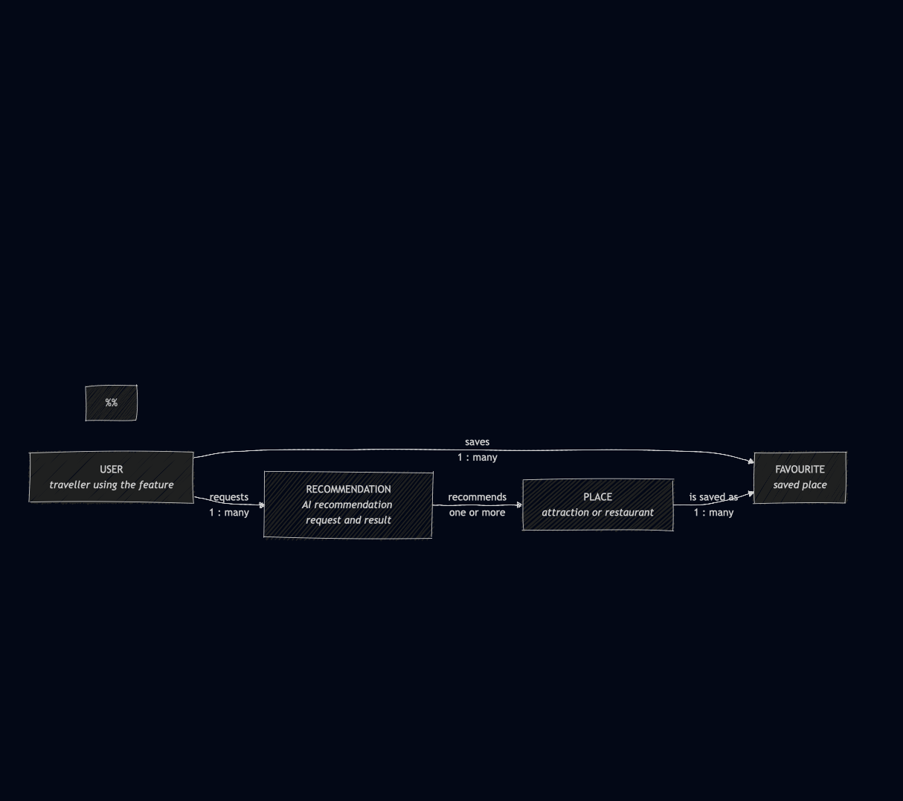


Three entities. NextStop is a **multi-traveller platform**: a traveller plans
many trips, and each trip belongs to exactly one traveller, who is its planner.
A trip is scheduled as many itinerary days. **Only TRIP and ITINERARY_DAY are owned by student-1.**
TRAVELLER belongs to the shared access service, and that boundary is the single
most consequential fact in this model - it is why the traveller relationship
cannot be a foreign key.

#### 2.7.2 Entity-relationship diagram

Attributes, keys and cardinality.

Source: `docs/diagrams/student-1-erd.mmd`
Source: `docs/diagrams/student-2-erd.mmd`
         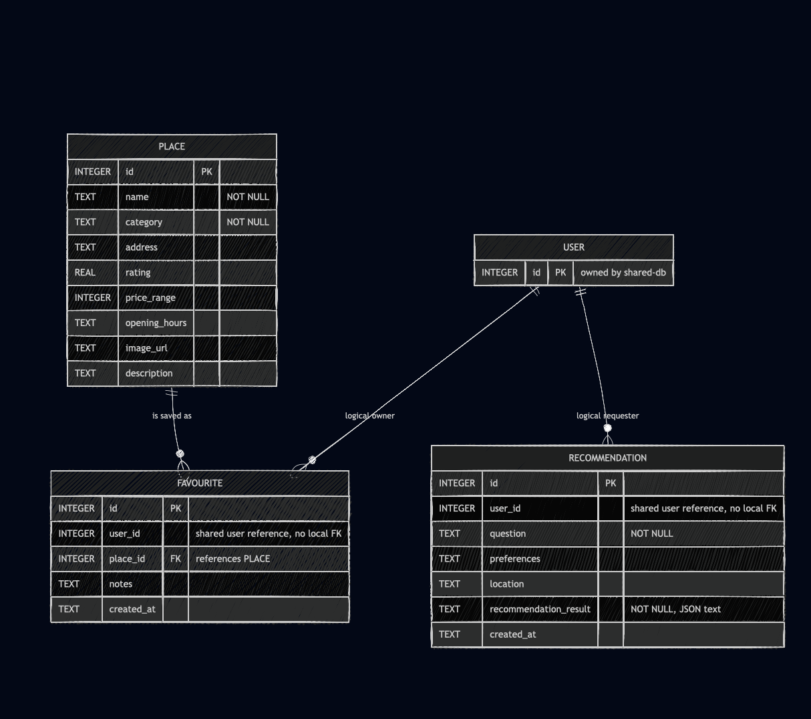

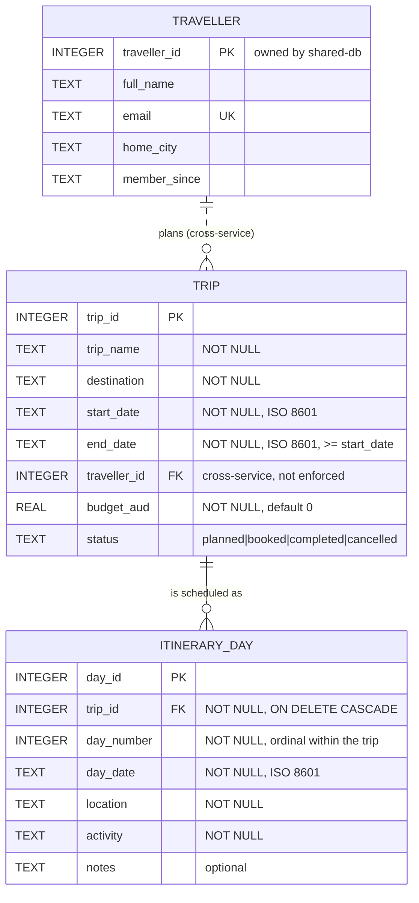

The two relationship notations differ deliberately:

| Notation | Relationship | Meaning |
|----------|--------------|---------|
| `\|\|--o{` (solid) | TRIP to ITINERARY_DAY | Identifying, enforced in SQLite by a foreign key with `ON DELETE CASCADE` |
| `\|\|..o{` (dashed) | TRAVELLER to TRIP | Non-identifying and **not enforceable** - the entities live in different services and different SQLite files |

#### 2.7.3 Logical model

Relations, keys, domains and constraints, independent of any particular DBMS.

**TRIP**

| Attribute | Domain | Key | Constraint |
|-----------|--------|-----|------------|
| trip_id | integer | PK | surrogate, auto-assigned |
| trip_name | string(120) | | NOT NULL |
| destination | string(120) | | NOT NULL |
| start_date | date | | NOT NULL |
| end_date | date | | NOT NULL, `end_date >= start_date` |
| traveller_id | integer | FK → TRAVELLER | NOT NULL, **cross-service** |
| budget_aud | decimal(10,2) | | NOT NULL, default 0 |
| status | enum | | one of planned, booked, completed, cancelled |

**ITINERARY_DAY**

| Attribute | Domain | Key | Constraint |
|-----------|--------|-----|------------|
| day_id | integer | PK | surrogate, auto-assigned |
| trip_id | integer | FK → TRIP | NOT NULL, cascade on delete |
| day_number | integer | | NOT NULL, >= 1 |
| day_date | date | | NOT NULL |
| location | string(120) | | NOT NULL |
| activity | string(255) | | NOT NULL |
| notes | string(255) | | optional |

**Normalisation.** Both relations are in third normal form.

- *1NF* - every attribute is atomic. Itinerary days are rows, not a repeating
  group or a delimited list inside TRIP.
- *2NF* - both relations use a single-attribute surrogate primary key, so no
  partial dependency on part of a composite key is possible.
- *3NF* - no non-key attribute determines another. `destination` does not
  derive `budget_aud`; `day_number` does not derive `location`.

`traveller_id` is deliberately the *only* traveller attribute stored here.
Copying `full_name` into TRIP would denormalise across a service boundary and
create a second source of truth that could silently diverge from the shared
access database. The name is resolved at render time instead - see ADR-001.

#### 2.7.4 Physical model

The logical model realised in SQLite, which is what the specification mandates
for Release 0.

```sql
CREATE TABLE trips (
    trip_id      INTEGER PRIMARY KEY,
    trip_name    TEXT NOT NULL,
    destination  TEXT NOT NULL,
    start_date   TEXT NOT NULL,
    end_date     TEXT NOT NULL,
    traveller_id INTEGER NOT NULL,
    budget_aud   REAL NOT NULL DEFAULT 0,
    status       TEXT NOT NULL DEFAULT 'planned'
);

CREATE TABLE itinerary_days (
    day_id     INTEGER PRIMARY KEY,
    trip_id    INTEGER NOT NULL,
    day_number INTEGER NOT NULL,
    day_date   TEXT NOT NULL,
    location   TEXT NOT NULL,
    activity   TEXT NOT NULL,
    notes      TEXT DEFAULT '',
    FOREIGN KEY (trip_id) REFERENCES trips (trip_id) ON DELETE CASCADE
);
```

```sql
CREATE TABLE places (
    id INTEGER PRIMARY KEY AUTOINCREMENT,
    external_place_id TEXT,
    name TEXT NOT NULL,
    category TEXT NOT NULL,
    address TEXT NOT NULL,
    latitude REAL,
    longitude REAL,
    rating REAL,
    opening_hours TEXT,
    price_range INTEGER,
    description TEXT,
    image_url TEXT
);

CREATE TABLE favourites (
    id INTEGER PRIMARY KEY AUTOINCREMENT,
    user_id INTEGER NOT NULL,
    place_id INTEGER NOT NULL,
    notes TEXT,
    created_at TEXT DEFAULT CURRENT_TIMESTAMP,
    FOREIGN KEY (place_id)
        REFERENCES places(id)
        ON DELETE CASCADE
);

CREATE TABLE recommendations (
    id INTEGER PRIMARY KEY AUTOINCREMENT,
    user_id INTEGER NOT NULL,
    question TEXT NOT NULL,
    preferences TEXT,
    location TEXT,
    recommendation_result TEXT NOT NULL,
    created_at TEXT DEFAULT CURRENT_TIMESTAMP
);
'''

Seeded with **12 trips and 15 itinerary days**, above the ten-record minimum
required by specification section 2.4.

**Where the physical model departs from the logical model, and why**

| Logical | Physical | Reason |
|---------|----------|--------|
| `date` | `TEXT` | SQLite has no date type. ISO 8601 strings sort and compare correctly as text. |
| `enum` for status | `TEXT` + application check | SQLite has no enum. Validated in `db/app.py` against `VALID_STATUSES`. |
| `end_date >= start_date` | application check | Enforced in `validate_trip()` rather than as a table constraint. |
| `decimal(10,2)` | `REAL` | See the limitation below. |
| FK to TRAVELLER | none | The referenced table is in another service's database file. |

`PRAGMA foreign_keys = ON` is set on every connection, because SQLite does not
enforce foreign keys by default - without it the cascade would silently not
happen.

**Known limitations of the physical model**

1. **`budget_aud` is `REAL`.** Binary floating point is the wrong
   representation for money and can accumulate rounding error. Integer cents
   would be correct. Not changed for Release 0 because the field is only
   displayed and summed for presentation, never used in a financial
   calculation, but it should be fixed before any budgeting arithmetic is
   added in Release 1.
2. **No unique constraint on `(trip_id, day_number)`.** Confirmed by
   experiment: posting a second day numbered 1 to trip 1 returns `201`, leaving
   day numbers `[1, 1, 2, 3, 4]`. The UI sorts by `day_number`, so duplicates
   display in arbitrary order rather than failing loudly. A
   `UNIQUE (trip_id, day_number)` constraint is the fix, deferred to Release 1
   because it needs a migration of seeded data.
3. **No indexes beyond the primary keys.** At 12 and 15 rows this is
   irrelevant; `itinerary_days(trip_id)` would be the first index to add, since
   every itinerary view filters on it.


#### student-2 - Kevin Kim - Attractions & Dining

**PLACE**

| Attribute | Domain | Key | Constraint |
|-----------|--------|-----|------------|
| id | integer | PK | surrogate, auto-assigned |
| external_place_id | string | | optional external provider identifier |
| name | string | | NOT NULL |
| category | enum/string | | NOT NULL; supported Student 2 place category |
| address | string | | NOT NULL |
| latitude | decimal | | optional |
| longitude | decimal | | optional |
| rating | decimal | | optional |
| opening_hours | string | | optional |
| price_range | integer | | optional price indicator |
| description | string | | optional |
| image_url | string | | optional place image reference |

**FAVOURITE**

| Attribute | Domain | Key | Constraint |
|-----------|--------|-----|------------|
| id | integer | PK | surrogate, auto-assigned |
| user_id | integer | logical FK -> shared USER | NOT NULL, cross-service and not locally enforced |
| place_id | integer | FK -> PLACE | NOT NULL, cascade on place deletion |
| notes | string | | optional |
| created_at | timestamp | | generated when saved |

**RECOMMENDATION**

| Attribute | Domain | Key | Constraint |
|-----------|--------|-----|------------|
| id | integer | PK | surrogate, auto-assigned |
| user_id | integer | logical FK -> shared USER | NOT NULL, cross-service and not locally enforced |
| question | string | | NOT NULL |
| preferences | JSON/string | | optional recommendation preferences |
| location | string | | optional location context |
| recommendation_result | JSON/string | | NOT NULL; persisted AI answer and recommended place identifiers |
| created_at | timestamp | | generated when stored |

**Normalisation.** The core relations are kept separate so that place facts,
user-place associations and AI interaction history do not duplicate one
another. PLACE stores facts about a place once. FAVOURITE represents the
many-user-to-many-place association without copying the place's name, address or
rating. RECOMMENDATION stores the interaction history rather than modifying the
PLACE record with user-specific AI output.

The USER's name, email and other account fields are deliberately absent from
both FAVOURITE and RECOMMENDATION. Only `user_id` crosses the service boundary,
preventing Student 2 from becoming a second source of truth for account data.

#### student-4 - Aurelia Sari - Account & Dashboard

**A decision worth stating before the models.** `USER` and `ACCESS_LOG` are
modelled here because student-4 designed them, but they are **not** stored in
student-4-db - they live in shared-db, next to `TRAVELLER`. shared-db's own
header comment already describes its role as owning "access data every feature
may needs", and a user's id and sign-in state are exactly that: any feature
that needs to know who is asking, or whether they're signed in, needs the
same resolution student-1 already does for `traveller_id`.
Keeping a second, competing `users` table in student-4-db would have created
two sources of truth for identity. `TRAVELLER` was left untouched rather than
merged with `USER`, since student-1 already depends on its exact shape, see
ADR-001 and R4-3.

**Conceptual model**

Source: `docs/diagrams/student-4-conceptual.mmd`


One user generates many access log entries. Unlike student-1's model, this
relationship is **not** cross-service, both entities live in the same
shared.db file, so the foreign key below is enforceable.

**Entity-relationship diagram**

Source: `docs/diagrams/student-4-erd.mmd`

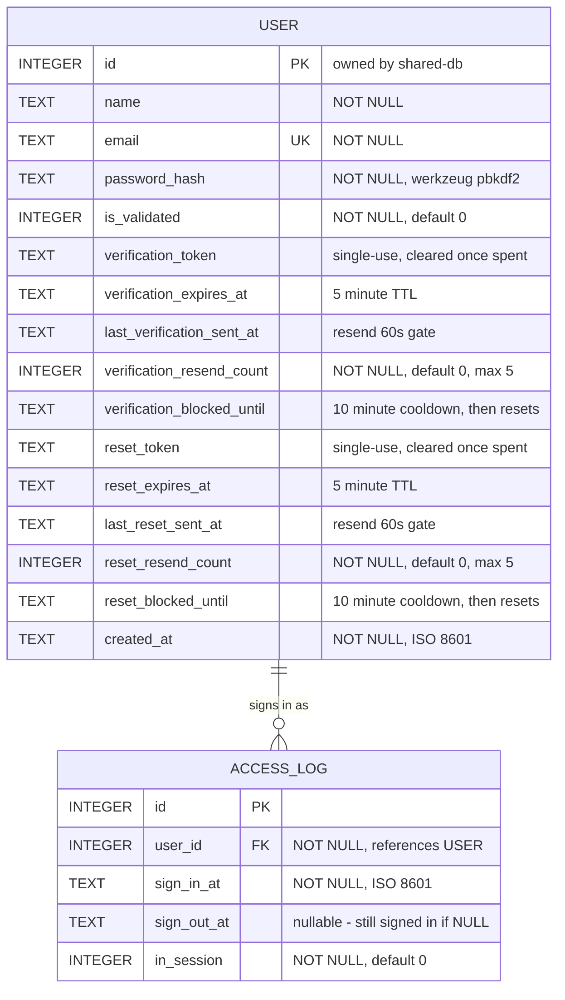

**Logical model**

**USER**

| Attribute | Domain | Key | Constraint |
|-----------|--------|-----|------------|
| id | integer | PK | surrogate, auto-assigned |
| name | string | | NOT NULL |
| email | string | UK | NOT NULL, unique |
| password_hash | string | | NOT NULL, never the plaintext password |
| is_validated | boolean | | NOT NULL, default false |
| verification_token | string | | nullable, single-use |
| verification_expires_at | timestamp | | nullable, 5 minutes from issue |
| last_verification_sent_at | timestamp | | nullable |
| verification_resend_count | integer | | NOT NULL, default 0, resets after a block |
| verification_blocked_until | timestamp | | nullable |
| reset_token | string | | nullable, single-use |
| reset_expires_at | timestamp | | nullable, 5 minutes from issue |
| last_reset_sent_at | timestamp | | nullable |
| reset_resend_count | integer | | NOT NULL, default 0, resets after a block |
| reset_blocked_until | timestamp | | nullable |
| created_at | timestamp | | NOT NULL |

**ACCESS_LOG**

| Attribute | Domain | Key | Constraint |
|-----------|--------|-----|------------|
| id | integer | PK | surrogate, auto-assigned |
| user_id | integer | FK -> USER | NOT NULL |
| sign_in_at | timestamp | | NOT NULL |
| sign_out_at | timestamp | | nullable |
| in_session | boolean | | NOT NULL, default false |

**Normalisation.** Both relations are in third normal form: every attribute is
atomic (1NF), each uses a single-attribute surrogate key so no partial
dependency is possible (2NF), and no non-key attribute determines another -
`verification_resend_count` does not derive `is_validated`, `reset_resend_count`
does not derive `password_hash`, `sign_in_at` does not derive `user_id` (3NF).

**Physical model**

```sql
CREATE TABLE users (
    id                          INTEGER PRIMARY KEY AUTOINCREMENT,
    name                        TEXT NOT NULL,
    email                       TEXT NOT NULL UNIQUE,
    password_hash               TEXT NOT NULL,
    is_validated                INTEGER NOT NULL DEFAULT 0,
    verification_token          TEXT,
    verification_expires_at     TEXT,
    last_verification_sent_at   TEXT,
    verification_resend_count   INTEGER NOT NULL DEFAULT 0,
    verification_blocked_until  TEXT,
    reset_token                 TEXT,
    reset_expires_at            TEXT,
    last_reset_sent_at          TEXT,
    reset_resend_count          INTEGER NOT NULL DEFAULT 0,
    reset_blocked_until         TEXT,
    created_at                  TEXT NOT NULL
);

CREATE TABLE access_logs (
    id          INTEGER PRIMARY KEY AUTOINCREMENT,
    user_id     INTEGER NOT NULL REFERENCES users(id),
    sign_in_at  TEXT NOT NULL,
    sign_out_at TEXT,
    in_session  INTEGER NOT NULL DEFAULT 0
);
```

Seeded with **10 users**, above the ten-record minimum, alongside the
pre-existing 12 `travellers` in the same database. `access_logs` starts
empty and fills as people sign in and out.

**Where the physical model departs from the logical model, and why**

| Logical | Physical | Reason |
|---------|----------|--------|
| `timestamp` | `TEXT` | Same reasoning as student-1's `date` fields: SQLite has no timestamp type, and ISO 8601 strings sort and compare correctly as text. |
| `boolean` | `INTEGER` | SQLite has no boolean type; `0`/`1` is the idiom used throughout this project. |
| Password stored | never as plaintext | Only `generate_password_hash()`'s output ever reaches this table - enforced by convention in `student-4-api`, not by a database constraint. |

**Known limitations of the physical model**

1. **No index on `access_logs(user_id)`.** Irrelevant at this scale, but it
   would be the first index to add once a "sign-in history for this user"
   query exists, the same shape of gap student-1 notes for `itinerary_days`.
2. *(Resolved.)* **`access_logs` rows are written but never closed.**
   `POST /access-logs/sign-out` now closes the most recent open row for a
   user, setting `sign_out_at` and `in_session = 0` (see ADR-001
   Decision 6).
3. **The 60s/5-attempt/10-minute resend state lives on the `USER` row itself**
   rather than in a separate rate-limit table. Simpler for one row-per-user
   at this scale; would need to move to a keyed table if rate limiting ever
   needs to apply per-IP as well as per-account.

**Travel Guides and the AI Assistant.** `DESTINATION` and the tables below it
are also owned by student-4-db, alongside `USER` and `ACCESS_LOG` above. Not
documented here when the Travel Guides tables were built, added now
alongside the AI Assistant tables that build on them.

**Conceptual model**

Source: `docs/diagrams/student-4-conceptual.mmd`

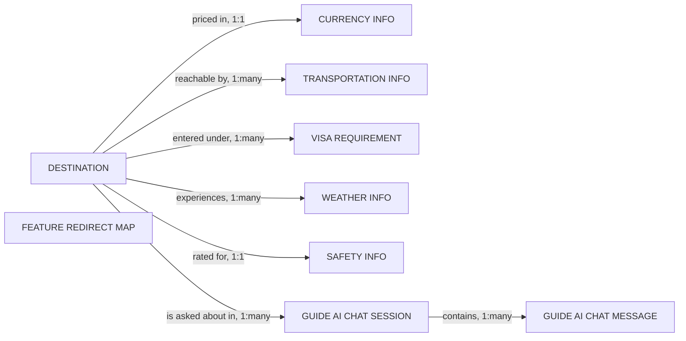

`FEATURE_REDIRECT_MAP` has no relationship to `DESTINATION`, a redirect
keyword applies to any question, not to one destination.

**Entity-relationship diagram**

Source: `docs/diagrams/student-4-erd.mmd`

| Table | Owns | Notes |
|-------|------|-------|
| `destinations` | Every city a guide exists for | 13 seed rows, every one an Australian city |
| `currency_infos` | Currency code, name and exchange tips per destination | One row per destination |
| `transportation_infos` | Transport mode, description and tips per destination | One row per (destination, type). Not every destination has every type |
| `visa_requirements` | Visa requirement per destination, per nationality | Seeded identically for every destination, entry rules depend on nationality, not the city landed in |
| `weather_infos` | Average temperature and rainfall per destination, per month | 12 rows per destination |
| `safety_infos` | Safety level and local tips per destination | One row per destination, tips genuinely vary by city |
| `feature_redirect_map` | A keyword that belongs to another feature | 16 seed rows, reset and reseeded on every `init_db.py` run, since it is seed config, not traveller data |
| `guide_ai_chat_sessions` | One chat, with the user who opened it and the destination it is currently about | Never wiped on reinit, holds real conversations |
| `guide_ai_chat_messages` | One turn of a chat, role, content and the intent it classified as | Never wiped on reinit |

**Physical model**

```sql
CREATE TABLE destinations (
    id INTEGER PRIMARY KEY AUTOINCREMENT,
    country TEXT NOT NULL,
    city TEXT NOT NULL,
    region TEXT NOT NULL
);

CREATE TABLE currency_infos (
    id INTEGER PRIMARY KEY AUTOINCREMENT,
    destination_id INTEGER NOT NULL REFERENCES destinations(id),
    currency_code TEXT NOT NULL,
    currency_name TEXT NOT NULL,
    exchange_tips TEXT NOT NULL
);

CREATE TABLE transportation_infos (
    id INTEGER PRIMARY KEY AUTOINCREMENT,
    destination_id INTEGER NOT NULL REFERENCES destinations(id),
    type TEXT NOT NULL,
    description TEXT NOT NULL,
    tips TEXT NOT NULL
);

CREATE TABLE visa_requirements (
    id INTEGER PRIMARY KEY AUTOINCREMENT,
    destination_id INTEGER NOT NULL REFERENCES destinations(id),
    nationality TEXT NOT NULL,
    requirement_type TEXT NOT NULL,
    notes TEXT NOT NULL
);

CREATE TABLE weather_infos (
    id INTEGER PRIMARY KEY AUTOINCREMENT,
    destination_id INTEGER NOT NULL REFERENCES destinations(id),
    month TEXT NOT NULL,
    avg_temp REAL NOT NULL,
    rainfall REAL NOT NULL,
    best_visit_time TEXT NOT NULL
);

CREATE TABLE safety_infos (
    id INTEGER PRIMARY KEY AUTOINCREMENT,
    destination_id INTEGER NOT NULL REFERENCES destinations(id),
    safety_level TEXT NOT NULL,
    tips TEXT NOT NULL
);

CREATE TABLE feature_redirect_map (
    id INTEGER PRIMARY KEY AUTOINCREMENT,
    keyword TEXT NOT NULL,
    feature_name TEXT NOT NULL,
    redirect_path_template TEXT NOT NULL
);

CREATE TABLE guide_ai_chat_sessions (
    id INTEGER PRIMARY KEY AUTOINCREMENT,
    user_id INTEGER NOT NULL,
    destination_id INTEGER NOT NULL REFERENCES destinations(id),
    created_at TEXT NOT NULL
);

CREATE TABLE guide_ai_chat_messages (
    id INTEGER PRIMARY KEY AUTOINCREMENT,
    session_id INTEGER NOT NULL REFERENCES guide_ai_chat_sessions(id),
    role TEXT NOT NULL,
    content TEXT NOT NULL,
    intent_category TEXT,
    created_at TEXT NOT NULL
);
```

Seeded with 13 destinations, 13 currency rows, 51 transportation rows, 104
visa rows, 156 weather rows, 13 safety rows and 16 redirect map rows. The two
chat tables start empty and fill as travellers use the AI Assistant tab.

**Known limitations of the physical model**

1. **`guide_ai_chat_sessions.user_id` is a cross-service reference, not an
   enforceable foreign key.** It points at shared-db's `users` table, the
   same kind of reference student-1's `trips.traveller_id` has to
   `travellers`, for the same reason, a user's id is cross-cutting data
   student-4-db does not own.
2. **A session's `destination_id` names only the most recently discussed
   city, not every city a chat has covered.** A traveller who asks about
   several cities in one chat sees the Past Chats list label follow whichever
   city they asked about last, not a history of all of them.
3. **`feature_redirect_map` keyword matching is a plain substring check,**
   not a real natural language classifier. A question phrased unusually
   enough to miss every keyword falls through to the guide category
   keywords or to unrelated, rather than to the feature it actually meant.

#### student-3 - Tanishpreet Kour - Travel Mate
 
**Conceptual model**
 
Source: `docs/diagrams/student-3-conceptual.mmd`
 
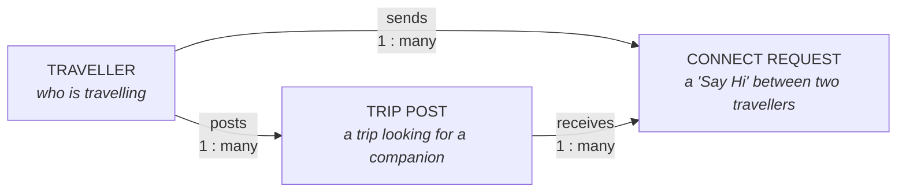
 
Three entities. A traveller posts many trip posts looking for a companion, and
sends many connect requests. Each connect request targets exactly one trip
post. **Only TRIP_POST and CONNECT_REQUEST are owned by student-3.** TRAVELLER
belongs to the shared access service - the same cross-service boundary
student-1 describes for its own TRAVELLER relationship, and for the same
reason: `traveller_id` cannot be a real foreign key across two separate SQLite
files.
 
**Entity-relationship diagram**
 
Source: `docs/diagrams/student-3-erd.mmd`
 
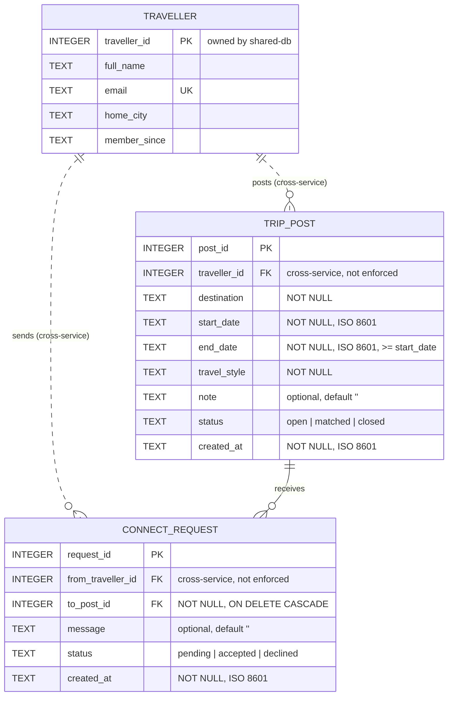
 
The two relationship notations differ deliberately, the same distinction
student-1 draws:
 
| Notation | Relationship | Meaning |
|----------|--------------|---------|
| `\|\|--o{` (solid) | TRIP_POST to CONNECT_REQUEST | Identifying, enforced in SQLite by a foreign key with `ON DELETE CASCADE` |
| `\|\|..o{` (dashed) | TRAVELLER to TRIP_POST / CONNECT_REQUEST | Non-identifying and **not enforceable** - the entities live in different services and different SQLite files |
 
**Logical model**
 
**TRIP_POST**
 
| Attribute | Domain | Key | Constraint |
|-----------|--------|-----|------------|
| post_id | integer | PK | surrogate, auto-assigned |
| traveller_id | integer | FK → TRAVELLER | NOT NULL, **cross-service** |
| destination | string(120) | | NOT NULL |
| start_date | date | | NOT NULL |
| end_date | date | | NOT NULL, `end_date >= start_date` |
| travel_style | string(120) | | NOT NULL |
| note | string(500) | | optional, default '' |
| status | enum | | one of open, matched, closed |
| created_at | date | | NOT NULL |
 
**CONNECT_REQUEST**
 
| Attribute | Domain | Key | Constraint |
|-----------|--------|-----|------------|
| request_id | integer | PK | surrogate, auto-assigned |
| from_traveller_id | integer | FK → TRAVELLER | NOT NULL, cross-service |
| to_post_id | integer | FK → TRIP_POST | NOT NULL, cascade on delete |
| message | string(500) | | optional, default '' |
| status | enum | | one of pending, accepted, declined |
| created_at | date | | NOT NULL |
 
**Normalisation.** Both relations are in third normal form.
 
- *1NF* - every attribute is atomic. `travel_style` is a single descriptive
  string rather than a repeating group of separate style flags.
- *2NF* - both relations use a single-attribute surrogate primary key, so no
  partial dependency on part of a composite key is possible.
- *3NF* - no non-key attribute determines another. `destination` does not
  derive `travel_style`; `status` does not derive `message`.
`traveller_id` and `from_traveller_id` are deliberately the *only* traveller
attributes stored here, for the same reason student-1 gives for `TRIP`:
copying a traveller's name into `trip_posts` would denormalise across a
service boundary and create a second source of truth. The name is resolved
at render time instead, through `get_traveller()` calling the shared access
API - see R3-7 for the known gap in that resolution.
 
**Physical model**
 
```sql
CREATE TABLE trip_posts (
    post_id        INTEGER PRIMARY KEY,
    traveller_id   INTEGER NOT NULL,
    destination    TEXT NOT NULL,
    start_date     TEXT NOT NULL,
    end_date       TEXT NOT NULL,
    travel_style   TEXT NOT NULL,
    note           TEXT DEFAULT '',
    status         TEXT NOT NULL DEFAULT 'open',
    created_at     TEXT NOT NULL
);
 
CREATE TABLE connect_requests (
    request_id         INTEGER PRIMARY KEY,
    from_traveller_id  INTEGER NOT NULL,
    to_post_id         INTEGER NOT NULL,
    message            TEXT DEFAULT '',
    status             TEXT NOT NULL DEFAULT 'pending',
    created_at         TEXT NOT NULL,
    FOREIGN KEY (to_post_id) REFERENCES trip_posts (post_id) ON DELETE CASCADE
);
```
 
Seeded with **12 trip posts and 12 connect requests**, above the ten-record
minimum required by specification section 2.4.
 
**Where the physical model departs from the logical model, and why**
 
| Logical | Physical | Reason |
|---------|----------|--------|
| `date` | `TEXT` | SQLite has no date type. ISO 8601 strings sort and compare correctly as text, the same reasoning student-1 and student-4 give for their own date/timestamp fields. |
| `enum` for `status` | `TEXT` + application check | SQLite has no enum. Validated in `db/app.py` against `VALID_POST_STATUSES`/`VALID_REQUEST_STATUSES`. |
| `end_date >= start_date` | application check | Enforced in `validate_post()` rather than as a table constraint. |
| FK to TRAVELLER | none | The referenced table is in another service's database file. |
 
`PRAGMA foreign_keys = ON` is set on every connection, so the `ON DELETE
CASCADE` between `trip_posts` and `connect_requests` actually fires - without
it SQLite would silently ignore the cascade.
 
**Known limitations of the physical model**
 
1. **`traveller_id`/`from_traveller_id` are not enforceable foreign keys**,
   the same cross-service gap R3-7 describes: they reference shared-db's
   `travellers` table by convention only. There is currently no foreign key
   linking `travellers` to `users` either, which is why the verified-badge
   feature (R3-8) can't be built yet.
2. **No unique constraint preventing a traveller from posting duplicate
   trips** to the same destination and dates. Not exercised by the seed
   data, but nothing in `validate_post()` currently rejects it.
3. **No indexes beyond the primary keys.** At 12 rows this is irrelevant;
   `trip_posts(destination)` would be the first index worth adding, since
   Browse filters on it directly.

#### student-5 - Aung Ko Khaing - Bookings & Budget

**Conceptual model**

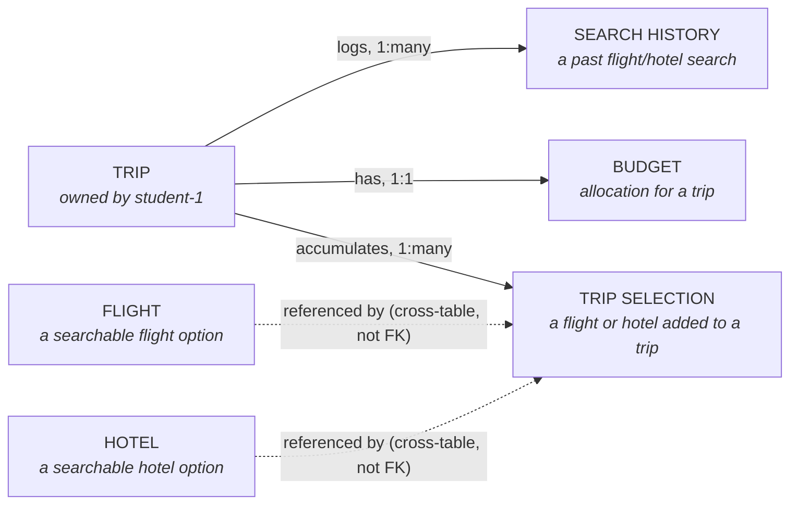

Six entities, only four of which are physically owned tables in this database —
`FLIGHT` and `HOTEL` are searchable catalogues, not per-trip records. `TRIP`
itself is owned by student-1's service, the same cross-service relationship
shape as student-1's `TRAVELLER` and student-4's `USER` — `budget_id`,
`selection_id`, and `search_id` all key off a `trip_id` that this service
doesn't itself own or validate.

**Entity-relationship diagram**

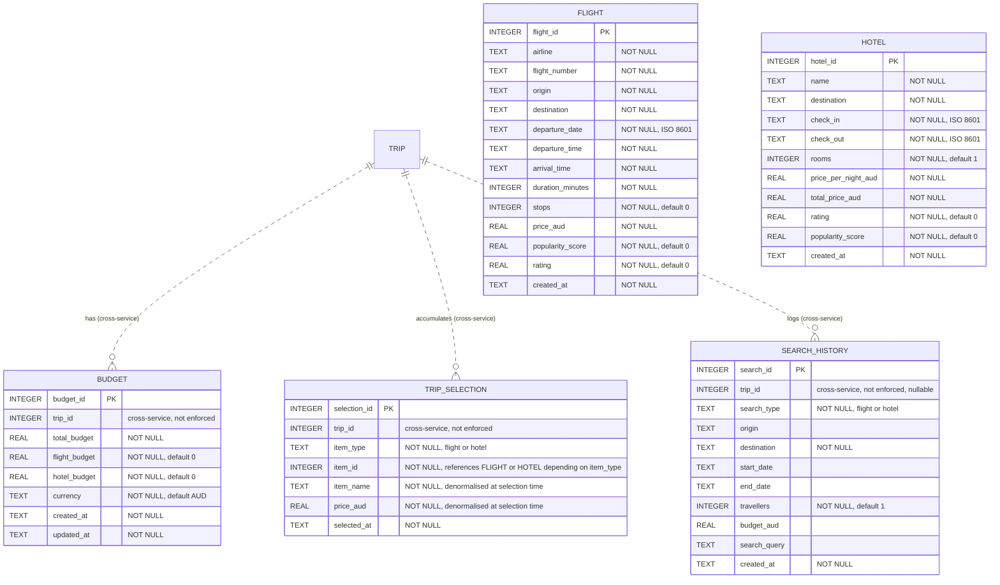

`TRIP_SELECTION.item_id` is deliberately a *polymorphic* reference — it points
at `FLIGHT.flight_id` when `item_type = 'flight'` and `HOTEL.hotel_id` when
`item_type = 'hotel'`, rather than two separate nullable foreign key columns.

**Logical model**

**BUDGET**

| Attribute | Domain | Key | Constraint |
|-----------|--------|-----|------------|
| budget_id | integer | PK | surrogate, auto-assigned |
| trip_id | integer | FK → TRIP | NOT NULL, **cross-service** |
| total_budget | decimal(10,2) | | NOT NULL |
| flight_budget | decimal(10,2) | | NOT NULL, default 0 |
| hotel_budget | decimal(10,2) | | NOT NULL, default 0 |
| currency | string(3) | | NOT NULL, default 'AUD' |
| created_at | timestamp | | NOT NULL |
| updated_at | timestamp | | NOT NULL |

**FLIGHT** / **HOTEL** — catalogue tables, no foreign keys of their own;
referenced (not enforced) by `TRIP_SELECTION.item_id`. Full attribute list
matches the ERD above.

**TRIP_SELECTION**

| Attribute | Domain | Key | Constraint |
|-----------|--------|-----|------------|
| selection_id | integer | PK | surrogate, auto-assigned |
| trip_id | integer | FK → TRIP | NOT NULL, cross-service |
| item_type | enum | | 'flight' or 'hotel' |
| item_id | integer | polymorphic FK → FLIGHT or HOTEL | NOT NULL, not locally enforced |
| item_name | string(120) | | NOT NULL, denormalised |
| price_aud | decimal(10,2) | | NOT NULL, denormalised |
| selected_at | timestamp | | NOT NULL |

**SEARCH_HISTORY** — attributes as in the ERD; `trip_id` cross-service and
nullable (a search can be logged before a trip context is chosen).

**Normalisation.** `TRIP_SELECTION.item_name` and `.price_aud` are a
deliberate, documented denormalisation: they copy values from `FLIGHT`/`HOTEL`
at the moment of selection rather than joining live. This is intentional, not
an oversight — a selection should keep showing the price the traveller
actually saw and chose at booking time, even if the catalogue's seed data (or
a future live pricing feed) changes that flight's price afterward. Every other
relation is in third normal form: single-attribute surrogate keys rule out
partial dependency, and no non-key attribute derives another (e.g. `rating`
does not derive `price_aud`).

**Physical model**

```sql
CREATE TABLE budgets (
    budget_id INTEGER PRIMARY KEY AUTOINCREMENT,
    trip_id INTEGER NOT NULL,
    total_budget REAL NOT NULL,
    flight_budget REAL NOT NULL DEFAULT 0,
    hotel_budget REAL NOT NULL DEFAULT 0,
    currency TEXT NOT NULL DEFAULT 'AUD',
    created_at TEXT NOT NULL,
    updated_at TEXT NOT NULL
);

CREATE TABLE flights (
    flight_id INTEGER PRIMARY KEY AUTOINCREMENT,
    airline TEXT NOT NULL,
    flight_number TEXT NOT NULL,
    origin TEXT NOT NULL,
    destination TEXT NOT NULL,
    departure_date TEXT NOT NULL,
    departure_time TEXT NOT NULL,
    arrival_time TEXT NOT NULL,
    duration_minutes INTEGER NOT NULL,
    stops INTEGER NOT NULL DEFAULT 0,
    price_aud REAL NOT NULL,
    popularity_score REAL NOT NULL DEFAULT 0,
    rating REAL NOT NULL DEFAULT 0,
    created_at TEXT NOT NULL
);

CREATE TABLE hotels (
    hotel_id INTEGER PRIMARY KEY AUTOINCREMENT,
    name TEXT NOT NULL,
    destination TEXT NOT NULL,
    check_in TEXT NOT NULL,
    check_out TEXT NOT NULL,
    rooms INTEGER NOT NULL DEFAULT 1,
    price_per_night_aud REAL NOT NULL,
    total_price_aud REAL NOT NULL,
    rating REAL NOT NULL DEFAULT 0,
    popularity_score REAL NOT NULL DEFAULT 0,
    created_at TEXT NOT NULL
);

CREATE TABLE trip_selections (
    selection_id INTEGER PRIMARY KEY AUTOINCREMENT,
    trip_id INTEGER NOT NULL,
    item_type TEXT NOT NULL CHECK(item_type IN ('flight', 'hotel')),
    item_id INTEGER NOT NULL,
    item_name TEXT NOT NULL,
    price_aud REAL NOT NULL,
    selected_at TEXT NOT NULL
);

CREATE TABLE search_history (
    search_id INTEGER PRIMARY KEY AUTOINCREMENT,
    trip_id INTEGER,
    search_type TEXT NOT NULL,
    origin TEXT,
    destination TEXT NOT NULL,
    start_date TEXT,
    end_date TEXT,
    travellers INTEGER NOT NULL DEFAULT 1,
    budget_aud REAL,
    search_query TEXT,
    created_at TEXT NOT NULL
);
```

Seeded with **12 rows in each of the five tables**, above the ten-record
minimum in specification 2.4. Destinations are real domestic Australian
routes/cities (Melbourne, Brisbane, Perth, Adelaide, Gold Coast, Cairns,
Canberra, Hobart, Darwin, Sunshine Coast, Launceston, Alice Springs), matching
the destinations used across student-4's Travel Guides tables so the two
features stay consistent.

**Where the physical model departs from the logical model, and why**

| Logical | Physical | Reason |
|---------|----------|--------|
| `date`/`timestamp` | `TEXT` | Same reasoning as every other student's tables: SQLite has no date/timestamp type, ISO 8601 strings sort and compare correctly as text. |
| `enum` for `item_type`/`search_type` | `TEXT` + `CHECK` constraint (`trip_selections`) or application validation (`search_history`) | SQLite has no enum type. |
| `decimal(10,2)` for money fields | `REAL` | See known limitation below. |
| FK to TRIP | none | `TRIP` lives in student-1's database file, a separate service. |
| Polymorphic FK (`item_id`) | plain `INTEGER`, no constraint | SQLite can't express "references table A or table B depending on another column" as a real foreign key. |

**Known limitations of the physical model**

1. **Every money field is `REAL`**, the same binary-floating-point concern
   student-1 documents for `budget_aud`. Not changed for Release 0 since values
   are only displayed and summed for presentation, but it should become
   integer cents before any real financial arithmetic is added.
2. **`trip_selections.item_id` isn't a real foreign key.** A selection can, in
   principle, reference a flight or hotel ID that's since been deleted from
   the catalogue. Since `item_name`/`price_aud` are denormalised at selection
   time (see Normalisation above), a stale reference wouldn't actually break
   display — but a genuine reconciliation check is still a reasonable Release
   1 addition.
3. **No indexes beyond primary keys.** At 12 rows per table this is
   irrelevant; `trip_selections(trip_id)` and `search_history(trip_id)` would
   be the first indexes to add, since every "load this trip's selections/
   history" query filters on exactly that column.

## 3. Repository structure

The repository follows the structure required by specification 7.1.

```
.
├── .github/workflows/       student-1.yml .. student-5.yml
├── ai-services/
│   ├── ai-mode/             shared AI-Mode service (Flask, :5300)
│   ├── agentic-loop/        Plan -> Act -> Observe -> Adapt loop
│   └── prompts/             prompt engineering artefacts
│       ├── implementation/  prompts the running application uses
│       └── review/          prompts the agentic loop uses
├── docs/
│   ├── diagrams/            architecture and data diagrams (Mermaid)
│   ├── evidence/            CI logs, agentic loop runs, screenshots
│   ├── ADR-001-service-boundaries.md
│   ├── CONTRIBUTING.md
│   └── technical-report.md
├── scripts/                 dev.sh, smoke_test.py, wait_for_health.py, scaffold_student.py
├── shared/                  unified index.html, CSS theme, access API, access DB
├── student-1/ .. student-5/ frontend/, api/, db/, tests/ per student
├── docker-compose.yml       one configuration for the whole application
├── .env.example
└── README.md
```

Each `student-N/` directory holds that student's three microservices:

```
student-N/
├── frontend/   nginx + HTMX page, links the shared CSS theme
├── api/        Flask backend/API returning HTMX fragments
├── db/         Flask + SQLite database API that owns its schema
└── tests/
```

**Separation of shared and individual components.** The specification requires a
clear boundary, and it is drawn so that it can be checked rather than trusted:

| Scope | Directories | Who edits |
|-------|-------------|-----------|
| Individual | `student-N/`, `.github/workflows/student-N.yml` | That student only |
| Shared | `shared/`, `ai-services/`, `scripts/`, `docker-compose.yml` | Anyone, announced first |

Two properties make the boundary hold. Each database service opens only its own
SQLite file, so cross-feature data must travel over HTTP. And in
`docker-compose.yml` each student's three services form one contiguous block, so
two people editing different features do not touch the same lines.

Directory names are fixed at `student-N/`. They were briefly renamed to include
owner names, which broke every build context and workflow path filter at once;
ownership is recorded in the README and in file headers instead.

---

## 4. Software architecture

### 4.1 Individual software architecture **(Individual)**

One diagram per student. student-1: `docs/diagrams/student-1-architecture.mmd`.
student-2: `docs/diagrams/student-2-architecture.mmd`.
            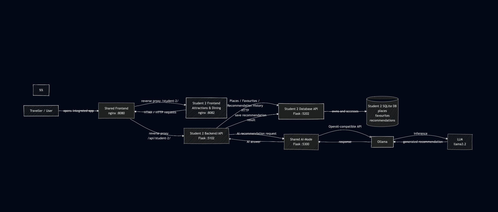
student-3: `docs/diagrams/student-3-architecture.mmd`.
student-4: `docs/diagrams/student-4-architecture.mmd`.

student-5: `docs/diagrams/student-5ERD.png`.
### 4.2 Integrated Release 0 software architecture

`docs/diagrams/integrated-architecture.mmd`.

Key decisions are recorded in `docs/ADR-001-service-boundaries.md`:

1. Each database service exclusively owns its schema; cross-feature data moves
   over HTTP only.
2. One shared AI-Mode service instead of five Ollama clients.
3. Ollama runs on the host by default, for RAM reasons.
4. One origin: `shared-frontend` reverse-proxies every student frontend and API.

### 4.3 Docker Compose architecture

`docs/diagrams/docker-compose-architecture.mmd`. Nineteen containers: three
shared, fifteen student, one shared AI service, plus the terminal-only
`agentic-loop` under the `tools` profile.

### 4.4 DevOps pipeline architecture

`docs/diagrams/devops-pipeline.mmd`.

---

## 5. Agentic AI

### 5.1 Plan -> Act -> Observe -> Adapt workflow

`docs/diagrams/agentic-loop.mmd`. The ACT step collects real evidence - live
HTTP calls and reads of the compose and workflow files - so OBSERVE reviews
facts rather than assumptions, and ADAPT's "next check" seeds the following
iteration.

### 5.2 AI-Mode implementation

| Item | Implementation |
|------|----------------|
| AI-Mode | `ai-services/ai-mode`, Flask on :5300 |
| Ollama runtime | Host, `host.docker.internal:11434/v1` |
| Approved LLM | `qwen2.5:0.5b` serving, `llama3.2:latest` for review |
| Request flow | Frontend -> Backend/API -> AI-Mode -> Ollama -> LLM |

### 5.3 Prompt engineering and context management

> **Marking criterion 5.** This criterion covers prompt engineering and context
> management *used during software development*, which is a different thing from
> the prompts the running application uses. Both are documented:
>
> | | Where |
> |---|-------|
> | AI **in** the product - AI-Mode, chatbot, agentic loop | this section and appendix A |
> | AI **for** development - Claude, used to build the microservices | **`docs/evidence/ai-assisted-development.md`** |
>
> The development-time document records the context sources used, how AI
> assistance mapped to each activity in specification section 4.4, the eight
> defects in AI-generated work that validation caught, and the prompting
> patterns that worked. Specification section 4.6 requires AI-generated work to
> be validated before submission; that document is the evidence it was.

#### 5.3.1 Prompts the running application uses

Prompt artefacts live in `ai-services/prompts/`, split into `implementation/`
(prompts the running application uses) and `review/` (prompts the agentic loop
uses).

| Prompt | Role |
|--------|------|
| `implementation/system_prompt.txt` | Chatbot persona and grounding rules |
| `implementation/chatbot_task_prompt.txt` | What the chatbot should do with a question |
| `implementation/chatbot_context_prompt.txt` | Schema and units the model can rely on |
| `review/planner_system_prompt.txt` | Reviewer persona for the agentic loop |
| `review/plan_prompt.txt` | PLAN step |
| `review/observe_prompt.txt` | OBSERVE step |
| `review/adapt_prompt.txt` | ADAPT step |
| `review/*_review_prompt.txt` | One per review target |
| `student-2/api/prompts/implementation/recommendation_system.txt` | Student 2 recommendation grounding rules: recommend only from the supplied candidate place records and return natural traveller-facing recommendations |
| `student-4/api/prompts/implementation/guide_chat_system.txt` | Student 4 Travel Guides grounding rules: answer only from the destination data given for that turn, never invent a figure, code or requirement, and never use an em dash or a semicolon in the answer |

**Student 2 context management.** Attractions & Dining does not ask the LLM to
search or interpret the entire database directly. The recommendation pipeline
first retrieves the live `places` records through the Student 2 database API and
applies deterministic filters for conditions the application can evaluate
reliably, such as place category, relative price and rating. Only the resulting
candidate records are included in the recommendation context.

The model therefore performs the qualitative part of the task - explaining
which supplied candidate is suitable and why - while ordinary application code
retains responsibility for deterministic database facts. The returned
recommendation is then validated against the canonical candidate names before
it is accepted or persisted.

Context management: `routes/ai_chat.py` builds a plain-text summary of the
traveller's live trips and itinerary days and passes it as context, so the model
answers about trips that exist. When the database is unreachable the chatbot
answers without grounding rather than failing outright.

**Student 4 context management.** Travel Guides splits Plan, Act, Observe and
Adapt across four small modules (`agentic_loop/core/classifier.py`,
`agentic_loop/pipelines/guide_chat_pipeline.py`, `agentic_loop/core/validator.py`
and `agentic_loop/core/orchestrator.py`) instead of asking the model to do any
of that work itself. Plan classifies the question into a guide category, a
redirect to another feature, or unrelated, using keyword matching, not the
model. Act then fetches only that one guide table's rows for the resolved
destination through `services/database_api.py` and passes them as context,
the model never sees the whole database. When that table has no row for the
destination, the model is never called at all, so a gap in the seed data can
never become an invented answer.

Observe (`validator.py`) checks the model's answer contains at least one
literal fact drawn from what was actually fetched, a currency code, a
temperature figure, a visa requirement type, or a distinctive word from a
safety or visa note, the same shape as Student 2's candidate name check.
Weather's fact list covers every seeded month, not only the current one,
since a question about a different month is still answered from context
that lists all twelve. A failed check retries once with a stricter prompt
before Adapt gives up and asks a clarifying question instead of guessing.

Three prompt iterations are documented in full in **appendix A**, each with the
observed failure, the change made and the measured result:

| | What went wrong | Fix |
|---|-----------------|-----|
| A.1 | The agentic loop's reviewer invented `schemaRepository.js`, `config.json` and Java files that do not exist | Grounding rules restricting it to files named verbatim in the evidence |
| A.2 | The assistant invented distances and per-day costs, and returned the wrong day | Grounding rules, a missing field added to the context, and a model change |
| A.4 | Model selection | `llama3.2` over `qwen2.5:0.5b` for accuracy, not speed |

A.2 is the useful one to read: three different causes produced the same symptom -
a confident wrong number - and only one of them was fixable by changing the
prompt.

### 5.4 Agentic loop workflow record

*Paste a run from `ai-services/agentic-loop/runs/` here, or reference the copy
in `docs/evidence/`. Each student identifies the prompts they contributed.*

#### student-2 - Kevin Kim

The shared development agentic loop was used to review the integrated application using a Plan → Act → Observe → Adapt workflow.

For Student 2, the loop verified that the Attractions & Dining database and API services were running successfully, confirmed that the Student 2 frontend, API and database were included in the integrated Docker Compose architecture, and identified the dedicated `student-2.yml` CI workflow.

The loop also demonstrated how evidence was collected from the running system, reviewed for PASS/ISSUE findings, and used to propose the next change or validation step.

This development agentic loop is separate from the Student 2 recommendation pipeline. The recommendation pipeline handles user-facing AI recommendations, while the shared agentic loop is used for development-time inspection and adaptation of the integrated application.

Evidence: `ai-services/agentic-loop/runs/agentic-loop-20260830-113857.md`

`student-2/api/prompts/implementation/recommendation_system.txt`

---

## 6. DevOps and CI/CD

### 6.1 GitHub Actions workflow files

`student-1.yml` to `student-5.yml`. Each one:

1. checks out the shared repository
2. byte-compiles that student's source
3. validates the shared compose configuration
4. builds the student's three microservices
5. starts them with the shared compose file
6. waits for `/health` on the database, API, and AI-Mode
7. runs `scripts/smoke_test.py N` - full CRUD plus a fragment check
8. curls the frontend
9. dumps container logs on failure and always tears down

Triggers: pushes to `main` and pull requests touching that student's directory,
the shared directories, or `docker-compose.yml`.

### 6.2 GitHub Actions execution evidence

All five workflows passed on pull request #1 and again on `main` after the
merge - ten green runs, 57s to 1m8s each, on clean GitHub-hosted runners.

Full logs: **`docs/evidence/github-actions-execution.md`**, which for each
workflow records the run URL, trigger, commit, the three images built, the
compose start-up, the health wait, and the complete CRUD validation output.

| Workflow | Feature | Owner | Result |
|----------|---------|-------|--------|
| `student-1.yml` | Trips & Itinerary | Caroline Zhou | success |
| `student-2.yml` | Attractions & Dining | Kevin Kim | success |
| `student-3.yml` | Travel Mate | Tanishpreet Kour | success |
| `student-4.yml` | Account & Dashboard | Aurelia Sari | success |
| `student-5.yml` | Bookings & Budget | Aung Ko Khaing | success |

One detail worth drawing out for the architecture section: each workflow starts
only `shared-frontend` and that student's three services, yet the compose
start-up log shows `shared-db` and `shared-api` coming up as well. Docker
Compose resolved the `depends_on` chain, which is what allows the cross-feature
traveller lookup to be exercised in CI rather than only on a developer machine.

*Still to add: screenshots of the Actions tab and the PR checks view.*

### 6.3 Docker Compose execution evidence

*`docker compose up --build` output and `docker compose ps` showing all
containers up, into `docs/evidence/`.*

---

## 7. Implementation summary

**Group foundation.** One shared repository with the structure in section 3. An
integrated application of 18 containers from a single `docker-compose.yml`: five
sets of frontend, backend/API and database microservices, plus a shared frontend,
access API and access database, plus the AI-Mode service. A unified home page
routes to all five features on one origin. A shared CSS theme covers the landing
page and the feature pages. Five GitHub Actions workflows build and validate each
student's services against the shared compose file.

**AI.** `ai-services/ai-mode` is the only service that talks to Ollama; backends
call it over HTTP, giving one place for model selection, prompt loading and
failure handling. `ai-services/agentic-loop` implements Plan - Act - Observe -
Adapt over four review targets, collecting real evidence in the ACT step - live
HTTP calls and reads of the compose and workflow files - and writing a markdown
record per run.

**Per student**

| Student | Feature | Built |
|---------|---------|-------|
| student-1 Caroline | Trips & Itinerary | Two tables (12 trips, 15 itinerary days), full CRUD on both through frontend, API and database. AI assistant grounded in live trip data. Cross-feature traveller resolution from the shared access API, with a 30s cache and graceful degradation. |
| student-2 Kevin | Attractions & Dining | Three tables (places 15, favourites 10, recommendations 10) with place and favourite CRUD, AI-powered recommendations through the shared AI-Mode service, deterministic candidate filtering, canonical place-name validation, persistent recommendation history, and shared user-ID alignment. |
| student-3 TJ | Travel Mate | Two tables (`trip_posts` 12, `connect_requests` 12), full CRUD on both through frontend, API and database. A traveller posts a trip looking for company; others send and respond to connect requests. |
| student-4 Aurelia | Account & Travel Guides | Sign-up with live client + server validation and a required T&C checkbox; email verification via Mailpit with a single-use, 5-minute token; resend rate-limited (60s / 5 attempts / 10 min block, then repeats). Sign-in checks the password server-side in shared-db, returns a generic error for both a wrong password and an unregistered email, blocks unverified accounts (re-sending a verification email), and logs every successful sign-in to `access_logs`. Identity (`users`, `access_logs`) placed in shared-db as shared data rather than student-4-db. The landing page and every feature page across the whole app now require a session, redirecting to sign in otherwise, only sign up, sign in and verify pending stay public. |
| student-5 Aung | Bookings & Budget | Five tables (`flights`, `hotels`, `budgets`, `trip_selections`, `search_history`, 12 rows each) with flight and hotel search, per-trip selections and budget tracking, integrated with AI-Mode. Also designed the landing page and the shared CSS theme used across the whole application. |

**Integration properties worth stating.** Each database container owns its schema
and is the only process that opens its SQLite file; cross-feature data moves over
HTTP only. No service calls Ollama directly. A service that is down degrades its
own route rather than the application: the hub returns 502 for a missing feature
and stays up, and student-1's trip table renders with `#7` in place of a
traveller name when the shared access API is unreachable.

---

## 8. Testing evidence

### 8.1 Local testing evidence

```
$ python3 scripts/smoke_test.py 1
Smoke test: student-1
  ok  database service is healthy
  ok  backend/API service is healthy
  ok  GET /trips returns 200
  ok  /trips is seeded with at least 10 records (found 12)
  ok  POST /trips creates a record (201)
  ok  PUT /trips/13 updates it
  ok  DELETE /trips/13 removes it
  ok  GET /trips/13 is 404 after delete
  ok  backend/API returns an HTML fragment, not JSON

student-1 passed all checks.
```
**STUDENT 3**
```
$ python3 scripts/smoke_test.py 3
Smoke test: student-3
  ok  database service is healthy
  ok  backend/API service is healthy
 
Smoke test: student-3 (Travel Mate)
  ok  database service is healthy
  ok  backend/API service is healthy
  ok  GET /trip_posts returns 200
  ok  GET /trip_posts returns a list
  ok  /trip_posts is seeded with at least 10 records (found 12)
  ok  POST /trip_posts creates a record (201)
  ok  GET /trip_posts/13 reads it back
  ok  PUT /trip_posts/13 updates it
  ok  update actually changed travel_style
  ok  DELETE /trip_posts/13 removes it
  ok  GET /trip_posts/13 is 404 after delete
  ok  GET /connect_requests returns 200
  ok  GET /connect_requests returns a list
  ok  /connect_requests is seeded with at least 10 records (found 12)
  ok  backend/API GET /api/student-3/trips returns 200
  ok  backend/API returns an HTML fragment, not JSON
  ok  frontend serves its page
  ok  page has HTMX attributes (7 found)
  ok  page calls its own API (/api/student-3/)
  ok  page uses the shared CSS theme
 
student-3 passed all checks.
```
*Add the runs for students 2, 3 and 5.*

$ python3 scripts/smoke_test.py 2
Smoke test: student-2
  ok  database service is healthy
  ok  backend/API service is healthy

Smoke test: student-2 places, favourites & recommendations
  ok  GET /health returns 200
  ok  GET /places returns 200
  ok  POST /places missing name/address returns 400
  ok  POST /places invalid category returns 400
  ok  POST /places valid create returns 201
  ok  PUT /places/<id> valid update returns 200
  ok  DELETE /places/<id> returns 200

  ok  GET /favourites?user_id=<id> returns 200
  ok  POST /favourites valid user_id/place_id returns 201
  ok  POST /favourites duplicate returns 400
  ok  DELETE /favourites/<id> by another user returns 404
  ok  DELETE /favourites/<id> by owner returns 200

  ok  GET /recommendations returns 200
  ok  POST /recommendations valid create returns 201
  ok  GET /recommendations/<id> returns 200
  ok  created recommendation stores correct user_id
  ok  created recommendation stores correct question
  ok  created recommendation stores correct location
  ok  created recommendation stores correct answer
  ok  created recommendation stores correct place_ids
  ok  DELETE /recommendations/<id> returns 200

  ok  POST /recommendations without user_id returns 201
  ok  anonymous recommendation stores NULL user_id
  ok  DELETE anonymous recommendation returns 200

student-2 places, favourites & recommendations passed all checks.
student-2 passed all checks.

```
$ python3 scripts/smoke_test.py 4
Smoke test: student-4 sign-up, email verification & sign-in
  ok  GET /health returns 200
  ok  GET /guides returns 200
  ok  seeded destination Sydney is present
  ok  seeded destination Melbourne is present
  ok  seeded destination Perth is present
  ok  seeded destination Hobart is present
  ok  GET /guides?query=Sydney returns 200
  ok  searching by city returns a match
  ok  searching by city excludes other cities
  ok  the Sydney row links to its guide detail endpoint
  ok  GET /guides/1 returns 200
  ok  the detail view names the city
  ok  the detail view has a back-to-list link
  ok  the detail view has a Currency subheading
  ok  the detail view names the Australian Dollar code
  ok  currency copy uses a period, not a semicolon, between sentences
  ok  guide text does not use an em dash
  ok  the detail view has a Transportation subheading
  ok  the detail view lists a Flights transport tab
  ok  the default (flights) transport tab shows a booking button
  ok  the flights booking button links to student-5's search
  ok  GET /guides/<id>/transportation?type=metro returns 200
  ok  the metro tab is shown
  ok  the metro tab does not show a flights booking button
  ok  the detail view has a Visa subheading
  ok  the detail view lists a New Zealand visa tab
  ok  no nationality is picked by default, so a placeholder is shown instead of a guess
  ok  GET /guides/<id>/visa?nationality=New Zealand returns 200
  ok  New Zealand's requirement type is shown
  ok  picking a nationality replaces the placeholder with its requirement
  ok  GET /guides/<id>/visa?nationality=<unknown> returns 200
  ok  an unseeded nationality falls back to the placeholder, not an error
  ok  the detail view has a Weather subheading
  ok  the detail view lists a January weather tab
  ok  the default weather tab shows a temperature
  ok  GET /guides/<id>/weather?month=July returns 200
  ok  the July tab is shown
  ok  GET /guides/<id>/weather?month=<invalid> returns 200
  ok  an invalid month falls back to a real month, not an error
  ok  GET /guides?query=Cairns returns 200
  ok  the Cairns row links to its guide detail endpoint
  ok  GET /guides/7/weather?month=January returns 200
  ok  Cairns's best time to visit note names the dry season
  ok  the detail view has a Safety subheading
  ok  the detail view shows Australia's safety level
  ok  the detail view shows Sydney's own safety tips
  ok  GET /guides/1/safety returns 200
  ok  the safety fragment has a Safety subheading
  ok  GET /guides/7/safety returns 200
  ok  Cairns has its own safety tips, not Sydney's
  ok  GET /guides/<unknown id>/safety still returns 200
  ok  an unknown destination id shows a not-found message, not an error
  ok  GET /guides?query=Alice Springs returns 200
  ok  the Alice Springs row links to its guide detail endpoint
  ok  GET /guides/13 returns 200
  ok  Alice Springs has no metro, so no Metro tab is shown
  ok  Alice Springs has no train service, so no Train tab is shown
  ok  GET /guides/<unknown id> returns 404
  ok  GET /guides/1/currency returns 200
  ok  currency fragment has a Currency subheading
  ok  currency fragment names the Australian Dollar code
  ok  GET /guides/<unknown id>/currency still returns 200
  ok  an unknown destination id shows a not-found message, not an error
  ok  GET /guides?query=Australia returns 200
  ok  searching by country returns its cities
  ok  GET /guides?query=Nowhereville returns 200
  ok  an unmatched search shows the not-found placeholder
  ok  seeded student1 can sign in
  ok  seeded traveller6 is pending verification
  ok  POST /auth/register without terms_accepted returns 400
  ok  error message names the T&C requirement
  ok  POST /auth/register with a weak password returns 400
  ok  POST /auth/register with an invalid email returns 400
  ok  POST /auth/register with valid data returns 201
  ok  created account has the requested email
  ok  created account starts unverified
  ok  the response never leaks the token or the password hash
  ok  registering the same email again returns 409
  ok  verification email arrives in Mailpit with a link
  ok  visiting the verification link returns 200
  ok  the link confirms verification
  ok  reusing the same (now-spent) link returns 404
  ok  resending for an already-verified account returns 400
  ok  second account for resend testing registers successfully
  ok  resending within 60s of registering returns 429
  ok  429 response names how long to wait
  ok  POST /auth/login with the wrong password returns 401
  ok  wrong-password error message is the generic one
  ok  POST /auth/login for an email with no account returns 401
  ok  unknown-email error is identical to wrong-password (no account enumeration)
  ok  POST /auth/login with the correct password on an unverified account returns 403
  ok  403 response names the email_not_verified error code
  ok  signing in to an unverified account within the resend cooldown does not send a duplicate email
  ok  POST /auth/login with the correct password on a verified account returns 200
  ok  login response returns the signed-in user
  ok  login response never leaks the password hash or verification token
  ok  GET /auth/status/<id> returns 200
  ok  session is valid right after login
  ok  no last_logout recorded yet
  ok  POST /auth/logout without a user_id returns 400
  ok  POST /auth/logout for the signed-in user returns 200
  ok  logout response reports in_session = 0
  ok  logout response stamps sign_out_at
  ok  GET /auth/status/<id> returns 200 after logout
  ok  session is invalid after logout
  ok  last_logout is now recorded
  ok  logging out again with no open session returns 404
  ok  GET /auth/status/<id> for an unknown id still returns 200
  ok  an unknown user id is reported as not signed in, not an error
  ok  POST /ai/guide-chat without a user_id returns 401
  ok  401 response names an error
  ok  student1 signs in for the AI Assistant checks
  ok  POST /ai/guide-chat with an empty question returns 400
  ok  a redirect question returns 200 without a session or a city
  ok  booking a hotel classifies as another feature, not a guide category
  ok  the hotel redirect points at student-5's search
  ok  a redirect with no prior session starts none
  ok  a food question returns 200
  ok  a food question redirects to Attractions & Dining, not student-5
  ok  the food redirect points at student-2
  ok  an unrelated question returns 200
  ok  a question with no guide keyword and no redirect keyword is unrelated
  ok  a guide category question with no city returns 200
  ok  the topic is still classified without a city
  ok  a missing city is an adapted response
  ok  no session is created when no city is named
  ok  a grounded weather question returns 200
  ok  the weather question classifies as weather
  ok  a resolved city starts a chat session
  ok  a rental car question returns 200
  ok  asking about a rental car is a transport question
  ok  a rental car question answers from the guide, it does not redirect to student-5
  ok  a follow up question in the same session returns 200
  ok  a follow up with no new city continues the same session
  ok  GET /ai/guide-chat/session/2 returns 200
  ok  the session's city is Cairns
  ok  the session has both questions and both answers recorded
  ok  GET /users/1/guide-chat-sessions returns 200
  ok  the session appears in the user's chat session list
  ok  DELETE /ai/guide-chat/session/2 returns 200
  ok  the delete response confirms deletion
  ok  the deleted session can no longer be fetched
  ok  deleting an already deleted session returns 404, not an error
  ok  student-4 landing page (index.html) is served
  ok  landing page calls verifySession before showing its content
  ok  signin.html is served without a session
  ok  signup.html is served without a session
  ok  verify-pending.html is served without a session
  ok  logout.html is served (not just index.html's fallback)
  ok  logout.html gates its content behind the one-time sign-out flag
  ok  shared home page is served
  ok  shared home page loads the shared session guard

student-4 sign-up, email verification & sign-in passed all checks.
```
Feature smoke test: student-5 (Bookings & Budget)
  ok  database service is healthy
  ok  backend/API service is healthy
  ok  database service reports health
  ok  budgets is seeded with at least 10 records (found 12)
  ok  flights is seeded with at least 10 records (found 12)
  ok  hotels is seeded with at least 10 records (found 12)
  ok  trip_selections is seeded with at least 10 records (found 12)
  ok  search_history is seeded with at least 10 records (found 12)
  ok  GET /budgets/1 returns the seeded budget
  ok  PUT /budgets/1 updates the budget
  ok  the update actually changed total_budget
  ok  PUT /budgets/1 restores the original values
  ok  GET /flights/search returns 200
  ok  flight search response has a results field
  ok  flight search for Melbourne returns at least one result
  ok  every flight result carries a recommendation_score
  ok  GET /hotels/search returns 200
  ok  hotel search for Melbourne returns at least one result
  ok  POST /selections creates a selection (201)
  ok  GET /selections/1 reads the trip's selections
  ok  the new selection appears in the trip's list
  ok  DELETE /selections/51 removes it
  ok  the deleted selection no longer appears
  ok  POST /search-history creates a record (201)
  ok  GET /search-history/1 returns 200
  ok  the new search appears in trip 1's search history

student-5 feature smoke test passed.

### 8.2 Screenshots of the integrated application

*To capture into `docs/evidence/` before submission:*

| # | Screenshot | Shows |
|---|------------|-------|
| 1 | Home page, full | Unified index routing to all five features |
| 2 | Home page integration status panel | 18 of 18 services up |
| 3 | student-1 trips table | CRUD, and traveller names resolved cross-service |
| 4 | student-1 itinerary for a trip | Second table, day-by-day |
| 5 | student-1 AI assistant answering | AI-Mode through Ollama, grounded |
| 6-9 | Each remaining student's feature | Every feature works in the integrated app |
| 10 | `docker compose ps` | All containers up |
| 11 | Agentic loop running in the terminal | Plan - Act - Observe - Adapt |
| 12 | GitHub Actions, five green workflows | CI evidence, alongside the logs already in `docs/evidence/` |
| 13 | student-4 AI Assistant tab, a grounded weather answer and a redirect to another feature | Destination resolved from the question text, redirect link clickable |

Take these from the integrated application at `http://localhost:8080`, not from
a feature's own port - the specification assesses features as part of the
integrated application.

---

## 9. Known issues and limitations

| # | Issue | Impact | Plan |
|---|-------|--------|------|
| 1 | `student-4-db` does not report table counts from `/health`, unlike the other four | Its schema is invisible to the integration health panel and to a quick check, which caused it to be mistaken for an empty database during review | One line in `student-4/db/app.py`, matching the pattern the other services use |
| 1b | *(Resolved.)* `POST /auth/logout` now closes the `access_logs` row `/auth/login` opens, exposed for reading via `GET /auth/status/<id>` (see ADR-001 Decision 6) | None | n/a |
| 2 | Ollama runs on the host, not in a container | Deployment has a manual prerequisite | Document in the video; containerise if RAM allows |
| 3 | Local models answer direct lookups correctly but fail aggregation across the full context - asked which of 12 trips has the smallest budget, `llama3.2` named a trip costing AUD 3,300 when the smallest is AUD 2,900 | An aggregate question gives a confidently wrong answer | Demonstrate direct lookups, which are reliable. A real fix computes aggregates in the backend and passes the answer as context, rather than asking the model to scan and compare. Release 1. |
| 4 | AI-Mode adds one hop over the specification's direct Backend -> Ollama flow | Deviation from the spec diagram | Justified in ADR-001 |
| 5 | Cross-feature referential integrity is advisory - SQLite cannot enforce a reference across service boundaries | A trip can point at a deleted traveller | Display degrades to `#<id>`; a reconciliation check is a Release 1 candidate |
| 6 | No automated tests beyond the smoke test | Limited regression cover | pytest is a Release 2 requirement |
| 7 | The agentic loop's ACT evidence is accurate, but `llama3.2:latest` (3B) still miscounts it and occasionally names files that do not exist | Review findings need a human check before being acted on | Tightened grounding prompts (Appendix A.1) removed the worst of it; a larger review model on a 16 GB machine is the real fix |
| 8 | Student 4's AI Assistant, `qwen2.5:0.5b`, sometimes pads a grounded answer with plausible but ungrounded extras, for example adding wearing a mask to a safety answer that never mentioned it, while the same answer also restates enough real facts to pass the Observe check | An answer can be mostly grounded with a small invented detail mixed in | The Observe check catches missing grounding, not partial embellishment. A stricter check (every clause must trace to context, not just one fact) is a Release 1 candidate |
| 9 | Student 4's AI Assistant classifies each question on its own, a bare follow up naming only a new city, with no topic word, is classified unrelated rather than continuing the previous topic | "What about Perth" after a weather question does not answer about Perth's weather | Carrying the previous message's intent forward when the new one names a city but no topic is a Release 1 candidate |

---

## 10. Project evidence

### 10.1 GitHub commit logs

```bash
git log --pretty=format:'%h %an %ad %s' --date=short
git shortlog -sn --all          # commits per author
```

Commits per author as at 29 August 2026:

| Author | Commits |
|--------|---------|
| caramelchew (Caroline Zhou) | 22 |
| Kevin-111-kim (Kevin Kim) | 7 |
| caro (Caroline Zhou, web edits) | 5 |
| AlvinKhaing (Aung Ko Khaing) | 1 |
| Aurelia Sari | 1 |

*Caroline appears under two identities because commits made through the GitHub
web editor use a different author name. Both are the same person.*

Full history, most recent first:

```
b099e38 caro 2026-08-29 Restore feature-page function, keep the new design, complete itinerary CRUD (#7)
b2678a0 AlvinKhaing 2026-08-28 Page Design and layout
33df5fb Kevin-111-kim 2026-08-25 Merge pull request #6 from aurelia-sari/student-2/attractions-dining-v1
db20b89 Kevin-111-kim 2026-08-25 Resolve main merge conflicts for student-2
a24a4dd Kevin-111-kim 2026-08-25 Fix student-2 feature and pass CI tests
546ebdd Kevin-111-kim 2026-08-25 Revert "Student 2 v0"
3d43d8c Kevin-111-kim 2026-08-25 Add Student 2 prompt directories
ab2d229 Kevin-111-kim 2026-08-25 Student 2 v0
f987f62 caro 2026-08-24 Merge pull request #3 from aurelia-sari/rename/nextstop
2ce6349 caramelchew 2026-08-24 Give the frontends a readiness probe, fixing a CI race
ed85ae4 caramelchew 2026-08-24 Rename the app to NextStop, and fix an nginx startup deadlock
f055a0f caro 2026-08-24 Update README.md
e64ef28 caro 2026-08-24 Merge pull request #2 from aurelia-sari/evidence/release-0-ci
3d0e451 caramelchew 2026-08-24 Add GitHub Actions execution evidence for Release 0
1860745 caro 2026-08-24 Merge pull request #1 from aurelia-sari/scaffold/release-0
0429a6c caramelchew 2026-08-24 Add cross-feature reads, and correct the student slot mapping
ce5cb28 caramelchew 2026-08-24 Ground the review prompts, fix false-negative health probes
863b714 caramelchew 2026-08-24 Scaffold Release 0: integrated microservices, AI-Mode, agentic loop, CI
2a8bae5 Aurelia Sari 2026-08-21 Initial commit
```

**Pull requests**

| # | Title | Author | Merged |
|---|-------|--------|--------|
| 7 | Restore feature-page function, keep the new design, complete itinerary CRUD | Caroline | 29 Aug |
| 6 | Student 2: attractions and dining | Kevin | 25 Aug |
| 3 | Rename to NextStop, fix an nginx startup deadlock | Caroline | 24 Aug |
| 2 | GitHub Actions execution evidence | Caroline | 24 Aug |
| 1 | Release 0 scaffold | Caroline | 24 Aug |

### 10.2 Contribution logs **(Individual)**

| Student | Contribution | Commits | Evidence |
|---------|--------------|---------|----------|
| Caroline Zhou | Repository scaffold and shared architecture; Trips & Itinerary feature (2 tables, full CRUD, AI assistant); shared AI-Mode service; agentic loop; all five CI workflows; cross-feature traveller resolution; ADR-001; local asset vendoring | 36 | `git log --author=caramelchew --author=caro` |
| Kevin Kim | Attractions & Dining feature: 3 tables (`places` 15, `favourites` 10, `recommendations` 10), CRUD, AI integration, user-aware favourites and recommendations | 12 | PRs #6, #17 |
| Aung Ko Khaing | Landing page design and the shared CSS theme used across the whole application (navy/cream palette, Poppins + Inter); Bookings & Budget feature: 5 tables, flight and hotel search, per-trip selections, budget tracking, AI-Mode integration | 12 | `git log --author=AlvinKhaing` |
| Tanishpreet Kour | Travel Mate feature: 2 tables (`trip_posts` 12, `connect_requests` 12), full CRUD, frontend for posting a trip and sending/responding to connect requests | 6 | `git log --author=Tanishpreetkour` |
| Aurelia Sari | Account & Dashboard: sign-up page, `POST /auth/register` with client + server validation, email verification via Mailpit (single-use, 5-minute token), rate-limited resend, the `users`/`access_logs` shared-db schema decision (2.7), and the session gate now applied to the landing page and every feature page across the whole app | 42 | `git log --author="Aurelia Sari"` |

Per-student commit counts:

```bash
git shortlog -sn --all
```

#### Caroline Zhou - detail

| Date | Contribution |
|------|--------------|
| 24 Aug | Repository scaffold: 18-container Compose stack, shared frontend/API/DB, AI-Mode service, agentic loop, 5 CI workflows, docs |
| 24 Aug | Trips & Itinerary: schema + seed, database API, backend/API, HTMX frontend, AI chatbot |
| 24 Aug | Cross-feature traveller resolution with caching and graceful degradation; corrected the student slot mapping |
| 24 Aug | Fixed an nginx startup deadlock and a CI readiness race |
| 28 Aug | Restored feature-page function after a design regression; added frontend wiring assertions to CI |
| 28 Aug | Completed CRUD on itinerary days |

#### Kevin Kim - detail

| Date | Contribution |
|------|--------------|
| 25 Aug | Implemented the Student 2 Attractions & Dining feature structure, including the `places`, `favourites` and `recommendations` data model and seeded place data. |
| 25 Aug | Implemented the Student 2 database API and backend/API for place management, including create, read, update and delete operations with input validation. |
| 25 Aug | Implemented the HTMX Attractions & Dining frontend for viewing and managing places and favourites through the integrated NextStop application. |
| 28 Aug | Updated the shared smoke-test runner so `scripts/smoke_test.py 2` dispatches to the dedicated Student 2 feature test instead of relying on the generic `/records` scaffold test. |
| 28-31 Aug | Integrated Student 2 with the shared AI-Mode service and implemented AI-powered place recommendations using live Student 2 place records. |
| 28-31 Aug | Added deterministic category, price and rating filtering before the LLM call, then validated generated recommendations against canonical candidate place names to reduce unsupported recommendations. |
| 28-31 Aug | Implemented persistent recommendation history so recommendation questions, generated answers, selected place IDs, location and user ID can be stored and retrieved through the `recommendations` table. |
| 28-31 Aug | Aligned favourites and recommendation ownership with the shared integer user-ID model, replacing early values such as `guest` and `user-1` while avoiding invalid cross-database SQLite foreign keys. |
| 31 Aug | Added the dedicated `student-2/tests/smoke_test.py` covering service health, place CRUD and validation, favourite ownership and duplicate protection, and recommendation persistence. |
| 31 Aug | Completed Student 2 CI integration through `.github/workflows/student-2.yml`, building the integrated Docker services and running the Student 2 smoke test through the shared runner. |
| 31 Aug | Added Student 2 architecture and data-design documentation: `student-2-architecture.mmd`, `student-2-conceptual.mmd` and `student-2-erd.mmd`. |
| 3-5 Sep | Replaced random `picsum.photos` place imagery with representative images for the actual seeded places and documented the long-term availability risk of externally hosted image URLs. |
| 5 Sep | Performed the final Student 2 smoke test; all place, favourite and recommendation checks passed successfully. |
| 5 Sep | Performed the final integrated AI recommendation test using `Can you recommend one cheap restaurant?`; the system returned Gelato Messina Darlinghurst from the Student 2 dataset and persisted the recommendation for user ID 2. |

#### Aurelia Sari - detail

| Date | Contribution |
|------|--------------|
| 30 Aug | Sign-up page (`signup.html`): name/email/password, live password-rule checklist, RFC-ish email validation, wired to `POST /auth/register` |
| 30 Aug | `student-4-api` register/list-users endpoints; replaced `index.html`'s placeholder "Records" tab with a live accounts view, closing the scaffold's own TODO |
| 30 Aug | Moved `users`/`access_logs` from student-4-db into shared-db as cross-cutting identity data, alongside the pre-existing `travellers` table; updated `shared-api`/`shared-db` proxy routes accordingly |
| 30-31 Aug | Email verification: single-use 5-minute token, `GET /auth/verify/<token>` confirm/expired/invalid pages, "check your email" pending page with a live resend countdown |
| 31 Aug | Real email delivery through Mailpit (new `mailpit` service in `docker-compose.yml`); resend rate limiting (60s / 5 attempts / 10 min block) enforced atomically in shared-db |
| 31 Aug | Required Terms & Conditions checkbox, submit-disabled-until-valid, and blur-based (not per-keystroke) field validation on the sign-up form |
| 31 Aug | This section, plus `docs/diagrams/student-4-architecture.mmd`, `student-4-conceptual.mmd` and `student-4-erd.mmd` |
| 31 Aug | `student-4/tests/smoke_test.py`, a real end-to-end CI check replacing the generic `records`-shaped one this feature no longer matched (fixed R4-6 / `scripts/smoke_test.py 4` failing with `FAIL: GET /records returns 200`) |
| 3 Sep | Session gate: `index.html` and `signin.html` redirect based on session state, new `shared/js/auth-guard.js` rolled out to `shared/index.html` and to student-1, student-2, student-3 and student-5's `index.html`, so the landing page and every feature page require a session while sign up, sign in and verify pending stay public. Frontend checks added to `student-4/tests/smoke_test.py` |
| 3 Sep | Logout confirmation page (`logout.html`), reached only via an actual sign-out (one-time `sessionStorage` flag) and wired up from both `index.html`'s sign-out button and `shared/index.html`'s sign-out link. Checks added to `student-4/tests/smoke_test.py` |

#### Aung Ko Khaing - detail

| Date  | Contribution |

|------|---------------|

| 28 Aug | Landing page design and the shared CSS theme (navy/cream palette) used across all five features |

| 31 Aug | Flight and hotel search feature and database file: schema, seed data, search implementation |

| 2 Sep | AI-Mode integration connected and working end to end — chatbot and budget advisor |

| 2 Sep | Added `check_student_5()` dispatch to the shared `scripts/smoke_test.py` |

| 2 Sep | Added the dedicated `student-5/tests/smoke_test.py`, exercising each Bookings & Budget resource on its own terms |

| 4 Sep | Frontend updates to `index.html` |

| 6 Sep | Added Student 5's sections to the technical report |

### 10.3 Attendance checkpoints

> **Each student completes their own row set. This cannot be reconstructed from
> the repository - fill it in from what actually happened.** Week 6 showcase
> attendance is mandatory; the specification is explicit that non-attendance
> scores 0 for that student.

| Week | Date | Session | Caroline | Kevin | TJ | Aurelia | Aung |
|------|------|---------|----------|-------|----|---------|------|
| 1 | | Lab | | | | | |
| 2 | | Lab | | | | | |
| 3 | | Lab | | | | | |
| 4 | | Lab - group registration | | | | | |
| 5 | | Lab | | | | | |
| 6 | | **Showcase (mandatory)** | | | | | |

---

## 11. Showcase video

**Video URL:** https://drive.google.com/file/d/1jgSkqvXlPP2wukkHOEHcKdjSRavjhFgc/view?usp=sharing

The video must show:

- the integrated application running
- every student demonstrating their own feature
- deployment steps, including starting Ollama
- the CI/CD pipeline

All five students must appear. All five must attend the Week 6 showcase -
non-attendance scores 0.

> **The video requirement changed on 30 August 2026.** The earlier version of the
> Canvas assignment page asked for "deployment steps, AI-agentic workflow
> execution, and CICD pipeline", and marking criterion 10 read "the assigned
> feature, AI-Mode integration, and the Agentic AI loop". Both now read
> **CI-CD DevOps workflow** in place of the agentic loop. The loop is still
> assessed, under criterion 4, as "implemented, demonstrated, and documented" -
> the run records in `docs/evidence/` and a terminal demonstration cover that,
> and it no longer has to appear in the video.
>
> Worth re-reading the assignment page before recording: it was edited without
> an announcement.

---

## Appendix A: prompt engineering iterations

These are iterations on the prompts the *product* uses. For prompt engineering
and context management during *development*, see
`docs/evidence/ai-assisted-development.md`.

Evidence for marking criterion 5 (prompt engineering and context management).

### A.1 Grounding the agentic loop's reviewer

**Problem observed.** The first version of `review/planner_system_prompt.txt`
described the reviewer's role but said nothing about what the project is made
of. Running the loop against the DevOps target with `llama3.2:latest`, the
model's ADAPT step proposed creating `schemaRepository.js`, adding settings to
`config.json`, and checking
`src/main/java/com/example/student/frontend/StudentFrontend.java` - none of
which exist. The ACT step's evidence was correct; the model invented a
JavaScript and Java codebase around it.

**Change.** Three additions to the prompts:

1. The system prompt now states the actual stack (Flask, nginx, HTMX, SQLite,
   GitHub Actions, Docker Compose) and adds explicit grounding rules, including
   "there are no .js, .json, or .java files in this project".
2. The OBSERVE prompt now forces a planned check that the evidence is silent
   about into ISSUE as "not shown by the evidence", rather than letting the
   model credit it as a PASS.
3. The ADAPT prompt now requires the proposed change to address something the
   observations actually flagged, and to say so when every check passed instead
   of inventing a defect.

**Why it matters.** The value of this loop is that ACT collects real evidence.
A model that invents filenames discards that advantage. Constraining the output
vocabulary to what appears in the evidence is what makes the review usable.

**Result.** The invented JavaScript and Java vocabulary disappeared, and the
model stayed within the project's real file names. It still miscounted the
services in `docker-compose.yml` and referred once to a `main.yml`. Prompt
grounding fixed the vocabulary problem but not the counting problem, which is
a capability limit of a 3B model rather than a prompt defect.

A sample run is committed at `docs/evidence/agentic-loop-sample-run.md`.

*To do: attach the before/after ADAPT output side by side for the report.*

### A.2 Stopping the chatbot inventing figures

**Problem observed.** With the first system prompt, the chatbot answered
questions about data it had not been given. Asked *"which of my trips has the
tightest budget for its length?"*, `qwen2.5:0.5b` replied that a trip "covers a
distance of 2026 kilometres and costs AUD 1,795 per day" - both invented, with
2026 taken from the year in a date. Asked what was planned on day 2, it returned
day 1's activity.

**Change 1 - the prompt.** The system prompt now leads with grounding rules that
override everything else: answer only from the supplied data, never state a
number that is not written verbatim in it, and say the information is not
recorded when it is absent. The task prompt tells the model to identify which
trip or day the question is about *before* answering.

*Result:* the day-2 question became correct on both models.

**Change 2 - the context had a hole.** Asked about budgets, the model had
nothing to work from: `build_context` listed every trip's name, destination,
dates and status but omitted `budget_aud`. The model filled the gap by
inventing. Prompt rules cannot fix missing data, only make the model admit it.
Budget is now included.

**Change 3 - the model.** Even with the tightened prompt, `qwen2.5:0.5b` still
invented kilometre figures for a question the data could not answer. `llama3.2`
answered *"This information is not recorded."* to the identical question, and
still responds in 2-8 seconds on the 8 GB machine, so it became the serving
model.

| Question | qwen2.5:0.5b | llama3.2 |
|----------|--------------|----------|
| What is planned on day 2? | correct after prompt fix | correct |
| How many kilometres will I travel? | invented per-day distances | **"This information is not recorded."** |
| Which trip has the smallest budget? | wrong | wrong |

**What is still not solved.** Both models fail the aggregation question. The
smallest budget is AUD 2,900; `llama3.2` names a trip at AUD 3,300. Scanning
twelve rows and comparing is not something a 3B model does reliably, and no
prompt fixed it. Recorded as known issue 3. The right fix is to compute the
aggregate in the backend and pass the answer as context, rather than asking the
model to do arithmetic - deferred to Release 1.

**The generalisable lesson.** Three different causes produced the same symptom:
a confident wrong number. One was a prompt that permitted invention, one was
missing context, one was model capability. Diagnosing which of the three you
have is the actual skill; changing the prompt only helps for the first.

### A.3 Grounding the traveller chatbot

`routes/ai_chat.py` builds a plain-text summary of the traveller's real trips
and itinerary days and passes it as context, so answers reference trips that
exist. `implementation/system_prompt.txt` adds two rules that matter for a
travel assistant: say so plainly when the data does not contain the answer, and
never claim to have made or changed a booking.

*To do: record an example answer with and without the grounding context.*

### A.4 Model selection

`llama3.2:latest` serves the application and also runs the review loop. It was
chosen over `qwen2.5:0.5b` for accuracy, not speed - see A.2. `llama3.1:8b`
remains unusable on the 8 GB machine, needing a 6.2 GB working set. The model is
configurable per machine through `.env`, because team hardware differs - see
ADR-001, decision 3.

### A.5 Constraining Student 2 place recommendations

**Problem.** A travel recommendation is partly deterministic and partly
qualitative. Whether a place is a restaurant, whether it falls into the
application's cheap/expensive range, and which supplied place has the highest
rating are facts the backend can determine directly. Asking the LLM to recover
those facts from an unrestricted prompt adds uncertainty for no benefit. A
second risk is that a fluent model can mention a plausible Sydney venue that
does not exist in Student 2's `places` table.

**Change 1 - filter before prompting.** The Student 2 recommendation pipeline
retrieves the live place records and applies deterministic conditions before
calling AI-Mode. Depending on the question, this can reduce the context to the
relevant category, price range, rating result or a small candidate set.

**Change 2 - ground the prompt.**
`student-2/api/prompts/implementation/recommendation_system.txt` instructs the
model to recommend only from the supplied records and to answer naturally
rather than exposing database field names to the traveller.

**Change 3 - validate after generation.** Prompt instructions are not treated
as an enforcement mechanism. After AI-Mode returns the generated response, the
Student 2 validator checks it against the canonical candidate place names. An
unsupported recommendation can therefore be rejected/retried rather than being
presented as if it came from the database.

The resulting flow is:

`Live places -> deterministic filtering -> candidate context -> AI-Mode ->
Ollama -> generated recommendation -> candidate-name validation -> persistence`

**Why it matters.** This separates responsibilities according to what each
component does reliably. Normal code handles database facts and filtering; the
LLM handles the qualitative explanation; validation acts as the guardrail
between generated text and application state.

**Result.** The final recommendation path is grounded in the live Student 2
place records and recommendation history is persisted only after the
application-level recommendation workflow completes successfully.

**Evidence.** A final recommendation test was performed through the integrated
Student 2 Attractions & Dining feature.

- **Question:** `Can you recommend one cheap restaurant?`
- **Returned place:** `Gelato Messina Darlinghurst`
- **AI response:** `Gelato Messina Darlinghurst is a great affordable option, with an average price of around A$10 and a rating of 4.6.`
- **Validated place ID:** `15`
- **User ID:** `2`
- **Location:** `Sydney`

The recommendation was displayed using the corresponding live place record,
including its category, address, rating, average price, opening hours and
description. The result was also persisted in the Student 2 `recommendations`
table. The stored record contained the original question, `user_id = 2`,
`location = Sydney`, the generated answer and `place_ids = [15]`.

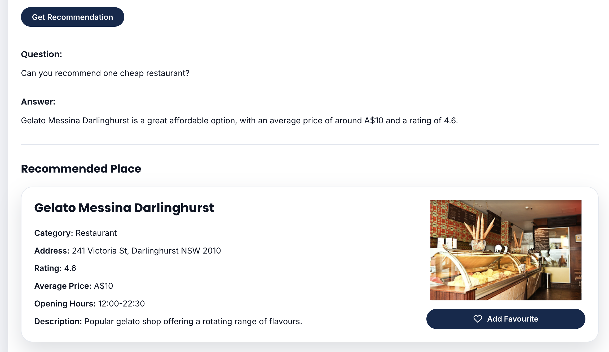

*To do: note any further model changes and the reason for each.*
